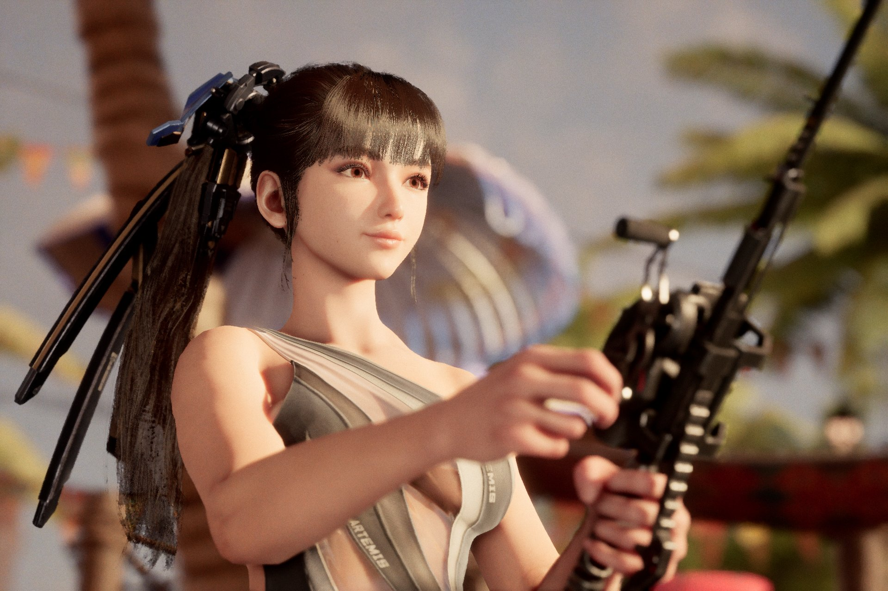

+++
title = "Stellar Blade devrait avoir droit à un portage PC et à du nouveau contenu"
date = 2024-07-26T06:50:01+01:00
draft = false
author = "Félix"
tags = ["Actu"]
image = "https://nostick.fr/articles/2024/juillet/stellar.jpeg"
+++ 

Bonne nouvelle pour les fans de [culture coréenne](https://www.millenium.org/guide/413417.html) : *Stellar Blade* devrait avoir droit à un portage PC. C’est tout du moins ce que laisse à penser [une offre d’emploi](https://career.shiftup.co.kr/o/105648) repérée par un forumeur de *[Tech4Gamers](https://forums.tech4gamers.com/threads/exclusive-stellar-blade-new-content-dlc-sequel-and-pc-port-confirmed.226/)*. On peut y lire que la boîte recherche un « *Battle Designer - PC Developper* »pour le jeu d’action à bimbo actuellement exclusif à la PS5. Pas dit que ça sorte tout de suite, mais au moins quelqu’un bosse dessus.

Ce n’est pas tout, le fouineur ayant également déniché une offre pour le poste de *Battle Designer - Monster Creator*. Il y est demandé des compétences en matière de conception de monstres, de création d'IA et en travail sur les données. Autant d’indices qui laissent à penser qu’un DLC (ou une suite ?) sont dans les cartons. 

Tout cela n’est pas vraiment une surprise : *Stellar Blade* a bien marché et le jeu a rapidement fait péter le million de ventes. L’idée de produire une suite ou un DLC ne devrait pas trop peiner à convaincre les dirigeants de Sony. Le japonais a pris l’habitude de sortir ses exclus PS5 sur PC après quelque temps, et l’hypothèse d’un portage sur PC était déjà sur la table au mois de mai. En attendant tout cela, les joueurs PS5 et amis de la culture pourront se consoler grâce à [une mise à jour estivale](https://x.com/StellarBlade/status/1816491013487448368) ajoutant un mode photo et un nouveau maillot de bain pour l’héroïne. On a hâte de voir quel sera le premier mod que la communauté des g@mers PC va nous pondre, tiens.