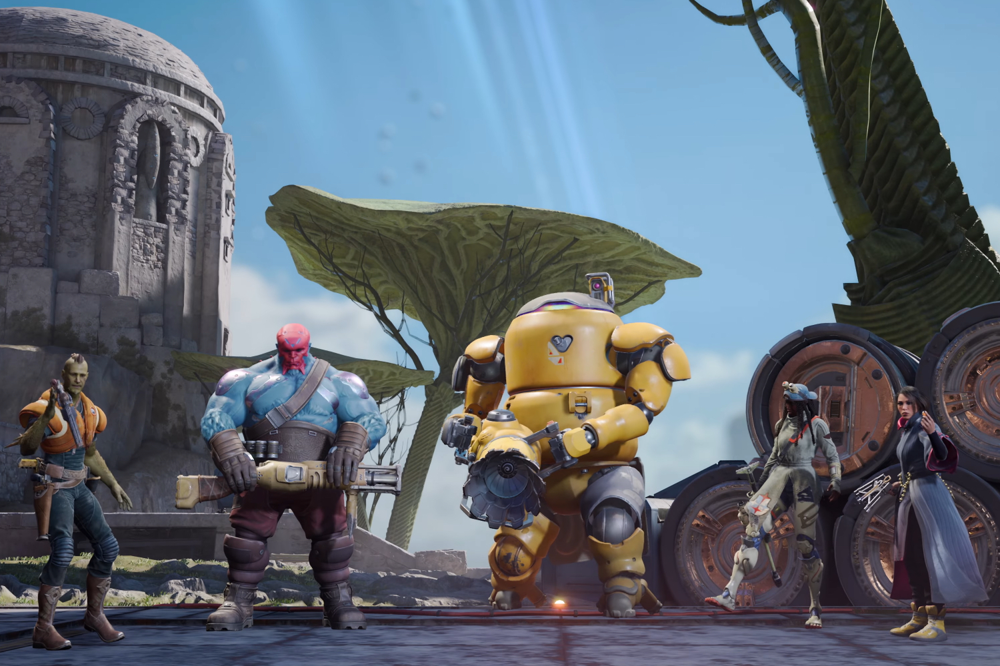
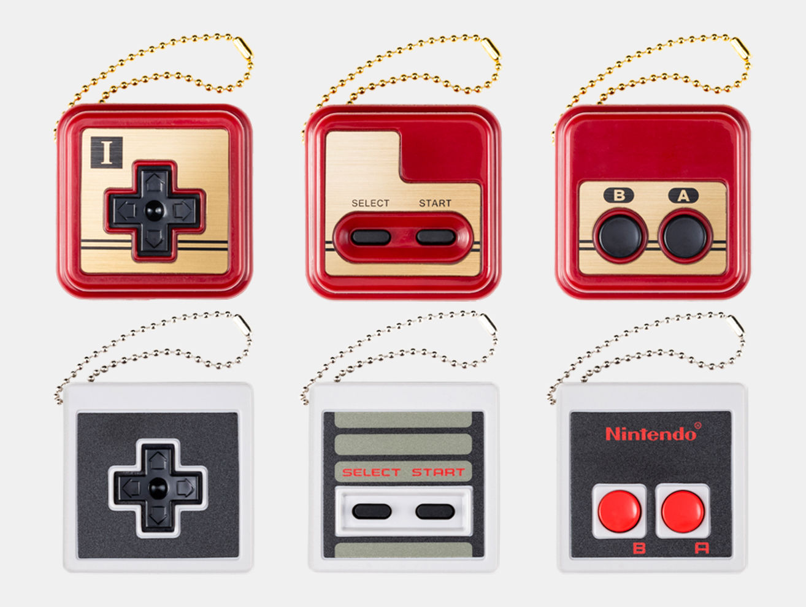
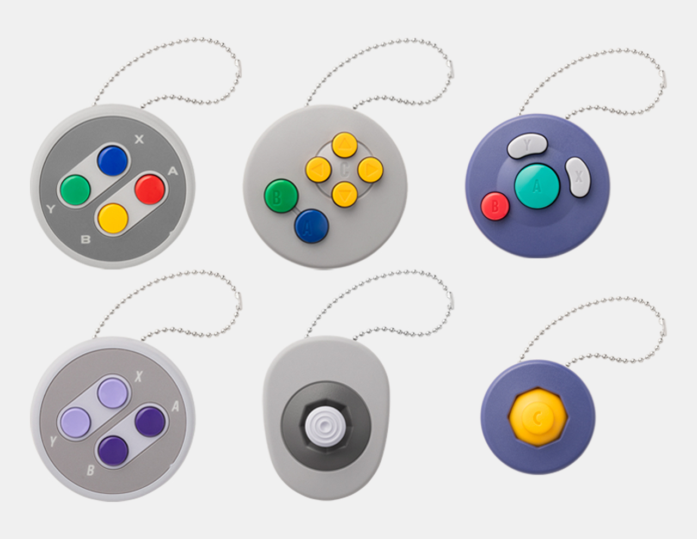
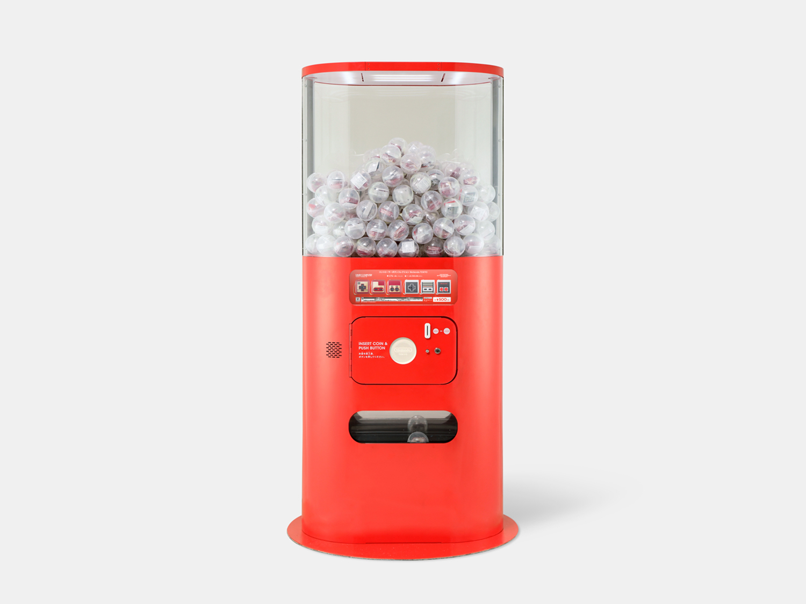
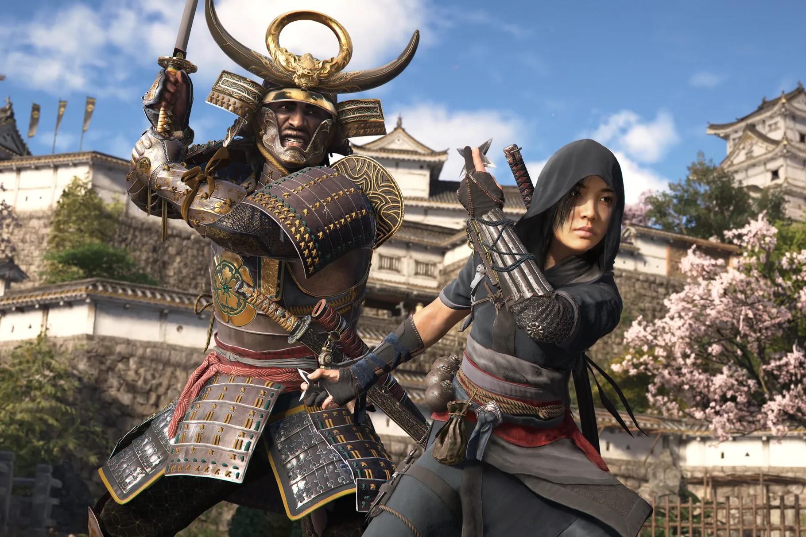

+++
title = "On vide le backlog de la semaine : porte-clefs Nintendo, Marvel vs. Capcom, Assassin's Creed Shadow…"
date = 2024-07-27T03:00:32+01:00
draft = false
author = "Mickael"
tags = ["XXL"]
image = "https://nostick.fr/articles/vignettes/juillet/concord-team.jpg"
+++

L’actualité du jeu vidéo ne s’arrête pas à la poignée d’articles publiés sur *Nostick* ! Histoire de rattraper le retard accumulé, voici un retour rapide sur quelques unes des infos les plus importantes (ou insignifiantes) de la semaine.

## L'image de la semaine : jouons avec les porte-clefs Nintendo 

Tout est toujours plus cool au Japon (bon OK, [pas tout](https://en.wikipedia.org/wiki/Nattō)), surtout quand c'est quelque chose estampillé Nintendo ! Le constructeur a [dévoilé](https://www.nintendo.com/jp/officialstore/index.html) une nouvelle collection de porte-clefs qui reproduisent des bouts des manettes de ses différentes consoles. Sérieusement. Qui n'a pas envie de tripoter ça dans sa poche ?

Dans le tas, les modèles les plus sexy sont évidemment ceux qui s'inspirent du design des manettes de N64 et de la NES japonaise ! Mais les autres ne sont pas mal non plus. Ces reproductions ne peuvent malheureusement pas se connecter à une console, mais par contre on peut en [utiliser](https://x.com/doben_ssb/status/1815788976361636131) des bouts pour remplacer des boutons défectueux sur les manettes d'origine : les composants sont en effet compatibles !

Hélas, mille fois hélas, ces morceaux de plastique ne sont disponibles que dans des tirettes installées dans les magasins Nintendo de Tokyo, d'Osaka et de Kyoto, ainsi qu'à l'aéroport Narita de Tokyo. Vu le cours du yen, ça vaut presque le coup de se payer le voyage.

## Ça fait envie : un nouveau jeu Marvel vs. Capcom ?

Beaucoup avaient espéré l'arrivée de *Marvel vs. Capcom Fighting Collection: Arcade Classics* durant l'EVO, la grande bagarre annuelle entre amateurs de jeux de baston, qui s'est achevé le 21 juillet. Si la collection était bien présente à Las Vegas, malheureusement Capcom n'en a pas profité pour en lancer la commercialisation — ni même donner une date de dispo. 

Néanmoins, l'annonce de cette compilation a redonné espoir à de nombreux joueurs qui désespéraient de voir disparaitre à tout jamais des classiques comme *Marvel vs Capcom 2*. Et qui sait ? Peut-être que cela donnera des idées aux deux partenaires pour relancer la machine à baston !

Shuhei Matsumoto, le producteur de la compile, a [expliqué](https://www.dexerto.com/gaming/exclusive-capcoms-dream-is-to-make-more-marvel-crossover-games-2831616/) à *Dexerto* que l'équipe de développement chez Capcom avait « *de grands rêves* ». « *Peut-être qu'il y a une opportunité pour un nouveau jeu Marvel vs Capcom. Peut-être qu'il y a une opportunité pour un nouveau jeu SNK basé sur Capcom* » ([*SNK vs. Capcom SVC Chaos* est d'ailleurs ressorti](https://nostick.fr/articles/2024/juillet/2007-snk-vs-capcom-svc-chaos--grande-bagarre/) le week-end dernier).

Dans l'hypothèse où tout le monde arriverait à se mettre d'accord autour des droits, ça ne serait qu'un début : « *cela prendrait du temps et des efforts pour créer et sortir ce genre de jeux* », indique-t-il, prudent. L'objectif pour le moment est de réintroduire les anciens jeux à un nouveau public. « *Peut-être qu'à l'avenir, si les gens se familiarisent avec ces séries, il y aura alors des opportunités futures de créer des jeux plus importants* », ajoute le producteur.

Le dernier jeu encore en activité, *Ultimate Marvel vs Capcom 3*, a toujours une base de joueurs très active malgré son grand âge (il est sorti en 2011 !). Beaucoup d'entre eux aimeraient un dépoussiérage du netcode rollback pour les bagarre en ligne… « *Il y a beaucoup de choses que l'équipe veut faire, et nous avons beaucoup d'amour pour Ultimate Marvel vs Capcom 3* », assure Shuhei Matsumoto, « *maintenant c'est une question de timing et de voir ce que nous pouvons faire pas à pas* ».

Ce qui donne matière à espérer, c'est que Marvel et Disney sont manifestement très conscients qu'il existe une communauté dynamique autour de *Marvel vs. Capcom*, notamment dans les tournois comme à l'EVO. « *D'après nos conversations [avec Marvel], il semble que des projets futurs pourraient dépendre de l'intérêt général des joueurs pour la collection de classiques d'arcade* », indique-t-il. Dès qu'elle sort, je veux que chacun en achète 3 exemplaires, minimum !

## Les emmerdes de la semaine pour Ubisoft 

Ubisoft a rappelé cette semaine qu'un jeu était d'abord et avant tout une œuvre de fiction, et pas un livre d'histoire. Depuis la présentation d'*Assassin's Creed Shadows*, une poignée d'idiots malintentionnés, placés tout à fait à droite de l'échiquier politique — emmenés par [le plus dinguo d'entre eux](https://www.bfmtv.com/tech/gaming/il-ne-fait-qu-alimenter-la-haine-ubisoft-s-en-prend-a-elon-musk-apres-la-polemique-sur-assassin-s-creed-shadows_AV-202406140643.html) — sont tombés à bras raccourcis sur l'éditeur. Le jeu, qui se déroule au Japon féodal, propose en effet de contrôler une shinobi, Naoe, et un samuraï, Yasuke.

Mais voilà. Yasuke est *N O I R*, un crime probablement impardonnable. Alors qu'on se rapproche du lancement du jeu (le 15 novembre), la tension monte aussi au Japon, où des représentants de cette même tendance ont [lancé](https://gamerant.com/assassins-creed-shadows-petition/) une pétition début juillet pour exiger l'annulation du jeu, ce qui ne devrait guère effrayer Ubisoft.

Yasuke est pourtant un personnage ayant réellement [existé](https://en.wikipedia.org/wiki/Yasuke). L'historien japonais Yu Hirayama l'a encore [confirmé](https://x.com/HIRAYAMAYUUKAIN/status/1814356500326035650) : même si on dispose de peu de documents historiques à son sujet, Yasuke a bien été fait samuraï par son seigneur, même si ses ennemis ne le considéraient pas comme tel probablement en raison de la couleur de sa peau.

Mais peu importe la réalité historique, ça ne sera jamais suffisant pour ceux qui portent des œillères. Ubisoft a voulu adresser un [message](https://news.ubisoft.com/en-us/article/7dWPCtVQU7udC0KkPFOyXh/assassins-creed-shadows-an-update-for-the-japanese-community) à tous et plus particulièrement aux joueurs japonais : « *Nous partageons votre passion pour l'histoire et respectons profondément votre souci de l'intégrité historique et culturelle de votre riche patrimoine* », commence l'éditeur avant de préciser que « *notre intention n'a jamais été de présenter nos jeux Assassin's Creed, y compris Assassin's Creed Shadows, comme des représentations factuelles de l'histoire ou des personnages historiques* ».

Même si tous les efforts ont été faits pour « *garantir une représentation immersive et respectueuse du Japon féodal* » (consultants externes, historiens, chercheurs et des équipes internes chez Ubisoft Japan), le studio cherche d'abord à titiller la curiosité des joueurs et les encourager à se plonger dans l'Histoire (la vraie) qui inspire les jeux de la saga.

À toutes fins utiles, Ubisoft rappelle que les jeux *Assassin's Creed* sont certes des « *œuvres de fiction inspirées par des événements et des figures historiques réels* », mais que « *depuis ses débuts, la série a pris des libertés créatives et incorporé des éléments fantastiques pour créer des expériences engageantes et immersives* ». Et la représentation de Yasuke en est une illustration.

Malgré tout, et c'est là où Ubisoft se prend les pieds dans le tapis, l'entreprise tient aussi à s'excuser par « *certains éléments de nos éléments promotionnels [ayant] suscité des préoccupations au sein de la communauté japonaise* », sans en dire plus et c'est bien dommage. De quoi parle-t-on ?

L'entreprise a déjà dû [s'excuser](https://www.pcgamer.com/games/action/ubisoft-apologizes-for-using-a-real-life-reenactment-groups-flag-in-assassins-creed-shadows-concept-art-without-permission/) début juillet pour avoir reproduit sans permission dans des documents promotionnels le drapeau d'un groupe japonais versé dans la reconstitution historique. Un bug qui ne méritait sans doute pas des excuses aussi publiques.

Ces excuses prêtent le flanc à toutes les suspicions et relancent la machine à troller pour l'extrême droite. Ce qui n'était vraiment pas nécessaire, surtout qu'elle n'a pas besoin de ça pour hurler bêtement au loup.

## On n'a pas eu le temps cette semaine mais on pense à eux

 

Grosse semaine pour deux des plus gros jeux de baston du moment ! Capcom a dévoilé le teaser de Terry Bogard, le champion à la casquette de *Fatal Fury* (et de *Smash* !), qui deviendra un perso jouable dans *Street Fighter 6* cet automne. Et Bandai Namco n'est pas en reste, en présentant comme il se doit Heihachi Mishima qui sortira de son volcan également cet automne dans la saison 1 de *Tekken 8*.

 

*Helldivers II* aura droit à une grosse mise à jour gratuite le 6 août, « Escalation of Freedom ». Le shooter en coop de PlayStation, aussi dispo sur PC,  va [accueillir](https://blog.playstation.com/2024/07/23/helldivers-2s-biggest-update-yet-escalation-of-freedom-drops-august-6/) de nouveaux ennemis et objectifs de mission, un tout nouveau biome et un palier de difficulté supplémentaire. Des tas de surprises sont aussi prévues, alors continuez donc à répandre la démocratie.

 

Hé oui, *S.T.A.L.K.E.R. 2: Heart of Chornobyl* connait un nouveau report, cette fois au 20 novembre ! Un de plus, un de moins, après tout le FPS devait sortir en 2022, mais vu les petits soucis (euphémisme) auxquels font face les ukrainiens de GSC Game World, il leur sera beaucoup pardonné. Courage !

 

Parce qu'on n'est jamais plus fort que quand on est ensemble, les comédiens, doubleurs et acteurs de motion capture membres du syndicat américain SAG-AFTRA ont [cessé](https://www.sagaftra.org/sag-aftra-members-who-work-video-games-go-strike) le travail depuis hier. Eux qui travaillent pour l'industrie du jeu vidéo réclament des protections contre les abus de l'IA. Cela faisait un an et demi que des négociations étaient en cours, mais elles n'ont abouti à rien. On est avec eux !

## osef

Cette merde de Cybertruck arrive dans *[Fortnite](https://www.fortnite.com/news/unlock-the-cybertruck-in-fortnite-by-goin-on-a-summer-road-trip-with-the-squad)* et *[Rocket League](https://www.rocketleague.com/en/news/unlock-the-cybertruck-on-a-rocket-league-summer-road-trip)*.

## Dans le reste de l'actu déchaînée

- Ouch, *Concord* a l'air mal parti. Les chiffres Steam pour la bêta ouverte du hero shooter de PlayStation, n'ont rien  d'encourageant. [Plus d'infos par ici.](https://nostick.fr/articles/2024/juillet/2207-concord-playstation-flop/)
- Xbox doit tendre la cédille à Microsoft pour décrocher des miettes de budget pub en Europe. C'est triste et [c'est à lire par là.](https://nostick.fr/articles/2024/juillet/2207-xbox-europe-aumone-pub/)
- Netflix continue de muscler son catalogue de jeux mobiles, qui commence à devenir franchement intéressant. [À découvrir dans cette actu.](https://nostick.fr/articles/2024/juillet/2307-netflix-continue-dinvestir-jeux-mobile/)
- Tout au long de sa longue histoire, Nintendo a testé tout un tas de trucs bizarres, mais la Satellaview trône sûrement en tête du podium. [Petit morceau d'histoire par ici.](https://nostick.fr/articles/2024/juillet/2307-sattelaview-console-oubliee-nintendo/)
- Quand les jeux service (comme *Concord*) ratent leur lancement, les éditeurs ont tendance à les abandonner à leur triste sort. C'est une erreur, selon le boss de *Warfare*. [Mais pourquoi ?](https://nostick.fr/articles/2024/juillet/2307-warframe-abandon-free-to-play/)
- Pour Take-Two Interactive, l'éditeur de *GTA*, l'ennemi c'est le review bombing ! Mais pourquoi donc ? [Parce que.](https://nostick.fr/articles/2024/juillet/2407-gta-vi-review-bombing/)
- Microsoft pourrait multiplier les formules d'abonnements au Game Pass, mais est-ce une bonne idée ? [Tentative de réponse par là.](https://nostick.fr/articles/2024/juillet/2407-game-pass-nouvelles-formules/)
- Le review bombing, c'est peut-être mal mais dès fois ça fait le taf : devant la pression, Respawn a laissé tomber les changements au battle pass d'Apex Legends. [À lire dans cette actu.](https://nostick.fr/articles/2024/juillet/2507-joueurs-plier-respawn-battle-pass-apex-legends/)
- On a failli attendre, mais enfin le voilà le mod *Fallout: London* qui déplace l'univers post-apo de *Fallout 4* à Londres. [Plus de détails par ici.](https://nostick.fr/articles/2024/juillet/2507-fallout-london-apocalypse-londres/)
- *Fortnite* reviendra bientôt sur iPhone en Europe, dans la propre boutique d'Epic mais aussi, et c'est une surprise, dans l'AltStore PAL ! [Toutes les infos ici.](https://nostick.fr/articles/2024/juillet/2507-fortnite-altstore-pal/)
- Le « jeu à bimbo » *Stellar Blade* (comme l'appelle Félix) s'apprête à passer de la PS5 au PC. Et il y aura même la possibilité de créer des mods ~~nude~~ ! [On se rince l'œil par là.](https://nostick.fr/articles/2024/juillet/2607-stellar-blade-portage-pc-nouveau-contenu/)
- La ROG Ally X pourrait prétendre au titre de meilleure console PC portable du marché si Asus ne la vendait pas si cher. [Félix a testé la bête !](https://nostick.fr/articles/2024/juillet/2907-coup-doeil-sur-la-rog-ally-x/)
- Steam considère finalement les démos comme des jeux à part entière, [et c'est pas trop tôt.](https://nostick.fr/articles/2024/juillet/2607-demo-steam/)