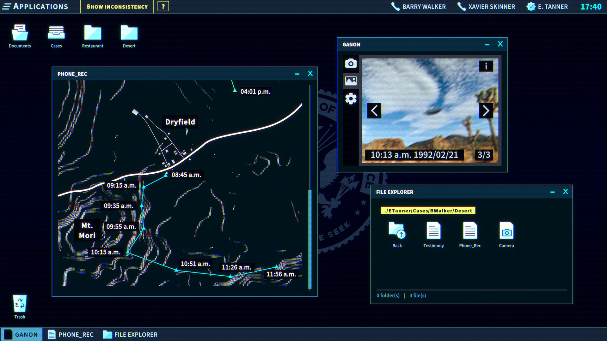
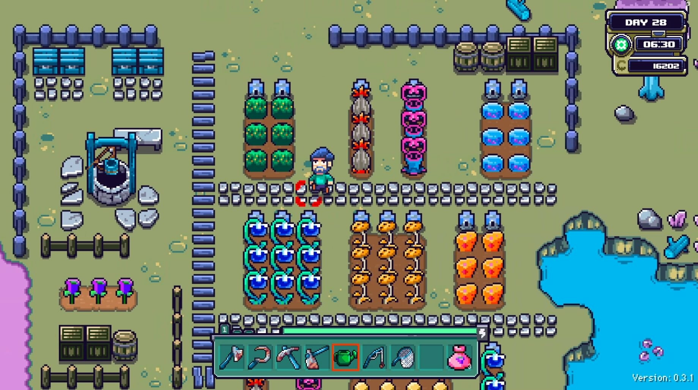

+++
title = "The Operator, Cataclismo : le récap des sorties de la semaine (28/07)"
date = 2024-07-28T07:00:01+01:00
draft = false
author = "Félix"
tags = ["C’est dispo"]
image = "https://nostick.fr/articles/2024/2807-the-operator-cataclismo-les-sorties-de-la-semaine/farlands.jpg"
+++

Entre le soleil, les restaus moules-frites à volonté et cette foutue méduse qui vous a flinguée l’épaule à la plage des Deux Galets, vous n’avez peut-être pas eu le temps de vous intéresser aux nouveautés du moment. Qu’à cela ne tienne : voici les sorties de ces derniers jours qui ont retenu notre attention.

## Gamer & Scully

***The Operator*** a pas mal fait parler de lui cette semaine : il s’agit d’un petit jeu d’enquête réalisé par un studio français s’étant très rapidement hissé dans le top des jeux les plus vendus du moment sur PC. On y enfile la tenue d’un agent d’une sorte de FBI qui travaille depuis son bureau sur un bien étrange mystère. Pas d’action ici étant donné qu’on enquête depuis son PC des années 90 dans ce qui ressemble à un gros puzzle-game. Il va s’agir de résoudre une affaire visiblement surnaturelle, le jeu étant décrit comme une « *lettre d’amour à la série X-Files* » par *[Le Monde](https://www.lemonde.fr/pixels/article/2024/07/23/on-a-teste-the-operator-le-jeu-narratif-qui-rend-hommage-a-x-files_6256514_4408996.html)*. L’ambiance est au complot et aux conspirations géantes tandis que les puzzles demanderont d’analyser des flux vidéo ou de fouiller dans des bases de données. Les tests sont tous unanimes sur les qualités du jeu, mais regrettent une durée de vie de 4-5 heures alors que l’univers a du potentiel. Écoutez [pour 13,79 €](https://store.steampowered.com/app/1771980/The_Operator/) ça me semble être une bonne affaire pour occuper votre dimanche soir si vous aimez bien vous creuser les méninges. 

## La plus belle des citadelles

**Cataclismo** a aussi fait un lancement en accès anticipé remarqué cette semaine. Il s’agit d’un mélange de jeu de construction de château et de tower défense dans laquelle il va falloir protéger sa petite citadelle construite avec amour de multiples attaques de monstres. Tout passe par la collecte de ressources et la construction de grosses murailles avant de positionner ses archers et autres guerriers. L’ambiance est sympa, il y a une campagne et le contenu à l’air correct pour une early-access. Un éditeur de cartes est présent, ce qui devrait garantir de nombreuses heures de fun aux mordus du genre. À essayer si c’est votre came : c’est vendu 30 balles [sur Steam](https://store.steampowered.com/app/1422440/Cataclismo/) et les retours sont tous positifs, même si le projet sera sans doute encore meilleur après quelques mois de maturation.



## La ferme des animaux (martiens)

Si vous commenciez à avoir fait le tour de *Stardew Valley*, ***Farlands*** pourrait vous intéresser : c’est la même chose, mais dans l’espace. Vous vous retrouvez cette fois-ci sur votre propre planète qu’il va falloir nettoyer avant de bâtir une ferme. Il est possible d’explorer les autres astres du système solaire pour aller à la chasse aux ressources, et il y a évidemment tout un tas de PNJ avec des histoires à raconter. Le pixel-art est mignon et la page Steam laisse à penser qu’un scénario plus vaste se cache derrière la boucle de gameplay habituelle. Les retours sont plutôt bons pour un early access, bien que pas mal de joueurs déplorent d’en avoir un peu vite fait le tour. Peut être pas à acheter tout de suite, mais vous pouvez le wishlister et repasser jeter un œil dans 6 mois. 15 balles sur [Steam](https://store.steampowered.com/app/2252680/Farlands/).

## La guerre, la guerre ne change jamais

**‌Conscript** a un concept pour le moins intrigant : un survival horror en vue du dessus dans lequel on incarne un soldat français pendant la Première Guerre mondiale. Pas de surnaturel ou de monstres ici, le joueur devant principalement affronter l’horreur de la guerre. Le titre s’inspire des premiers *Resident Evil* et de *Silent Hill* avec son lot de serrures à clefs bizarres, de puzzles et de salles de repos étrangement calmes. Les graphismes sont en 3D à gros polygones, tout comme le gameplay qui se veut old school. Les retours sont globalement positifs, le projet étant encore plus impressionnant quand on sait qu’il a été créé par un développeur solo. Sans doute pas pour tout le monde et un peu déprimant en ces belles journées d’été, mais la balade a l’air de valoir le détour. 20 € sur [Steam](https://store.steampowered.com/app/1286990/CONSCRIPT/), une démo est dispo pour les curieux. Également dispo sur toutes les consoles et même sur Switch.



## En rab

Il y a eu pas mal d’autres sorties intéressantes cette semaine, à commencer par un bien étrange F2P sur Switch appelé ***[‌The New Denpa Men](https://www.nintendo.com/fr-be/Jeux/Jeux-a-telecharger-sur-Nintendo-Switch/THE-NEW-DENPA-MEN-2618000.html)***. Si j’ai bien compris, c’est un RPG en ligne qui fait un carton où on contrôle des petits bonhommes en costume qui explorent des donjons. C’est gratuit alors pourquoi pas. On notera sinon l'arrivée de ***Old School Rally*** qui a été plutôt bien accueilli et qui devrait plaire aux nostalgiques des jeux de course sur PS1 (9,75 € [sur PC](https://store.steampowered.com/app/2824660/Old_School_Rally/)). Le petit jeu indé ***Été*** a fait parler de lui : il s’agit d’un titre relax dans lequel on doit « *colorier Montréal* ». Les graphismes sont sympas, à voir si ça vaut [les 25 € demandés](https://store.steampowered.com/app/1065070/Ete/). Le RPG/jeu de puzzles ***Arranger*** a été très bien accueilli par les critiques, et son univers créé par le concepteur graphique de *Braid* es visuellement alléchant. À essayer vu que c'est inclus dans l'abonnement Netflix, sinon il faudra prévoir 18 € sur Switch, PlayStation ou [PC](https://store.steampowered.com/app/2596420/Arranger_A_RolePuzzling_Adventure/). Enfin, le F2P ***Mahjong Soul*** est désormais disponible [sur Steam](https://store.steampowered.com/app/2739990/Mahjong_Soul/) : un conseil, ne le téléchargez pas si vous ne voulez pas passer des jours à essayer de comprendre les règles avant de tomber accro comme une merde à l'équivalent du poker japonais  (je dois avoir 300 heures au compteur sur la version iOS).
