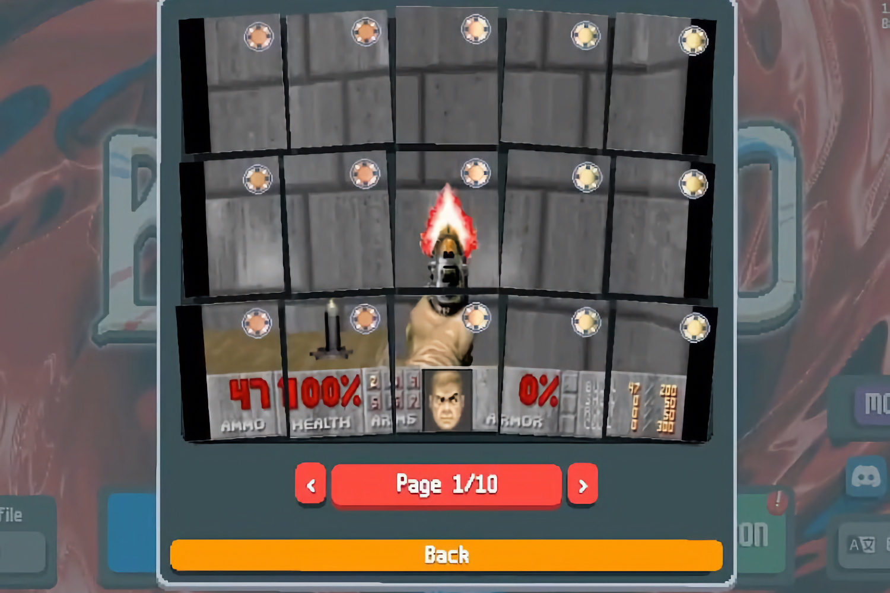

+++
title = "Balatro aussi peut faire rouler Doom"
date = 2024-07-29T12:00:32+01:00
draft = false
author = "Mickael"
tags = ["Actu"]
type = "telex"
+++
Si *Doom* peut fonctionner dans [une GBA](https://itrunsdoom.tumblr.com/post/686594124750651392/the-game-boy-advance-it-almost-ran-quake-a-tech), [une Game & Watch](https://itrunsdoom.tumblr.com/post/636101690695761920/the-nintendo-game-watch-super-mario-bros-yeah), un [tracteur jailbreaké](https://x.com/kwiens/status/1558688970799648769) ou encore [dans… *Doom*](https://itrunsdoom.tumblr.com/post/689668091900313600/this-is-clearly-in-full-defiance-of-god-satan), alors *Doom* peut aussi rouler dans *Balatro*. C'est l'exploit réalisé par le redditeur UwUDev, à la grande [surprise](https://x.com/LocalThunk/status/1816567788078870924) et joie du développeur du jeu de cartes, LocalThunk. C'est à découvrir [ici](https://www.reddit.com/r/balatro/comments/1eby5y7/literally_nobody_asked_for_it_but_here_it_is_doom/).

Apparemment, la solution pour intégrer le FPS dans le jeu de poker est d'utiliser des cartes joker pour les transformer en écran vidéo. Bon, ça a l'air assez compliqué et puis de l'aveu même de l'inventeur, « *c'est vraiment injouable* ». Néanmoins, puisqu'il n'y a pas vraiment de standard pour attribuer le macaron, Balatro rejoint donc le palmarès des trucs dans lesquels il est possible de faire tourner *Doom* !