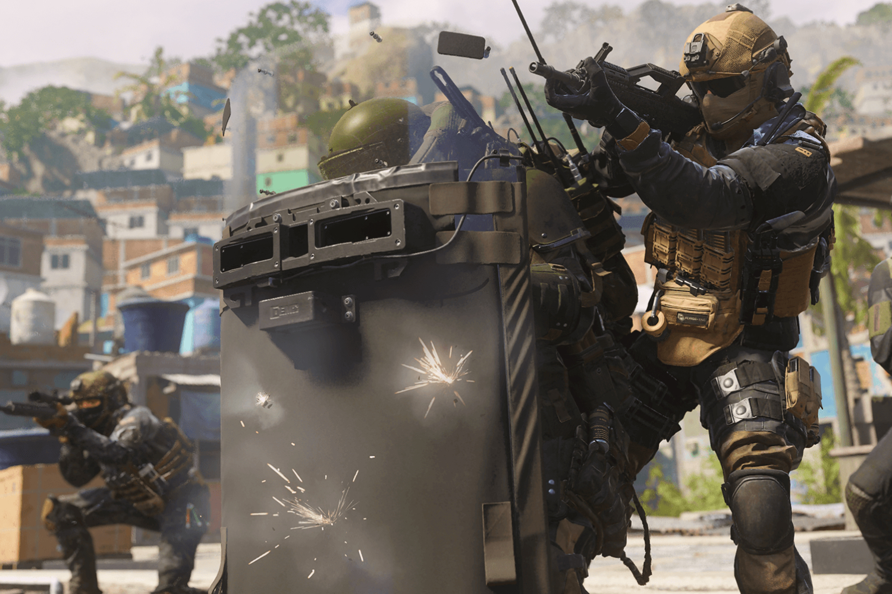
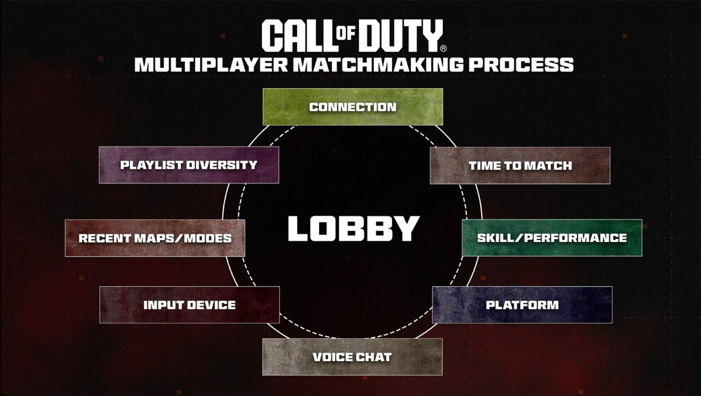
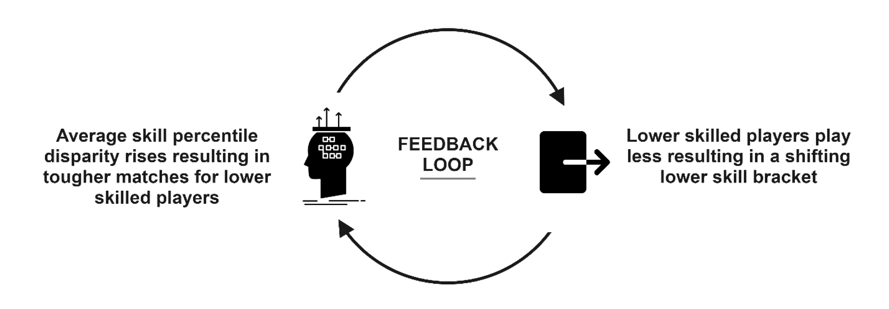

+++
title = "Pourquoi Call of Duty ne choisit par les joueurs au hasard dans les parties multi"
date = 2024-07-29T14:00:00+01:00
draft = false
author = "Mickael"
tags = ["Actu"]
image = "https://nostick.fr/articles/vignettes/juillet/call-of-duty-matchmaking-3.jpg"
+++

Activision bat en brèche une croyance profondément ancrée chez certains joueurs de *Call of Duty* : pour eux, il serait plus juste de créer des parties multi en laissant le hasard choisir les joueurs, plutôt que se baser sur leurs compétences (SBMM pour « Skill-based matchmaking »). Des amateurs de *CoD* estiment en effet que ce n'est pas très drôle de se donner toujours à fond dans des parties multi où tous les joueurs sont à peu près au même niveau, alors que la plupart d'entre eux veulent simplement jouer décontract'.

Un système de matchmaking basé sur une sélection aléatoire de joueurs permettrait de combattre à la fois des adversaires beaucoup plus costauds et beaucoup plus faibles, apportant ainsi une certaine fraîcheur au jeu. Si cela a été le choix d'Ubisoft pour *XDefiant*, Activision a préféré le SBMM pour *Call of*.

Mais histoire d'en avoir le cœur net, Activision a réalisé une expérience décrite dans une très sérieuse étude consacrée au rôle des compétences dans la création de parties multi, que l'on pourra lire [ici](https://www.activision.com/cdn/research/CallofDuty_Matchmaking_Series_2.pdf). En début d'année, la moitié des joueurs américains de *Modern Warfare III* ont été secrètement soumis à un test durant lequel les contraintes de compétences ont été assouplies lors du processus de matchmaking, qui laissait donc plus de place au hasard.

Après 14 jours, l'étude a déterminé que le taux de retour des joueurs dans le jeu avait diminué pour 90 % des cobayes. 10 % seulement des joueurs les plus balaises sont revenus plus souvent (et pour cause : ils gagnaient plus souvent). Le taux d'abandon durant les parties a augmenté pour 80 % des joueurs, et de seulement 10 % pour les joueurs les plus compétents.

L'enseignement est assez clair : en réduisant l'importance des compétences lors de la création de parties en multi, l'engagement des joueurs a diminué. Moins de joueurs sont revenus au jeu, et davantage d'entre eux quittaient les parties en cours. En revanche, les joueurs les plus fortiches ont certainement apprécié l'expérience, mais ce n'est pas la cible principale d'Activision : l'éditeur veut séduire un maximum de joueurs, pas uniquement ceux qui se débrouillent le mieux.

L'équilibre à trouver est donc délicat. « *Un des principes fondamentaux de Call of Duty est de satisfaire le joueur* », explique l'étude. « *Les joueurs de tous niveaux doivent pouvoir profiter d'une expérience de jeu amusante et compétitive (…) Si nous ne savons pas comment les joueurs se comporteront dans une partie, nous ne pouvons pas fournir une expérience équilibrée aux joueurs* ». D'où le SBMM, pour éviter que les joueurs « faibles à moyens » quittent le jeu continuellement.
