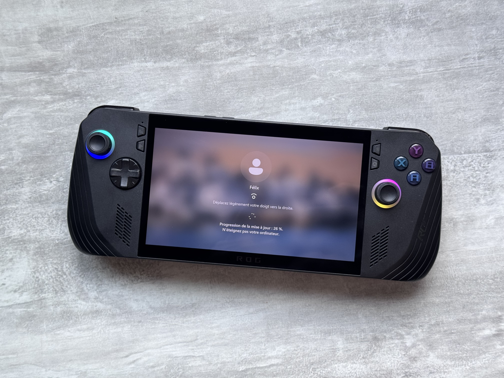
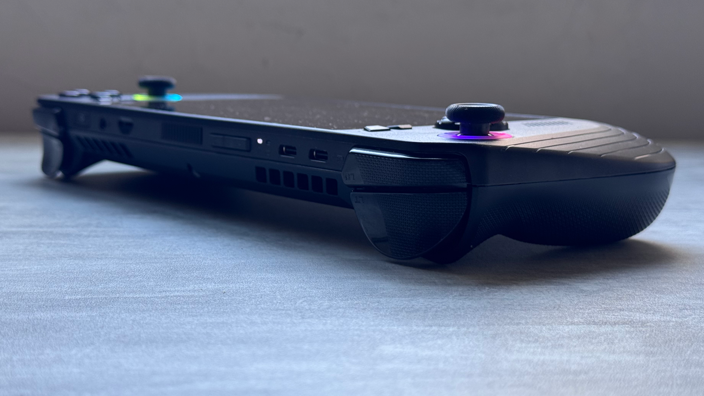
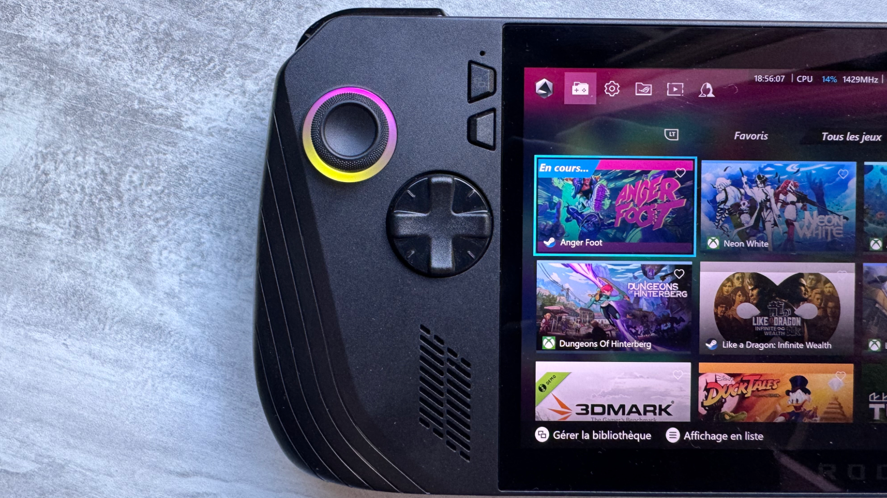
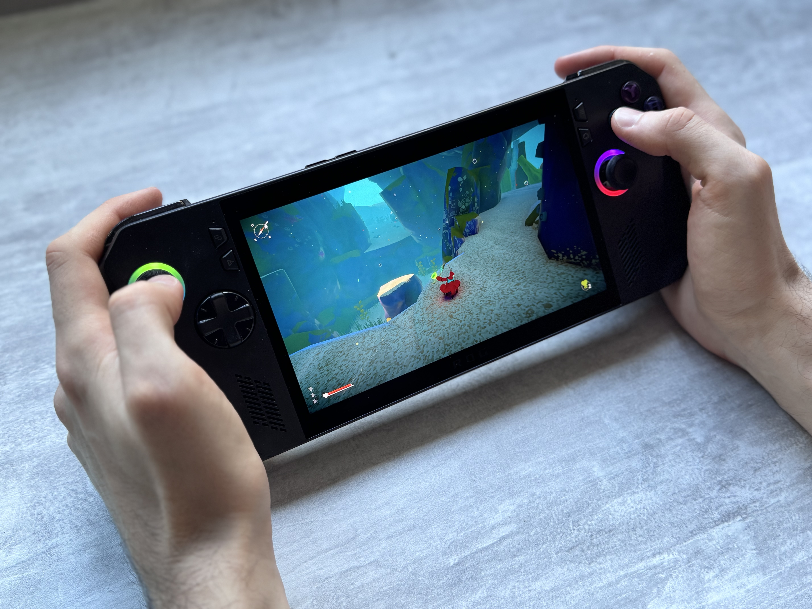

+++
title = "Test de la nouvelle ROG Ally X : la meilleure console portable du marché coûte 200 € de trop"
date = 2024-07-26T10:10:30+01:00
draft = false
author = "Félix"
tags = ["Test"]
type = "une"
image = "https://nostick.fr/articles/2024/2907-coup-doeil-sur-la-rog-ally-x/rogallyx.jpeg"
+++ 

 

Si vous m’aviez dit il y a deux ans que je passerais bientôt la plupart de mon temps à jouer sur une console portable de chez Asus tournant sous Windows 11, je vous aurais sans doute ri au nez. C’est pourtant ce qui s’est passé : depuis que j’ai acheté [la première ROG Ally](https://rog.asus.com/fr/gaming-handhelds/rog-ally/rog-ally-2023/), ma tour prend la poussière et j’ai même carrément viré le gros clavier qui trainait sur mon bureau. Alors certes, le processeur n’est pas assez puissant pour faire tourner les derniers AAA correctement, certes Windows me casse régulièrement les pieds. Mais pour jouer à 90 % des jeux indés qui sortent en ce moment, émuler la Switch et lancer quelques vieilleries, la console fait des merveilles.

Malgré tout mon amour pour elle, la ROG Ally reste quand même bourrée de défauts. La batterie ne tient pas une heure en fond de cinquième, le design blanc est salissant, la prise en main peut être reloue, Windows, putain Windows… Asus est visiblement consciente de ce problème étant donné qu’elle vient de lancer [la ROG Ally X](https://estore.asus.com/fr/90nv00f1-m000e0-rog-ally-x-2024.html), une révision du modèle originel avec quelques améliorations. C’est un excellent produit, malheureusement vendu beaucoup trop cher face à la concurrence. Jetons-y un coup d’œil.

 et la nouvelle (en noir). Le design se rapproche de plus en plus du Steam Deck.") 

## La même, mais en mieux 

Reprenons pour ceux qui n’auraient pas suivi l’énorme boom du secteur depuis l’arrivée [du Steam Deck](https://nostick.fr/articles/2024/avril/2604-6-mois-avec-le-steam-deck-oled/) : la ROG Ally est un PC Gamer vendu sous le format d’une grosse Switch, joysticks et boutons inclus. La machine est basée sur Windows et embarque un écran tactile, ce qui est sur le papier une bonne idée étant donné que tous les jeux PC tournent nativement sur la ROG Ally. Pas besoin de bidouille à la Proton pour lancer ses FPS multijoueurs avec des anti-cheats bien envahissants ou les jeux du Game Pass. En contrepartie il faut utiliser Windows sur un écran tactile 7", ce qui n’est pas vraiment fun au quotidien.

La première ROG Ally avait un gros défaut : son autonomie. On s’y fait, mais il est en pratique difficile de dépasser les 3h sauf à jouer à des visuals novels sans Wi-Fi et sans son avec la luminosité au minimum. La console tient moins d’une heure (!) sur de gros jeux et à peine 2 h sur des titres moins gourmands. Avec le temps on s’habitue, on prend le réflexe de rester proche d’une prise et de jouer par petites sessions, mais ça reste quand même handicapant pour ce genre de gadget qu’on a envie de trimballer partout.

Asus a tout bonnement doublé la batterie de la ROG Ally X, qui passe de 40W à 80W. Le résultat se remarque instantanément étant donné que l’autonomie double aussi. On peut jouer tout à fond pendant 2 h à un AAA, ce qui pour ma part me suffit largement. La console tiendra plutôt 3 h en mode « Performance » (le réglage intermédiaire pour les jeux « standards ») et 6 h en mode silencieux pour vos jeux 2D. Alors OK c’est pas Byzance et il faut toujours prendre l’habitude de recharger la machine régulièrement, mais ça fait le job pour un gros voyage en train ou pour ne pas être emmerdé pendant une longue session dans un canap'.

## Du mieux sur les perfs

La fiche technique évolue aussi : le stockage passe de 512 Go à 1 To avec un SSD plus facile à changer (désormais au format M.2 2280). Le port propriétaire pour les eGPU Asus hors de prix a été remplacé par un second USB-C 3.2 Gen2 à 10 Gb/s. Le port microSD a été déplacé pour ne plus flinguer les cartes, un des soucis de la V1. Le design a été légèrement revu, la console ayant désormais une robe noire moins salissante, mais moins originale ainsi que des joysticks et des gâchettes améliorées. Petite mention pour les boutons arrière qui sont plus petits qu'avant, ce qui fait qu’on a moins tendance à cliquer dessus par accident.

Malgré sa taille et son poids, la ROG Ally X est un plaisir à utiliser. La batterie la rend un peu plus lourde que sa prédécesseur, mais je ne m’en suis jamais plaint même pendant mes longues sessions sur *Anger Foot*. Les poignées sont désormais plus profondes, ce qui est un vrai plus : la première pouvait parfois engourdir les mimines sur de longues sessions. Ça pourrait être plus léger et plus compact, mais en l’état, il est assez difficile de chouiner. On regrettera juste que les ventilateurs ne soient pas plus discrets, émettant toujours un vrombissement énervant qui vous attirera des regards dans les endroits silencieux. 

Et côté technique ? La machine conserve sa puce Z1 Extreme et sa dalle 7 pouces LCD qui a l’avantage d’être VRR, à savoir que la framerate de l’écran se synchronise avec celle du jeu pour un meilleur rendu. On reste sur Windows 11, un système malheureusement loin d’être optimisé pour le tactile, mais qui est habilement caché par un launcher maison qui a eu droit à une couche de peinture pour l’occasion. Passé la première heure à installer Steam et deux trois bricoles, il est quasiment possible de ne jamais avoir à interagir avec le système de Microsoft (et tant mieux).

Il y a du neuf sur la RAM, qui passe de 16 à 24 Go et est plus rapide vu qu’on grimpe de 6 400 MT/s à 7 500 MT/s. Asus promet 15 % d’amélioration en jeu, ce qui se vérifie… de temps à autre. Je ne vais pas vous faire une liste de benchs (d’autres le font mieux que moi), mais en gros on récupère 2-3 FPS par-ci ou 3-4 FPS par là selon le mode utilisé. C’est globalement la même chose qu’avant au quotidien et je n’ai pas vraiment ressenti la différence sur la plupart de mes jeux, mais je ne tape pas souvent dans les titres exigeants. Cependant, ce coup de fouet sera sans doute salvateur pour certains gros jeux qui vont passer du « limite jouable » à « ça passe ».

La ROG Ally X fait tourner des jeux récents certes, mais à 30 FPS et parfois même juste en 720p si vous visez les AAA sortis sur les deux dernières années. C’est loin d’être génial pour *Alan Wake II*, mais la machine fait du très bon boulot sur les jeux indés ou plus anciens (*Another Crab’s Treasure*, *Dungeon of Hinterberg*, *NieR:Automata*…). Si vous envisagez un achat, je vous invite à regarder des benchs sur YouTube de vos titres préférés pour voir ce que ça donne. Dans l’idée la puce suffit sur 90 % des jeux, à condition de savoir jouer des taquets graphiques et de parfois revoir ses exigences à la baisse. 

## Pour conclure

Une console plus puissante, une autonomie doublée, une prise en main améliorée… On achète ? Difficile de recommander cette console : ASUS la vend au tarif délirant de 899 €, ce qui fait *très* cher quand Valve vend son Steam Deck OLED équivalent à 679 € avec un écran OLED. La ROG garde « l’avantage » d’embarquer Windows et d’être un poil plus puissante, mais selon les jeux que vous visez c'est souvent kif-kif. Ça reste une très chouette machine portable, et cette ROG Ally X pourra valoir le coup pour les obsédés des performances quand elle tombera dans les 700 / 800 €. 

*La ROG Ally est affichée à 899 € chez les revendeurs ([Fnac](https://www.fnac.com/Console-portable-Asus-ROG-Ally-X-Noir/a20619434/w-4) et consort) ou directement chez [ASUS](https://estore.asus.com/fr/90nv00f1-m000e0-rog-ally-x-2024.html). La console est livrée avec 3 mois de Game Pass Ultimate, ça fait toujours plaisir.*

 