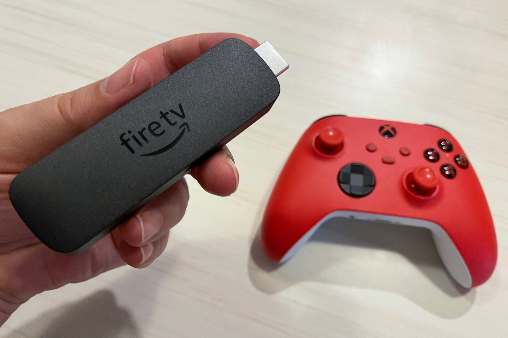
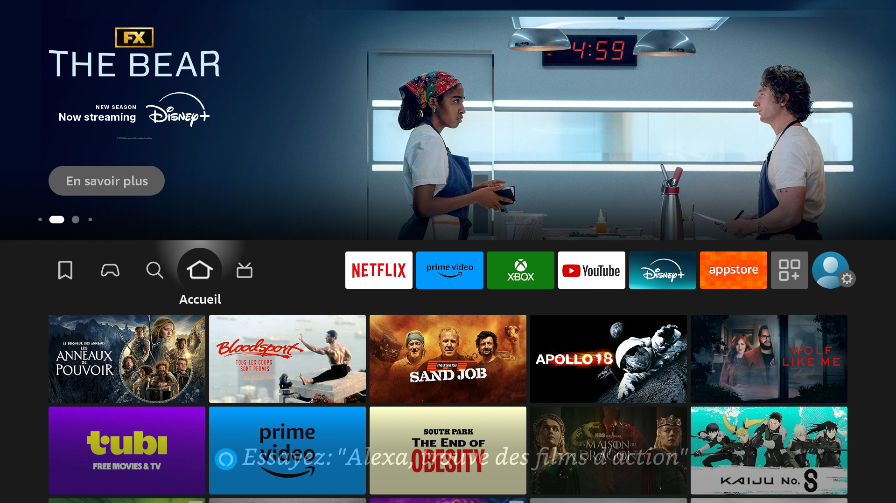
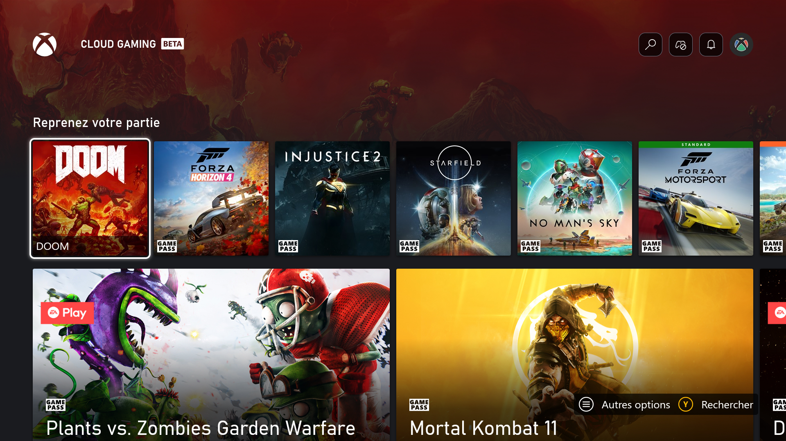
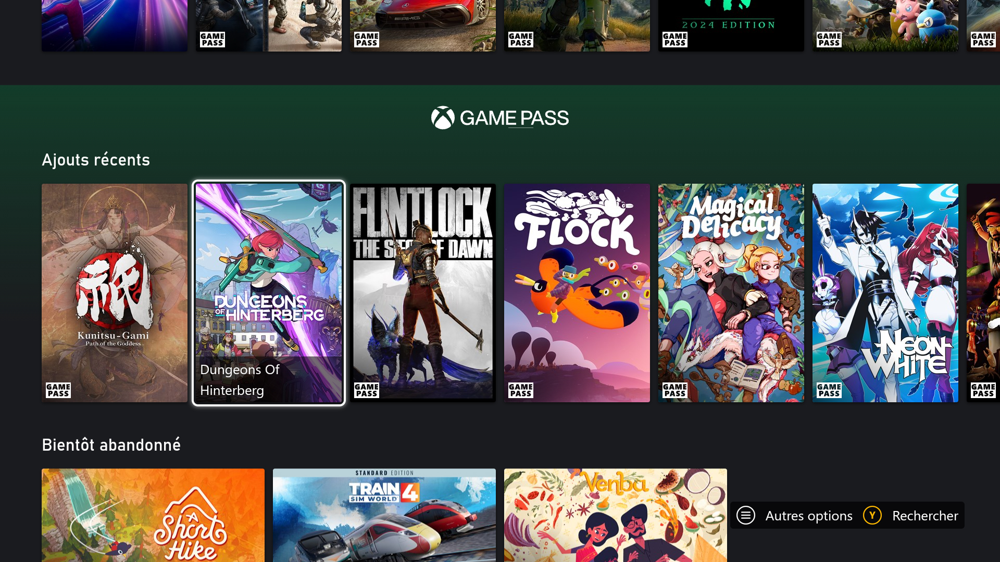
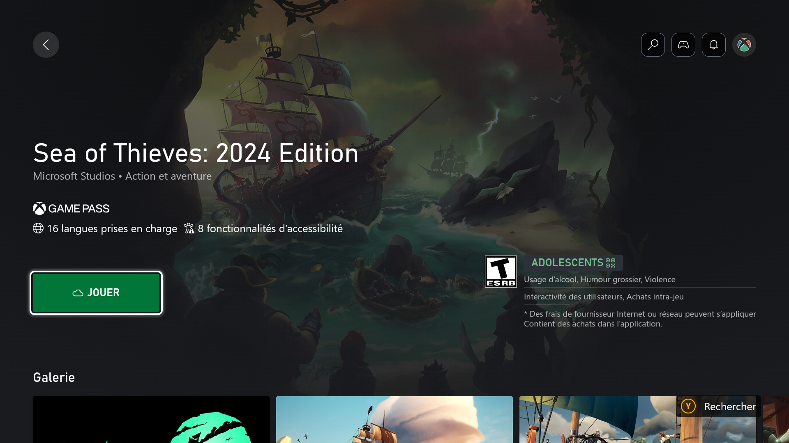
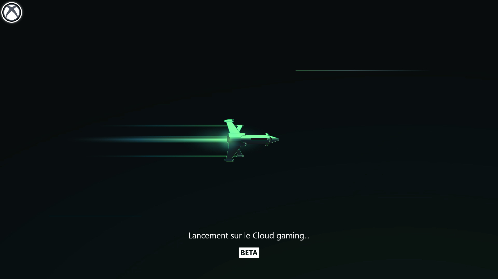
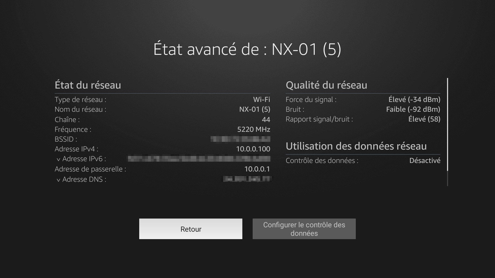
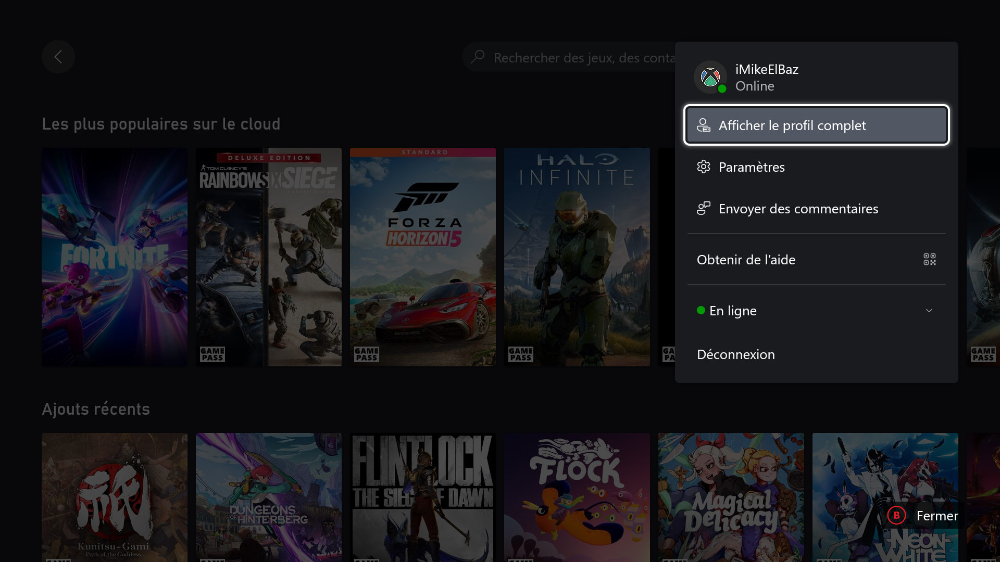
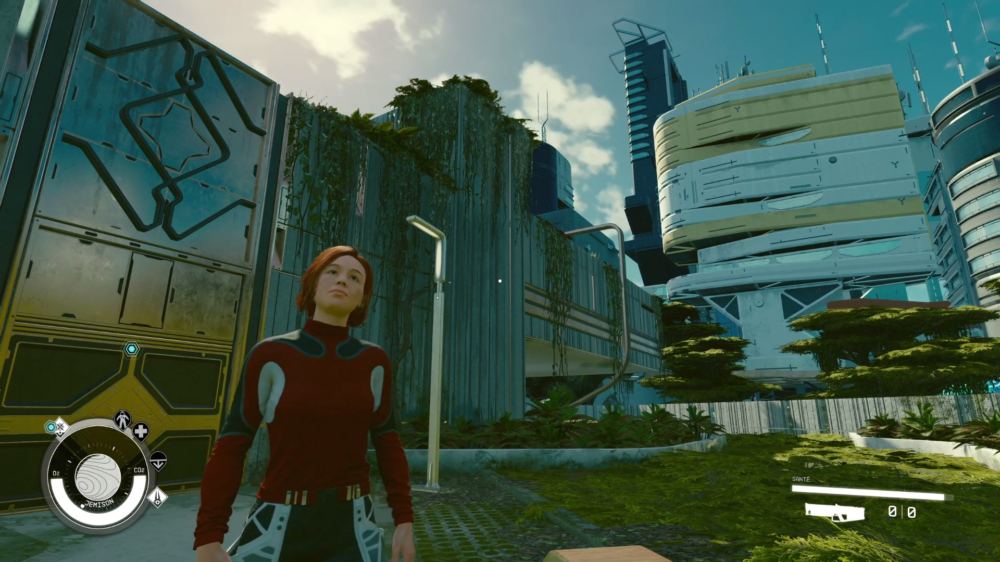

+++
title = "Test de Xbox Cloud Gaming sur le stick Fire TV d'Amazon : mieux que la Xbox ?"
date = 2024-07-29T07:00:32+01:00
draft = false
author = "Mickael"
tags = ["Test"]
type = "une"
image = "https://nostick.fr/articles/vignettes/juillet/game-pass-stick-fire-tv-9.jpg"
+++

**Qui a besoin d'une Xbox quand on a sous la main une télé, une manette, un abonnement Game Pass Ultimate, une bonne connexion web… et un Fire TV d'Amazon ? C'est la nouvelle proposition de Microsoft, qui n'a plus trop l'air de croire dans ses consoles. Et si le constructeur avait raison ?** 

À l'heure du cloud gaming, posséder un PC gaming ou une console a-t-il encore du sens ? Sans aucun doute ! Cette technologie a beau être de plus en plus efficace et fiable, elle nécessite toujours un bon réseau Wi-Fi ou une solide connexion cellulaire, ce qui n'est pas encore donné à tout le monde.

Mais Microsoft y croit, plus que jamais. Alors que [le constructeur semble se désintéresser de plus en plus de ses consoles Xbox](https://nostick.fr/articles/2024/juillet/2207-xbox-europe-aumone-pub/), il met le paquet sur le Game Pass et son service Xbox Cloud Gaming. [Disponible](https://support.xbox.com/fr-FR/help/games-apps/cloud-gaming/verified-devices-for-xbox-cloud-gaming) sur console, sur PC, sur Mac, iPhone, iPad, ou encore Android sous la forme d'application native ou depuis un navigateur web, ce qu'on appelait xCloud est aussi présent sur certaines télés connectées de Samsung ainsi que sur les casques Quest de Meta.

Et tout récemment, Microsoft a lancé son service de jeux en streaming sur les sticks Fire TV d'Amazon, au travers d'une application dédiée sobrement baptisée Xbox. L'affaire est manifestement de première importance, [au vu de la campagne marketing](https://nostick.fr/articles/2024/juillet/1707-xbox-probleme/) ! Et évidemment, il fallait bien qu'on se lance dans ce nouveau monde.

## Mais c'est quoi ce truc ?

Accéder à des centaines de jeux quasiment immédiatement, y compris les dernières nouveautés Xbox, dans les meilleures conditions, c'est la promesse du Xbox Cloud Gaming qui s'incarne depuis peu dans une app Game Pass pour les sticks TV d'Amazon. Dans le principe, lancer une partie de *Forza Horizon 5* ou de *Starfield* est aussi simple que d'installer cette application, de jumeler une manette et roule ma poule !

Bien sûr, il faut aussi un abonnement Game Pass Ultimate, le seul à intégrer le service de streaming — sauf si vous voulez jouer à *Fortnite*, auquel cas l'accès est complètement gratuit. 

Un des avantages de cette solution, c'est que les sticks Fire TV  sont infiniment plus faciles à trimballer qu'une Xbox : il suffit de les brancher sur le port HDMI de n'importe quel télé, qu'il s'agisse de celle du salon familial ou du téléviseur dans la chambre du gamin. Il est même envisageable de l'emporter dans son bagage à l'hôtel ou au Airbnb, pour peu qu'il y ait un bon Wi-Fi sur place.

L'app Game Pass est compatible avec les sticks Fire TV 4K (70 €) et 4K Max (80 €), mais ne dépensez pas autant ! Amazon les vend régulièrement en promo, comme ça a été le cas pendant les derniers Prime Days (-20 €). Quant à la manette, les modèles Xbox, DualSense ou DualShock 4 sont compatibles.

## Qu'est-ce qui est bien ?

Une fois toutes les conditions réunies, l'expérience est très proche de ce qu'on peut connaitre sur une Xbox, avec l'interface du service qui a le mérite d'aller droit au but (et de ne pas afficher de publicité, contrairement à l'écran d'accueil de la console !). J'ai pris autant de plaisir à jouer à *Forza Horizon* et à *Injustice 2* à partir du stick qu'en local, sur mon Steam Deck ou mon PC.

Microsoft a visiblement trouvé le moyen de réduire les temps de chargement qui plombaient le lancement des jeux au plus fort de *Starfield* l'an dernier. Plus besoin d'attendre des plombes pour se jeter à corps perdu dans une partie de *Doom 2016* ! Les performances graphiques m'ont semblé très correctes, même si *Starfield* tourne à 30 FPS. La latence n'a pas été un problème, même dans les jeux qui y sont très sensibles. Honnêtement, je ne m'attendais pas à ce que tout roule aussi bien !

C'est devenu un cliché, mais le Game Pass est toujours une excellente affaire pour les joueurs. Le service regorge de jeux pour tous les goûts, On y trouve aussi bien des gros AAA que des titres indépendants, en solo comme en multi (mais pas en local, on y reviendra plus bas). Le service fait aussi une belle place aux jeux rétro, avec une offre qui va s'enrichir avec le fond de catalogue d'Activision Blizzard.

Et bien sûr, on a droit aux nouveautés des studios Xbox en sortie simultanée, sans avoir à poireauter de longues minutes (heures) devant la jauge de téléchargement du jeu !

## Qu’est-ce qui est moins bien ?

La démonstration technique est plutôt impressionnante : on se retrouve à jouer avec les performances d'une « vraie » Xbox, mais contenue dans un stick bien moins encombrant que la console (et 7 fois moins cher qu'une Series X !). Mais les exigences sont telles qu'il faudra y réfléchir à deux fois avant de succomber, d'abord parce qu'il y a l'impératif de la couverture Wi-Fi à la maison.

Microsoft demande une connexion de 10 Mbps pour les smartphones, et de 20 Mbps pour les PC, les tablettes et les téléviseurs. Un réseau sur la bande de fréquence des 5 GHz est aussi chaudement recommandé (plutôt que celle des 2,4 GHz vite encombrée). Autre exigence : une latence aussi réduite que possible.

Pour le jeu en réseau, Microsoft [recommande](https://support.xbox.com/en-CA/help/hardware-network/connect-network/xbox-one-connection-speed) une latence de moins de 150 millisecondes. Mais pour le cloud gaming où les jeux ne sont pas en local, le mieux est d'avoir une latence [sous les 20 ms](https://cloudbase.gg/cloud-gaming-latency) pour profiter de la meilleure réactivité possible ; une latence comprise entre 20 et 50 ms est considérée comme bonne. Au-delà, ça devient un peu plus coton.

Malheureusement, le speedtest disponible dans le Fire TV ne mesure pas la latence, il faudra télécharger une app tierce comme Internet Speed Test ou Analiti pour en avoir le cœur net. 

Important à savoir : seuls les modèles de Fire TV 4K et Max sont compatibles avec l'app Game Pass… et uniquement la génération 2023 et au-delà. Le vieux stick qui prend la poussière derrière votre télé risque donc de ne pas prendre en charge l'application.

Ce qui nous amène au coût de cette solution. L'abonnement Game Pass Ultimate est désormais facturé 17,99 €, soit 216 € par an, ce qui représente environ 3 jeux AAA pour Xbox. La question de la valeur se pose ici très clairement, ce d'autant que s'y ajoutent les coûts du stick TV en lui-même (et marginalement celui de l'abonnement à internet, qui ne sert probablement pas qu'à ça). 

Microsoft pourrait donner un coup de pouce avec une formule du Game Pass ne proposant que l'accès Xbox Cloud Gaming, qui serait proposé à beaucoup moins cher. [La rumeur veut que l'entreprise y travaille](https://nostick.fr/articles/2024/juillet/2407-game-pass-nouvelles-formules/).

Chacun verra midi à sa porte, pour les joueurs équipés PC et/ou Xbox qui aiment picorer un nouveau jeu chaque semaine, le Game Pass Ultimate reste l'affaire du siècle malgré la hausse des prix, avec son catalogue de hits, sans oublier l'arrivée régulière de jeux « day one ». 

Reste à savoir si *Black Ops 6* sera proposé en streaming, en raison de l'accord entre Microsoft et Ubisoft qui gère toute la partie cloud gaming pour les jeux Activision Blizzard (oui, c'est compliqué). *Call of Duty: Modern Warfare III* est disponible sur le Game Pass depuis quelques jours… mais pas dans le cloud.

Ceux qui aiment poncer deux ou trois jeux chaque année préféreront probablement les acheter sur console ou sur PC, où ils bénéficieront probablement d'une meilleure qualité graphique. Car pour impressionnante que puisse être la technologie de cloud gaming, on n'obtiendra pas plus de 1080p à 60 i/s. Pas de 1440p, pas de 4K ici. Les serveurs qui moulinent les jeux à distance sont des Xbox Series X depuis [octobre 2021](https://www.theverge.com/2021/10/7/22714067/xbox-cloud-gaming-custom-xbox-series-x-hardware-upgrade#).

La qualité demeure très bonne, mais on obtiendra de bien meilleures performances avec un abonnement GeForce NOW dont la formule Ultimate (RTX 4080) pousse une image en 4K à 240i/s. Évidemment, le modèle de Nvidia est très différent du Game Pass, puisqu'ici il faut « apporter » ses jeux, autrement dit les avoir achetés au préalable sur Steam et ailleurs (et espérer qu'ils soient compatibles).

Il y a deux ans, Microsoft avait [annoncé](https://www.windowscentral.com/gaming/xbox/microsoft-gaming-ceo-phil-spencer-says-the-ability-to-buy-games-and-play-through-xbox-cloud-gaming-is-still-on-the-way) qu'il sera possible de jouer à un jeu déjà acheté, à la manière de GeForce NOW, mais cette option n'a toujours pas été lancée. Peut-être que cela finira par arriver avec ce fameux abonnement dédié cloud ?

Autre limite qui pourrait être un obstacle infranchissable pour de nombreux joueurs : le jeu multi en local n'est pas disponible. Xbox Cloud Gaming, c'est pour les aventures en solo !

## C’est oui ou c’est non ?

Xbox Cloud Gaming peut-il remplacer une Xbox ? On en est loin. Une console en fait toujours plus que le service de streaming : pas besoin d'un Wi-Fi en forme olympique, les performances graphiques sont meilleures (la Series X monte jusqu'à 4K), on peut y jouer à plusieurs sur le canapé, et puis l'offre de jeux disponible sur consoles est bien supérieure à ce que propose le Xbox Cloud Gaming — bon courage pour jouer à *Baldur's Gate 3* ou *Devil May Cry 5* sur xCloud.

Si vous avez souscrit au Game Pass Ultimate, il y a des chances que vous ayez déjà un PC et/ou une Xbox à la maison. Le service Xbox Cloud Gaming n'est là que pour tester une nouveauté sans avoir à la télécharger, ou encore pour équiper une télé esseulée. En l'état, personne n'irait recommander la formule Ultimate uniquement pour jouer en streaming.

Les choses pourraient changer si Microsoft devait lancer un hypothétique abonnement « cloud », si possible à un prix sous les 10 €, et avec la possibilité d'acheter et de jouer à des titres qui ne sont pas au catalogue du service. En attendant, c'est une option supplémentaire (et mine de rien, de qualité) qui complète l'offre de divertissement du Fire TV, aux côtés de Netflix, YouTube, Prime Video et consorts. C'est déjà pas mal, mais ça pourrait être tellement plus !

 