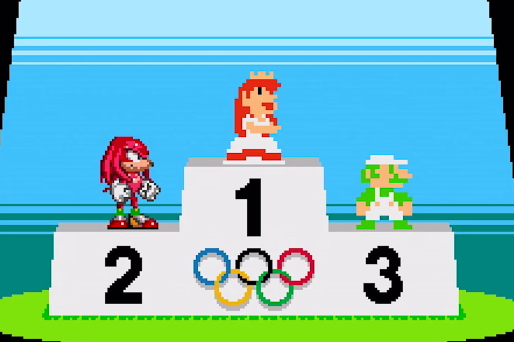

+++
title = "Paris 2024 : Mario & Sonic hors qualifs' pour les Jeux olympiques"
date = 2024-07-30T14:47:32+01:00
draft = false
author = "Mickael"
tags = ["Actu"]
image = "https://nostick.fr/articles/vignettes/nostick.jpg"
+++

Vous en avez probablement entendu parler, en ce moment les Jeux olympiques battent leur plein à Paris ! Mais s'il est beaucoup question des exploits sportifs des athlètes du monde entier, il n'y a pas grand chose à se mettre sous la dent et entre les mains pour célébrer l'événement, si ce n'est le free-to-play mobile *[Olympics Go! Paris 2024](https://olympics.com/ioc/news/ioc-launches-innovative-paris-2024-mobile-game-ahead-of-olympic-games)* qui n'a vraiment pas l'air terrible — mais qui a reçu le sceau officiel du CIO.

Mais évidemment, ce qu'attendaient tous les joueurs, c'est un nouvel opus de la série *Mario & Sonic* qui, depuis 2007 déclinait les aventures des deux mascottes aux JO. Hélas, le dernier titre en date, *Mario & Sonic at the Olympic Games Tokyo 2020*, est bien l'ultime opus. Même si ces jeux développés par Sega et édités par Nintendo ne sont pas des chefs d'œuvre, ils ont connu un succès tout à fait honorable.

 

Le CIO a décidé de ne pas renouveler la licence des JO auprès de Nintendo et de Sega, selon Lee Cocker, un ancien de chez ISM Ltd, une société de marketing en charge de la gestion des licences vidéoludiques des Jeux. « *[Le CIO] voulait travailler avec d'autres partenaires* », explique-t-il auprès d'*[Eurogamer](https://www.eurogamer.net/olympics-ditched-mario-sonic-series-to-explore-nfts-and-esports)*. Les organisateurs des JO s'intéressaient aussi à l'esport… et aux NFT ! *Olympics Go!* est bourré de ces JPG non fongibles sans intérêt.

Le comité est aussi à l'origine de l'organisation du tournoi olympique inaugural de l'esport qui se tiendra l'année prochaine en Arabie saoudite. « *En gros, le CIO voulait ramener [les jeux vidéo] en interne et tester d'autres partenaires afin de gagner plus d'argent* », résume celui qui a travaillé sur presque tous les épisodes de *Mario & Sonic*, qui ne joueront donc pas les touristes à Paname pour les XXXIIIe Olympiades.