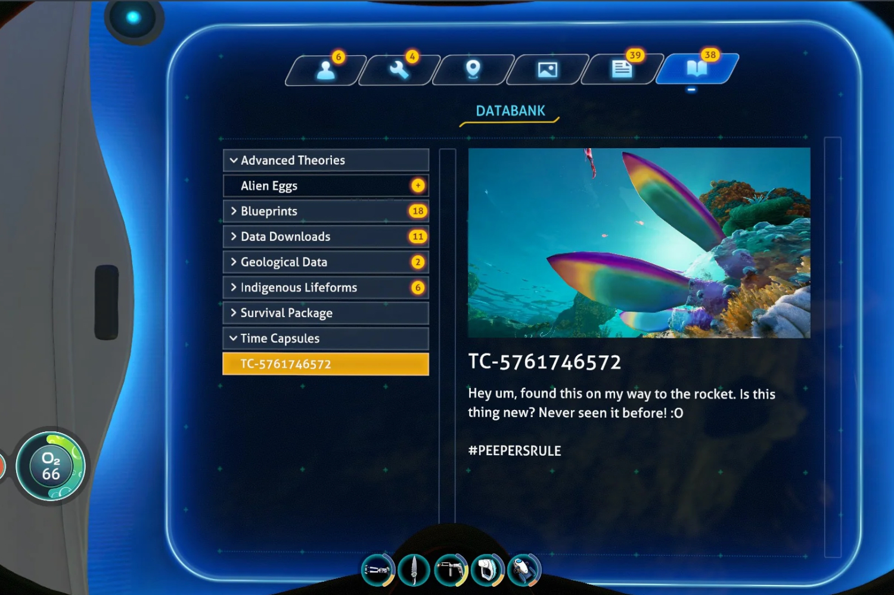

+++
title = "Subnautica 1 cache des surprises pour Subnautica 2"
date = 2024-07-30T08:00:32+01:00
draft = false
author = "Mickael"
tags = ["Actu"]
image = "https://nostick.fr/articles/vignettes/juillet/Subnautica.jpg"
+++

Les développeurs de *Subnautica* sont des petits malins ! Ils ont en effet glissé dans le jeu des captures d'écran de *Subnautica 2*, attendu l'année prochaine. À un joueur du premier opus qui s'étonnait de ne jamais avoir vu la créature présente dans une time capsule, un modérateur du Reddit officiel du jeu a [confirmé](https://www.reddit.com/r/subnautica/comments/1e4vn00/comment/leuop67/) qu'il s'agissait bien d'une bestiole que l'on retrouvera dans le deuxième opus !

La créature en question ressemble à une sorte de long têtard arc-en-ciel, ce qui a intrigué la petite communauté autour du jeu qui n'avait jamais vu un tel poisson ! Et pour cause. Certains ont avancé qu'il pouvait s'agir d'un mod (ce qui est possible avec *Subnautica*). La confirmation du modérateur, et surtout sa petite [phrase](https://www.reddit.com/r/subnautica/comments/1e4vn00/comment/ldi739e/) « *Il pourrait y en avoir d'autres, ou pas* », a lancé les joueurs dans une nouvelle chasse aux trésors !

Quant à la suite, les développeurs de chez Krafton se montrent très discrets. On sait simplement que *Subnautica 2* sortira en 2025, et qu'il ne s'agira pas d'un jeu service, sans plus de précision. Le premier jeu et sorti en 2018 et s'il commence à accuser le poids des ans, il n'en demeure pas moins un excellent survival sous-marin.