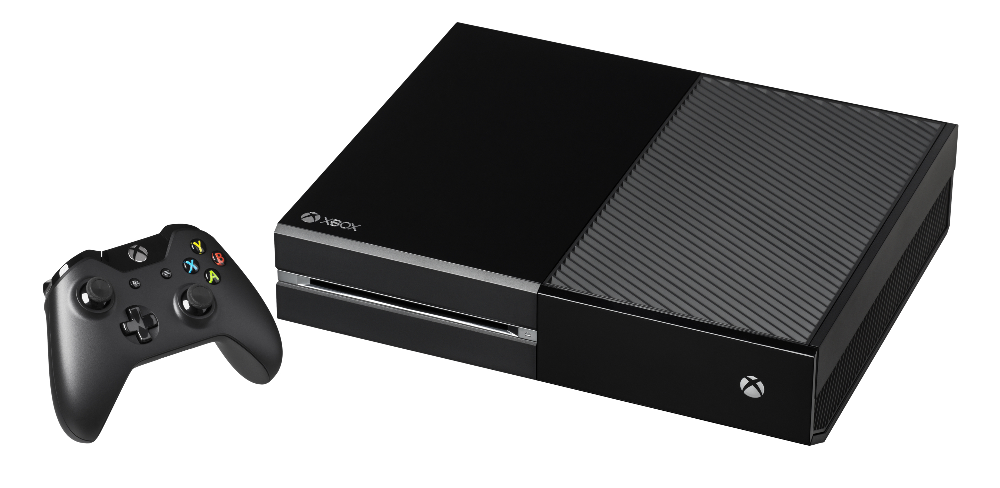

+++
title = "Des Xbox One « VCR » de 2013 en panne d'internet"
date = 2024-07-30T07:00:00+01:00
draft = false
author = "Mickael"
tags = ["Actu"]
type = "telex"
+++
Voilà un bug étrange auquel Microsoft va devoir s'atteler rapidement. Certaines Xbox One « VCR » de 2013, autrement dit la première version d'avant la révision matérielle de 2016 (Xbox One S), ne peuvent plus se connecter internet selon *[Digital Foundry](https://www.eurogamer.net/digitalfoundry-2024-df-weekly-original-xbox-one-consoles-failing-to-update-disabling-most-console-functionality)*. Tout fonctionne, sauf l'accès au web ce qui est toujours embêtant pour les modes en ligne (pas de Xbox Live) ou pour les achats qui requièrent une identification sur internet (à moins que la console ait été configurée avec le compte principal de l'utilisateur).

Le gros souci, c'est lors de la revente (ou du don) de la console : après avoir effectué une restauration avec les réglages d'usine, l'appareil est complètement briqué. Et sans internet, pas de mise à jour possible, pas de téléchargement, et il n'est même pas possible d'installer quoi que ce soit à partir d'une clé USB.

Le critère qui distingue une Xbox One défectueuse d'une autre qui ne rencontrera pas de problème étant inconnu, il est impossible de savoir combien d'unités sont touchées. Maintenant que l'affaire s'étale sur les interwebs, Microsoft va certainement se pencher dessus et trouver une solution, du moins on peut l'espérer.