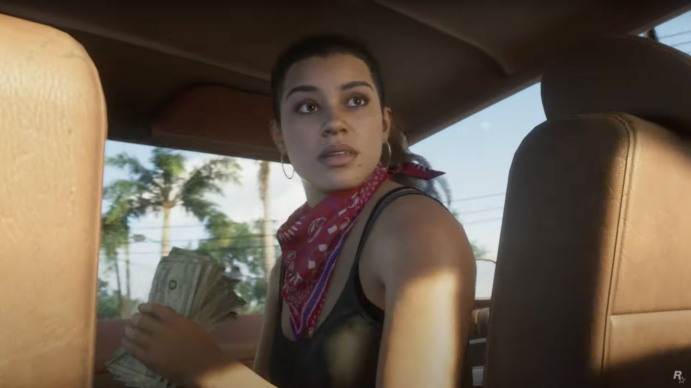

+++
title = "Il ne faudrait pas s'attendre à un bouleversement technique pour GTA VI"
date = 2024-07-31T14:03:32+01:00
draft = false
author = "Mickael"
tags = ["Actu"]
type = "telex"
+++ 

*GTA VI* ne devrait pas être le bond technologique qu'a été le passage entre *GTA IV* et *GTA V*, selon Obbe Vermeij, l'ancien directeur technique de Rockstar North. On peut avoir le souffle coupé par les séquences de plage vues dans le trailer du futur opus, mais « *il est plus difficile* » de faire mieux que la dernière fois, explique-t-il chez *[SanInPlay](https://www.youtube.com/watch?v=XpF3lMqgPSw)*.

« *Par exemple, la différence entre la PlayStation 1 et la PlayStation 2 était énorme, et entre la PlayStation 4 et la PlayStation 5, ce n'est pas si grand, non  ?* ». Il y a donc des chances que le saut technologique ne soit pas immense entre *GTA V* et *GTA VI*, ce d'autant que *GTA V* n'a pas arrêté d'être mis à jour et amélioré depuis sa sortie en 2013.

Pour Obbe Vermeij, qui admet qu'il n'en sait rien au fond, « *GTA VI ne sera pas radicalement différent de GTA V* ». On en aura le cœur et les yeux nets à l'automne 2025.