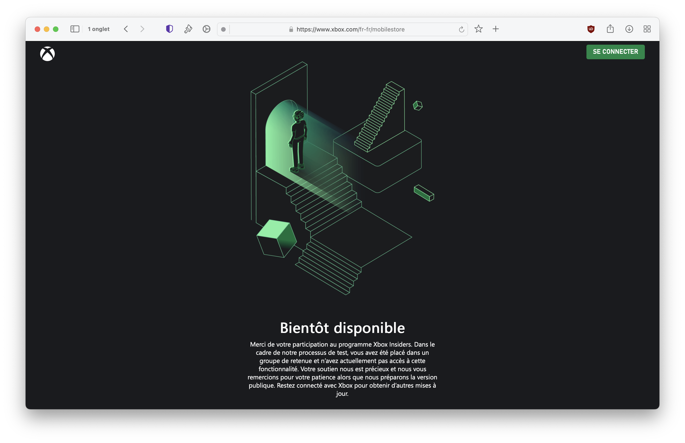

+++
title = "Microsoft ne devrait plus trop tarder à présenter sa boutique mobile"
date = 2024-07-31T17:25:01+01:00
draft = false
author = "Félix"
tags = ["Actu"]
image = "https://nostick.fr/articles/2024/juillet/3107-microsoft-ne-devrait-plus-trop-tarder-boutique-mobile/vignettos.png"
+++ 

 

Ça avance du côté du Xbox Mobile Store. Cela fait maintenant plusieurs années que Microsoft fait miroiter une boutique d’apps pour mobile, qui vient de se concrétiser un peu plus : [une page officielle](https://www.xbox.com/fr-fr/mobilestore) a été mise en ligne sur Xbox.com. Certes, elle ne nous apprend rien, mais au moins les choses bougent.

La page indique que cette boutique mobile devrait dans un premier temps être réservée aux membres « Xbox Insiders ». « *Votre soutien nous est précieux et nous vous remercions pour votre patience alors que nous préparons la version publique* », est-il écrit sous un dessin représentant un joueur dans un graphique qui n’est pas sans évoquer les escaliers d’Escher. Malheureusement, aucun bouton pour s’inscrire ou être tenu au courant.

C’est un maigre indice alors que le temps presse pour Microsoft, qui avait promis de lancer sa boutique mobile en juillet. Plus tôt dans l’année, la présidente de Xbox Sarah Bond  avait annoncé une échoppe 100 % en ligne dans un premier temps afin d’être massivement disponible (même sur iOS où Apple est particulièrement casse-pieds). On devrait y trouver les hits mobiles de la boîte, à savoir *Minecraft* et *Candy Crush*. Pas grand-chose à ajouter pour le moment, mais on peut imaginer que le lancement ne devrait plus trop tarder. 