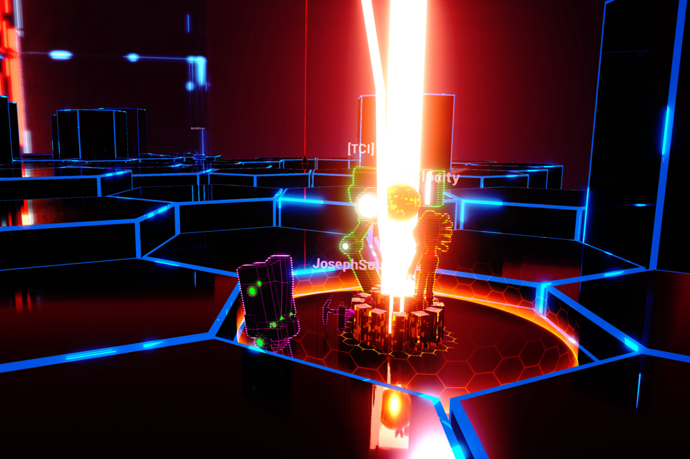

+++
title = "Quantum Lock supprimé de Steam, les développeurs ont perdu le code source"
date = 2024-07-31T09:47:32+01:00
draft = false
author = "Mickael"
tags = ["Actu"]
image = "https://nostick.fr/articles/vignettes/juillet/quantum-lock.jpg"
+++

FAITES DES SAUVEGARDES BON SANG DE BOIS ! C'est l'enseignement que nous pouvons tous tirer, oui même toi Félix, de la mésaventure arrivée au studio Fat Bomb. Ce dernier a dû retirer son jeu *Quantum Lock* de Steam. Il est toujours [présent](https://store.steampowered.com/app/411720/Quantum_Lock/) dans la boutique, mais il est impossible de l'acheter. En cause ? « *Nous n'avons plus accès au code source* », expliquent les développeurs penauds, qui ajoutent qu'ils sont dans l'impossibilité de modifier le jeu ou d'y apporter des correctifs. Oups.

*Quantum Lock* est sorti en 2015 ; c'était le premier jeu de Fat Bomb, et l'honnêteté recommande de dire qu'il n'a jamais vraiment le succès, avec un maximum de 10 joueurs en simultané. Après avoir constaté que le titre ne présentait aucun bug apparent, l'équipe est partie sur d'autres projets. Il y a quelques semaines, Aaron Leaton le confondateur du studio a rouvert le dossier du jeu, avec dans l'idée de remettre la main sur des assets en vue de créer une nouvelle map pour *Light Bearers 2*, sa nouvelle création.



C'est là qu'il a découvert que *Quantum Lock* était bourré de bugs et de problèmes « *si évidents maintenant* », comme il l'explique à *[PCGamer](https://www.pcgamer.com/games/indie-studio-pulls-game-from-steam-after-realizing-it-lost-the-source-code-we-lacked-both-the-knowledge-and-resources/)*. Il s'est effectivement passé 8 ans depuis, de quoi en apprendre un peu plus sur l'art délicat du développement de jeux. Le gros souci, c'est qu'il ne pouvait plus rien faire, le code source du jeu ayant disparu corps et biens.

« *À l'époque du développement de Quantum Lock, nous n'avions aucune routine pour sauvegarder nos données, à part les mettre sur un disque dur portable* », indique-t-il. Et ce fameux disque a été perdu. « *Nous manquions à la fois de connaissances et de ressources pour pouvoir héberger des données sur un serveur local ou dans le cloud* ».

Les choses ont bien changé depuis, une stratégie de sauvegarde a été mise en place avec un serveur en local et des sauvegardes dans deux endroits différents. Mais aucune solution n'a été trouvée pour *Quantum Lock*, à la grande tristesse des archivistes du jeu vidéo. Pour les développeurs qui se lancent, Aaron Leaton a deux choses importantes à dire : « *votre premier jeu va sûrement faire un flop* » car « *personne n'est bon dans rien au début* » ; et « *utilisez Google Drive pour vos sauvegardes* » !