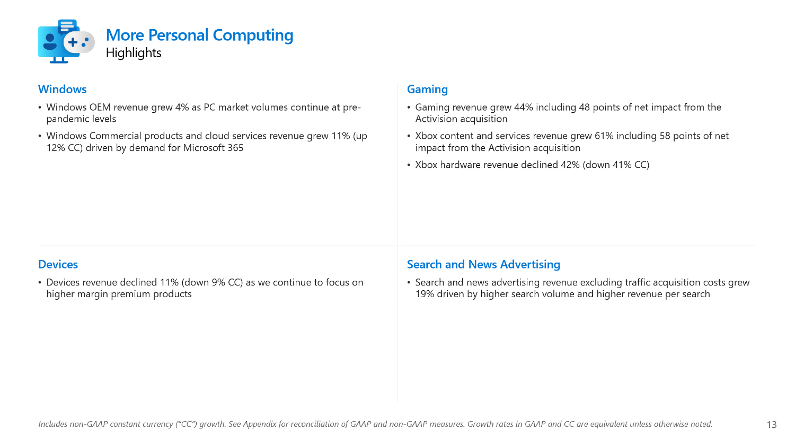

+++
title = "Les ventes de Xbox coulent à pic"
date = 2024-07-31T11:47:32+01:00
draft = false
author = "Mickael"
tags = ["Actu"]
image = "https://nostick.fr/articles/2024/juillet/3107-ventes-xbox-coulent-pic/xbox.jpg"
+++

")

Il ne doit pas se vendre des masses de Xbox, il s'en est vendu *encore moins* au printemps ! Microsoft a [publié](https://view.officeapps.live.com/op/view.aspx?src=https://c.s-microsoft.com/en-us/CMSFiles/SlidesFY24Q4.pptx?version=d1825a39-c7b8-f75f-fe23-275f2be198cc) les résultats pour son quatrième trimestre fiscal, qui recouvre la période d'avril à fin juin. Et pour l'activité consoles, le couperet est fin et tranchant : les ventes ont flanché de 42 % par rapport à l'an dernier !

Pour des consoles en milieu de vie qui sont encore loin d'avoir donné tout leur jus, c'est évidemment très mauvais. Les chiffres de vente ont été dans le rouge tout au long de l'année fiscale de Microsoft, exception faite du trimestre des fêtes de fin d'année (un modeste +3 %). Pour le reste, on oscille entre -7 % (premier trimestre), -31 % (troisième trimestre) et -42 % donc.

La fin de l'année calendaire peut-elle redresser la barre de ce bateau ivre ? L'automne sera marqué par [le lancement d'une nouvelle Series X blanche sans lecteur optique](https://nostick.fr/articles/2024/juin/0906-microsoft-revoit-sa-gamme-xbox/), et moins chère. Mais contrairement à la PS5 Pro attendue elle aussi dans les parages, cette Xbox n'affichera pas de gain de performances. 

Ceux qui ont déjà une Xbox ne risquent donc pas de repasser à la caisse ; et puisque le groupe a manifestement décidé de [couper dans les budgets pub (en Europe, du moins)](https://nostick.fr/articles/2024/juillet/1207-microsoft-xbox-pub-europe/), ce nouveau modèle ne risque pas d'attirer l'attention des clients potentiels.

Si ça continue de sentir mauvais pour les consoles, en revanche les ventes de jeux se portent bien avec une progression de 44 % par rapport à l'an dernier où Activision Blizzard n'était pas encore tombé dans l'escarcelle de Microsoft. L'éditeur est le plus gros contributeur de cette progression avec 48 points. L'activité « contenus et services » de Xbox (le Game Pass) nage dans les dollars, avec un chiffre d'affaires en hausse de 61 % par rapport à l'an dernier, mais là aussi Activision représente le gros de cette progression (58 points).

Autrement dit, sans l'apport des jeux Activision, cette activité aurait augmenté de 3 % seulement. Les prochains mois devraient être plus agitée du côté des studios Xbox (hors Activision), avec de grosses sorties attendues comme *Indiana Jones*. Globalement, la division More Personal Computing, qui inclut Xbox mais aussi Windows, affiche une augmentation de 14 %, avec 15,9 milliards de dollars.

