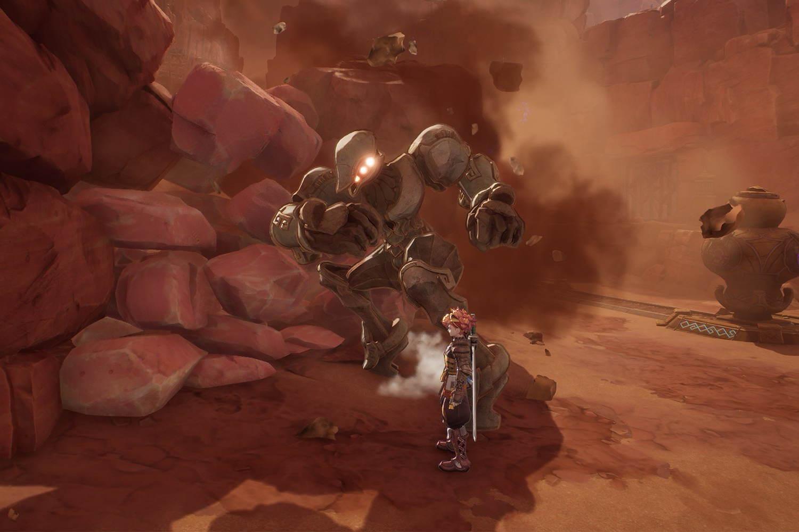

+++
title = "Un avant goût de Visions of Mana pour tenir jusqu'à la sortie du jeu"
date = 2024-07-31T08:27:32+01:00
draft = false
author = "Mickael"
tags = ["Trailer"]
image = "https://nostick.fr/articles/vignettes/juillet/visions-of-mana.jpg"
+++

Square Enix savait que les fans de la saga Mana, débutée en 1993 sur la NES avec *Secret of Mana*, n'en pouvaient plus d'attendre ce nouvel opus *Visions of Mana* — premier nouveau jeu depuis 15 ans ! Alors plutôt que de continuer à faire poireauter les aventuriers jusqu'au jour de lancement (la libération est pour le 29 août), l'éditeur a lâché une bande annonce et surtout, une démo !

 

La démo de *Visions of Mana* est disponible sur presque toutes les [plateformes](https://mana.square-enix-games.com/fr) (PS4/PS5, Xbox Series S/X, Steam). Elle offrira un petit avant-goût de ce à quoi s'attendre : un peu de combat, un peu d'exploration, un peu d'histoire (on visitera le premier chapitre). Hélas, la progression ne sera pas sauvegardée vers le jeu complet, il faudra tout refaire.

Le blog PlayStation propose d'en [savoir](https://blog.fr.playstation.com/2024/07/29/visions-of-mana-nouveaux-details-sur-trois-reliques-spirituelles-plus-une-video-qui-plonge-en-profondeur-dans-le-jeu/) un peu plus sur le jeu avec Ryosuke Yoshida, le directeur de *Visions of Mana*, notamment les Reliques spirituelles qui équipent la fine équipe du joueur et qui permet de bananer du monstre comme qui rigole.