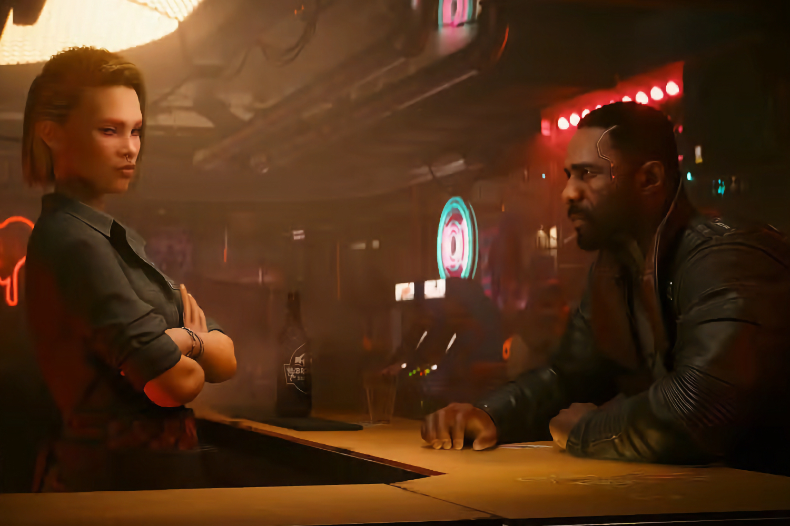
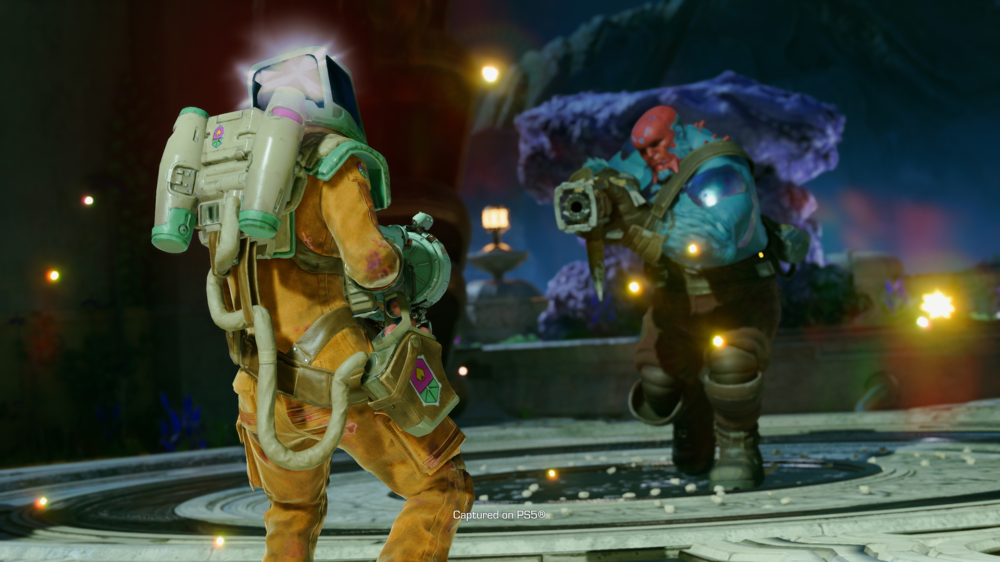
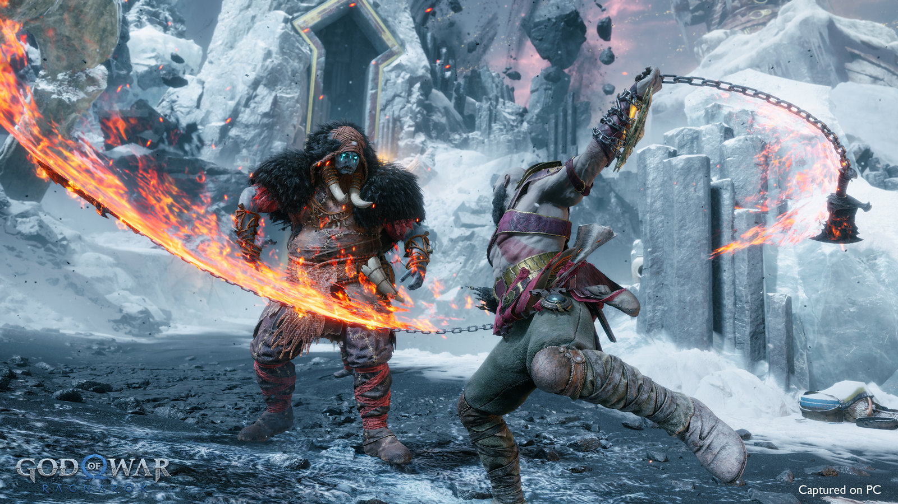
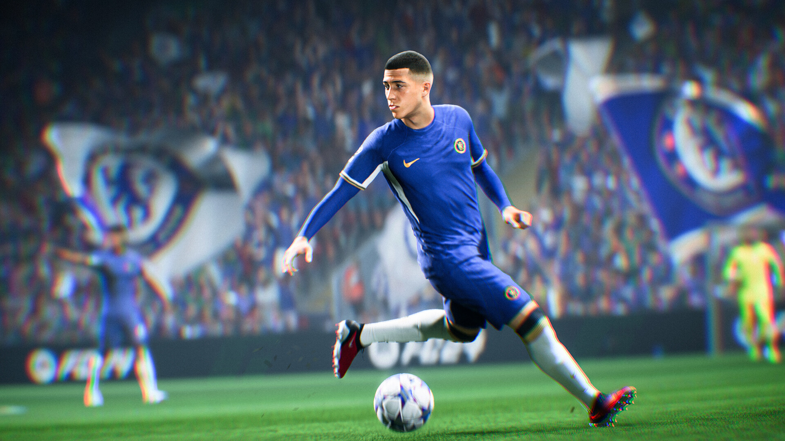
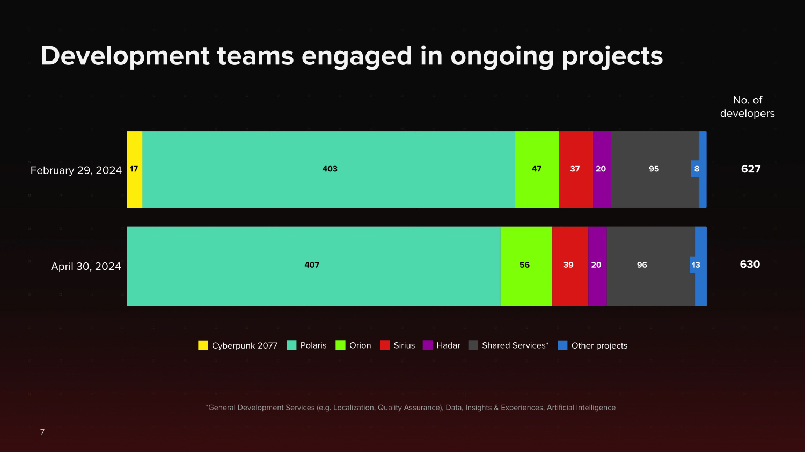

+++
title = "Bucolique, évangélique, un peu cyclothymique : la folle semaine du jeu vidéo (01/06)"
date = 2024-06-01T11:31:32+01:00
draft = false
author = "Mickael"
tags = ["Actu"]
image = "https://nostick.fr/articles/vignettes/Cyberpunk.jpg"
+++

L’actualité du jeu vidéo ne s’arrête pas à la poignée d’articles publiés sur *Nostick* ! Histoire de rattraper le retard accumulé, voici un retour rapide sur quelques unes des infos les plus importantes (ou insignifiantes) de la semaine.

## Les hauts et les bas de Sony

La semaine avait mal commencé pour Sony, qui a dû [supprimer une interview de Neil Druckmann de son site](https://nostick.fr/articles/2024/mai/2905-ivre-sony-invente-declarations-neil-druckmann/) après avoir inventé de toutes pièces des propos du créateur de *The Last of Us*. Fort heureusement, le constructeur avait aussi [des bonnes nouvelles à partager sur la santé financière de PlayStation](https://nostick.fr/articles/2024/mai/3005-pas-si-mal-pour-playstation/)… sans oublier, évidemment, [le State of Play avec sa myriade de nouveaux jeux PC (et PS5)](https://nostick.fr/articles/2024/mai/3105-sony-paquet-pc/).

Et de jeux PC, il en a été question pendant la petite causerie d'Hermen Hulst et Hideaki Nishino, les deux nouveaux big boss de Sony Interactive Entertainment (SIE), qui occupent le poste précédemment tenu par Jim Ryan parti à la retraite fin mars. Ils ont discuté de la stratégie PlayStation pendant un briefing ce jeudi, et le PC en fait clairement partie.

Tout d'abord pour tout ce qui est jeu service. *Helldivers 2* est le modèle à suivre : le TPS coop est sorti en même temps sur PS5 et sur PC, et ça a été un carton atomique avec 12 millions de copies vendues en quelques semaines. À l'avenir, les futurs jeux PlayStation infusés aux micro-transactions — dont *Concord* le 12 août — seront lancés sur les deux plateformes simultanément.

En revanche, les jeux solo à la *God of War* ou *Spider-Man*, véritables signatures de la marque, resteront des exclusivités PlayStation au moins pendant un temps. « *Avec nos titres phares, nos jeux solo ou narratifs qui constituent l'épine dorsale de ce que PlayStation Studios a livré ces dernières années et dans notre histoire, nous adoptons une approche plus stratégique* », a [détaillé](https://www.videogameschronicle.com/news/sony-hopes-to-entice-pc-players-to-ps5-by-releasing-tentpole-games-for-console-first/) Hermen Hulst, le patron des studios PlayStation.

Sony va continuer à adapter ses gros jeux AAA sur PC, mais il y aura un délai avec la version PlayStation, comme ça sera le cas pour *God of War Ragnarok* (les nouvelles aventures de Kratos sortiront sur PC deux ans après les PS4/PS5). Il s'agit de présenter ces grandes franchises à un nouveau public qui pourrait par la suite jouer aux suites de ces franchises « *sur la plateforme PlayStation* », espère-t-il.

Ce qui est vrai pour le PC l'est aussi pour la télé et le cinéma. Bon, l'adaptation de *Gran Turismo* ([rappelez-vous cette horreur](https://www.metacritic.com/movie/gran-turismo/)) n'a probablement donné envie à personne de prendre le volant de la simulation de bagnoles. On peut toutefois penser que le carton atomique de *The Last of Us* sur *HBO* a dû aider à vendre quelques copies supplémentaires du jeu.

Mais puisque les jeux PlayStation finissent par sortir sur PC, les joueurs ne seront-ils pas tentés de se contenter de leurs bonnes vieilles tours ? « *La console est une plateforme technologique que nous construisons en partant de zéro* », rappelle Hideaki Nishino, responsable Experience Platform. « *La valeur de la console continuera de persister et notre mission est de continuer à la perfectionner* ».

Et sur mobile ? PlayStation a tenté à plusieurs reprises de se lancer sur ce marché mais la sauce n'a jamais pris. Alors que Xbox peut désormais compter sur King (*Candy Crush*) et Activision (*Call of Duty Mobile*) pour faire les poches des joueurs mobiles, Sony en est encore à essayer de trouver sa place dans ce secteur extrêmement lucratif.

« *Nous adoptons une approche un peu plus mesurée par rapport à notre stratégie plus agressive sur PC* », a [expliqué](https://www.videogameschronicle.com/news/playstation-boss-very-excited-about-upcoming-mobile-games/) Hermen Hulst. « *Le PC est évidemment plus proche du cœur de notre développement que le mobile* », poursuit-il. Sony joue la carte de la prudence et de la complémentarité en travaillant avec des studios qui ont l'habitude des plateformes mobiles, comme NCSoft (Nintendo fait d'ailleurs de même pour ses jeux mobiles). Le groupe a également mis en place une équipe en interne chargée de développer des jeux pour iOS et Android.

Alors demain, pourquoi pas un *God of War* sur iPhone ? Après tout, on peut déjà jouer au remake de *Resident Evil 4* et à *Death Stranding* sur les derniers jouets d'Apple.

## La FIFA trouve son nouveau champion

Qui sera le prochain éditeur à porter fièrement le maillot FIFA sur son jeu de foot ? Pendant des années, c'est EA qui a eu ce privilège (contre un gros chèque versé aux instances européennes du ballon rond), mais le partenariat a pris fin l'an dernier. Ça n'a pas trop gêné *EA Sports FC 24* qui, malgré l'absence d'étiquette « FIFA », caracole en tête des classements des ventes de jeux.

Electronic Arts a même fait [savoir](https://ir.ea.com/press-releases/press-release-details/2023/EA-SPORTS-FC-24-Sees-Massive-Fan-Engagement-to-Kick-Off-New-Era-of-Football/default.aspx) que malgré un nom alambiqué, sa simulation avait atteint 11,3 millions de joueurs une semaine après son lancement, soit 1 million de plus que *FIFA 23*. Même pas peur ! Dès la fin du contrat avec EA, la FIFA s'est mise en quête d'un nouveau studio pour reprendre le flambeau. Et il n'est pas impossible que la fédé ait trouvé son champion.

Rien n'a encore été officialisé, mais il [semble](https://x.com/MikeStrawMedia/status/1794529425247109424) bien que 2K soit  l'heureux élu, d'après Mike Straw d'*Insider Gaming*. Le fuiteur MohPlay [ajoute](https://x.com/mohplay_inc_/status/1793985090231451777) que l'on devrait voir le premier jeu estampillé FIFA 2K25 dès cette année ! L'éditeur étant un spécialiste des jeux de sports, ça n'étonnera personne qu'il ait voulu se frotter à la célèbre licence, et voulu la rentabiliser au plus vite.

Le genre des simus de foot devrait donc s'enrichir très rapidement d'un nouveau joueur, en plus d'*EA Sports FC* et de l'*eFootball* de Konami. Y a t-il de la place pour un troisième larron sur ce terrain bien encombré ?

## C'est bel et bien terminé pour Cyberpunk 2077

Voilà une bonne chose de faite. Le studio CD Projekt en a définitivement terminé avec *Cyberpunk 2077* : plus aucun développeur de l'entreprise ne [travaille](https://www.cdprojekt.com/en/wp-content/uploads-en/2024/05/cd-projekt-group-presentation-q1-2024.pdf) sur le jeu ! C'est une première en dix ans, et il est à peu près certain que CD Projekt ne reviendra plus dessus à moins d'une grosse faille de sécurité à boucher.

Après la livraison en septembre dernier de *Phantom Liberty*, seul et unique DLC du jeu, ainsi que de la grosse mise à jour 2.0, le nombre d'employés assignés à *Cyberpunk* s'était réduit comme peau de chagrin (ils n'étaient plus que 17 fin février). Tous les esprits sont maintenant occupés à la suite, alias le projet Orion, qui est en développement à l'antenne de Boston.

Mais *Cyberpunk 2* n'est pas le seul titre qui mitonne chez CD Projekt (et on espère que le studio ne bâclera rien, contrairement au premier volet au lancement catastrophique). Il y a un autre projet Polaris, actuellement développé en Europe, sans oublier le remake du premier *The Witcher*. Michał Nowakowski, le patron du studio, a indiqué durant les résultats trimestriels que la société entendait accélérer la cadence de sortie de ses jeux. Peut-être qu'avec des implants cybernétiques, ça ira plus vite.

## Xbox met la main sur le nouveau projet des créateurs de Batman Arkham

Alors que Rocksteady s'enfonce chaque jour davantage dans le caca de *Suicide Squad*, Xbox s'est arrangé la publication et probablement l'exclusivité du premier jeu de la nouvelle entreprise fondée par Sefton Hill and Jamie Walker, les co-fondateurs du studio créateur de l'Arkhamverse.

C'est du moins le bruit de couloir [partagé](https://exputer.com/news/xbox/hundred-star-xbox-aaa-project/) par le site *eXputer*  qui a habituellement de bonnes sources. Le studio en question, Hundred Star Games, n'a pas été officiellement annoncé mais il a bel et bien été créé par Hill et Walker en janvier, à Londres. Il existe même [un site web](https://www.hundredstar.games/).

D'après les quelques documents officiels qui trainent, cette jeune pousse a l'ambition de rassembler une centaine de vétérans et de talents émergents du jeu vidéo. Le studio veut se faire une place sur le redoutable créneau du jeu AAA, et on imagine bien que les sous de Microsoft ne seront pas de trop. Leur première production émargera dans cette catégorie et il coche d'ores et déjà toutes les cases : jeu action/aventure en solo, sous Unreal Engine 5.

Le pedigree des deux fondateurs, qui ont bien sûr été des pivots pour la saga Batman Arkham, fait d'Hundred Star Games un acteur à suivre de très près. Reste à voir maintenant ce qui va en sortir, et quand : les triple A demande beaucoup de temps en cuisin, mais Xbox a fait un pari sur l'avenir.

## Des huées pour l'abonnement à Rainbow Six Siege

Ubisoft tente régulièrement l'aventure du jeu service, et se plante tout aussi régulièrement : *Skull & Bones*, *The Division*, *Ghost Recon: Breakpoint*… Difficile de trouver la formule qui marchera à tous les coups. Et pourtant, l'éditeur compte une réussite dans ce domaine avec *Rainbow Six Siege* qui, depuis quasiment dix ans, peut compter sur une solide communauté de joueurs — à tel point qu'il a battu son propre de joueurs en simultané sur Steam au mois de mars, avec 201 000 amateurs.

 

Avec un tel succès entre les mains, on pouvait espérer qu'Ubisoft fera tout son possible pour éviter de casser son jouet. Mais évidemment, c'est mal connaitre l'entreprise qui a lancé… un abonnement payant : pour 10 $ par mois, l'abonnement R6 promet tout un tas de babioles pour les fans hardcore, dont l'accès au battle pass, des skins, des crédits…

L'annonce a provoqué la colère des fans qui ont [hué](https://www.tiktok.com/@royzagaming/video/7373343581811133704) l'annonce lors de sa présentation durant l'événement BLAST R6 [Major Manchester](https://www.ubisoft.com/de-de/esports/rainbow-six/siege/news-updates/7zKCcXO9gwBPjIWQ0KsLww/welcome-to-the-blast-r6-manchester-major). Certes, il s'agissait de la vidéo préenregistrée ci-dessus, mais tout de même, ça la fout mal. Les huées sont-elles arrivées jusqu'aux oreilles d'Ubisoft ?