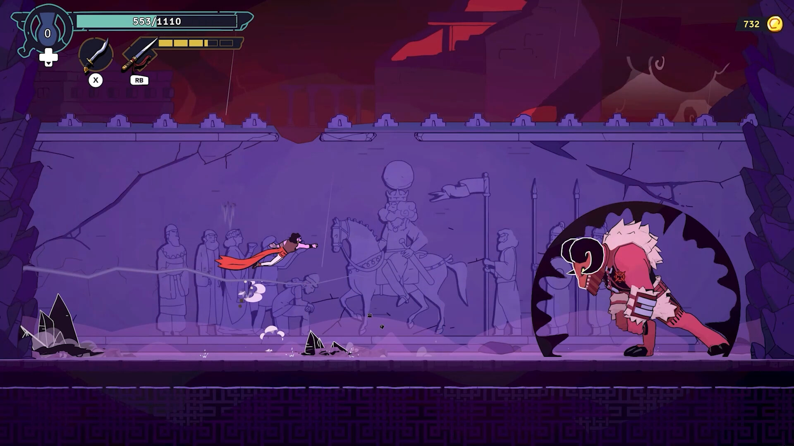
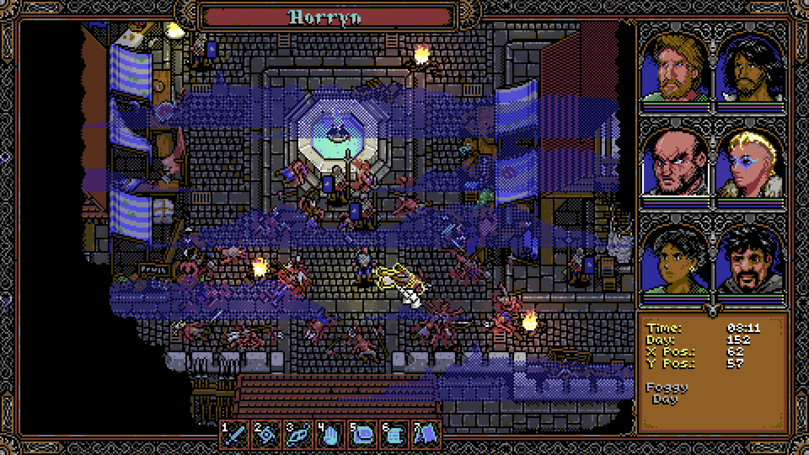

+++
title = "Les sorties de la semaine (02/06)"
date = 2024-06-02T08:00:01+01:00
draft = false
author = "Félix"
tags = ["C’est dispo"]
image = "https://nostick.fr/articles/2024/juin/020624-les-sorties-de-la-semaine/rpop.jpg"
+++

Entre le boulot, les courses et la météo maussade qui vous fait rêver d’évasion, vous n’avez peut-être pas eu le temps de vous intéresser aux nouveautés du moment. Qu’à cela ne tienne : voici les sorties de ces derniers jours qui ont retenu notre attention.

## Les fans de PoP vont-ils faire une overdose de rogue ?

**The Rogue Prince of Persia** est sorti en accès anticipé cette semaine : il s’agit d’un roguelike 2D développé par le studio Evil Empire, responsable de DLC et autres mises à jour pour l’excellent *Dead Cells*. Ici, il va donc falloir venir à bout de différents niveaux à grand renfort de sauts de cabri et de coups de poing balancés aux multiples ennemis. Le jeu est visiblement plutôt fun et tourne bien sur le Steam Deck, mais souffre forcément de la comparaison avec *Hades 2* arrivé [au début du mois](https://nostick.fr/articles/2024/mai/1005-hades-ii-divin-et-diabolique/). Mickael y a joué un peu et m’expliquait que c’est très joli, mais qu’on a assez vite fait le tour du contenu de ce titre qui reste assez facile. Cela reste une bonne base et les devs ont promis de muscler leur jeu côté contenu au fil des mises à jour. En l’état, c’est peut être un poil léger pour que vous y mettiez les 20 € demandés sur [Steam](https://store.steampowered.com/app/2717880/The_Rogue_Prince_of_Persia/). 

## Entre tradition et modernité

Les fans de Metroidvania sont gâtés en ce moment. Après le fantastique *Animal Well* il y a [quelques semaines](https://nostickreloaded.substack.com/p/panique-chez-xbox-sortie-surprise), voici venir ***Nine Sols*** des taïwanais de chez Red Candle Games. Changement d’ambiance complet pour ce studio jusqu’à présent spécialisé dans les jeux d’horreurs qui s’essaye ici à un action-platformer en 2D avec des combats inspirés de *Sekiro*. J’y ai joué deux petites heures, et c’est très sympa. L’univers se veut « Taopunk » en mélangeant des éléments taoïstes avec du cyberpunk, et les graphismes en style dessin animé sont très réussis. Je n’ai pas vu beaucoup de critiques, mais les évaluations sont pour le moment « très positives » sur Steam et sur Reddit. Attention tout de même parce que le jeu est DUR : je m’y suis repris à 5-6 fois juste pour venir à bout de la première zone et j’imagine que ça se corse pas mal par la suite. Si vous avez aimé *Hollow Knight* et que vous êtes prêt à saigner des doigts, ce ne sera pas une mauvaise pioche. 29 balles sur [Steam](https://store.steampowered.com/app/1809540/Nine_Sols/), également compatible avec les Mac M1.



## C’est dans les vieux pots…

Je suis un peu trop jeune pour avoir connu les premiers *Baldur’s Gate* et autres *Ultima*. Heureusement pour nous autres millenials, ***SKALD: Against the Black Priory*** permet de retrouver les sensations des RPG des années 80 sans avoir à se battre avec une interface d’un autre âge. Le jeu propose d’incarner une bande d’aventuriers se retrouvant dans un monde aux inspirations lovecratiennes avec son lot de lieux sinistres, de monstres innommables et de paysages déformés. L’ambiance est définitivement rétro avec des graphismes 8-bits, la progression se faisant à coup de jet de dés et de distribution de points de compétences. Les testeurs louent une ambiance très chouette avec des quêtes intrigantes et un système de jeu sympa, bien qu’ils regrettent quelques petites pétouilles ici et là qui pourraient être corrigée, mais qui noircissent un peu le tableau. En attendant, les retours sont globalement positifs et ce sera sûrement un bon choix si vous cherchez un RPG à l’ancienne avec une interface modernisée sur certains points. 15 € sur [Steam](https://store.steampowered.com/app/1069160/SKALD_Against_the_Black_Priory/), dispo pour PC et Mac.

## Le Kart et le Territoire (de Yharnam)

En 2022, une développeuse s’est amusée à créer un *demake* de *Bloodborne* pour PS1 avec des contrôles adaptés aux manettes d’époque, des ennemis en gros polygones et une bande-son MIDI. Fort de son petit succès, elle a ensuite décidé de plancher sur un spin-off à la *Mario Kart*, un concept idiot parti d’un *meme* qui a abouti à un jeu complet. ***Nightmare Kart*** propose donc pas moins de 21 personnages, 13 véhicules et un total de 15 circuits. Le projet est généreux : on y trouve une campagne avec des cinématiques, du multi à deux joueurs en écran partagé ou encore un mode arène. Initialement appelé *Bloodborne Kart*, le jeu a été renommé suite à un coup de fil des avocats de Sony - et le contenu lié au jeu remplacé par quelque chose de similaire, mais sans problème de copyright. Les premiers retours sont très bons et le titre est disponible gratuitement [sur itch.io](https://b0tster.itch.io/nmkart) (on peut choisir de payer la somme que l’on veut). Une sortie sur [Steam](https://store.steampowered.com/app/2930160/Nightmare_Kart/) devrait arriver prochainement. 



## En rab’

Pour patienter jusqu’à la sortie de *Bloodlines 2*, le visual novel ***Vampire: The Masquerade - Coteries of New York*** est désormais disponible sur [iOS](https://apps.apple.com/fr/app/vampire-the-masquerade-cony/id6469044109) et [Android](https://play.google.com/store/apps/details?id=com.pid.vmcony&hl=fr&gl=fr) pour 5 €. Les reviews de l’époque n’étaient pas incroyable, mais ça pourra faire le taf si vous avez envie de retrouver l’ambiance glauque de la licence d’autant plus que le format VN se prête bien aux smartphones/tablettes. On en parlait [la semaine dernière](https://nostickreloaded.substack.com/i/144965095/multiversus-reprend-la-bagarre), mais ***MultiVersus*** est de retour sur PC et consoles de salon si vous voulez voir Vera de Scooby-Doo affronter Arya Stark. Les fans de F1 pourront jeter un œil sur ***F1 24*** même si bon, visiblement c’est plus ou moins la même chose que l’année dernière (et de l’année d’avant). Le sympathique ***Humanity*** est sorti sur Xbox et le Game Pass, ce qui devrait ravir les fans de puzzle-games chelous. Enfin, notons la sortie de ***Anthology of the Killer***, une collection de petits jeux indés rigolos codés par un seul mec vendu 6 $ [sur itch.io ](https://thecatamites.itch.io/anthology-of-the-killer) et qui est très bien d’après *[RPS](https://www.rockpapershotgun.com/dont-worry-im-a-murderer-award-winning-comedy-anthology-of-the-killer-is-out-next-week)*.

