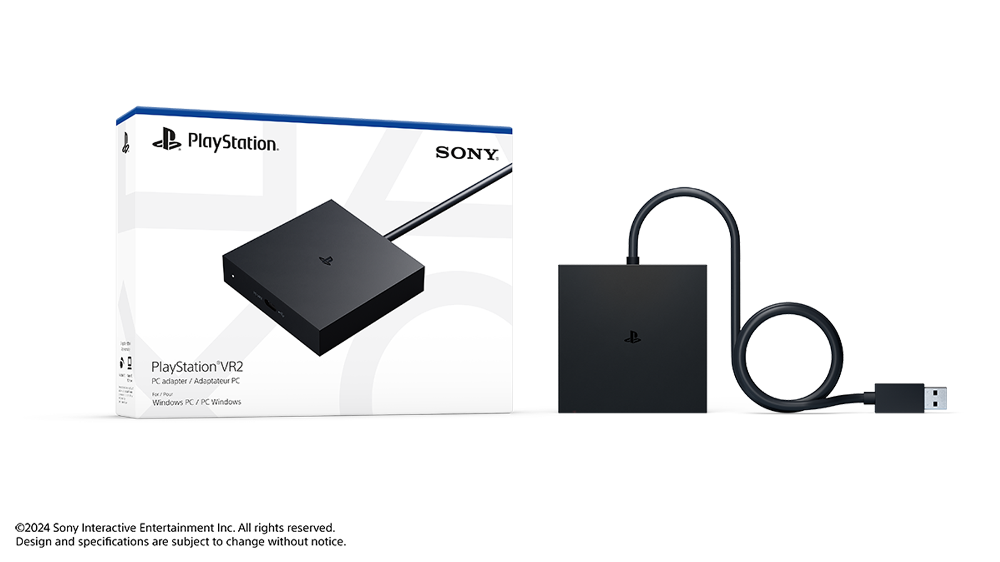

+++
title = "Le PSVR2 sera bientôt compatible PC grâce à un adaptateur facturé 60 €"
date = 2024-06-03T17:30:01+01:00
draft = false
author = "Félix"
tags = ["Actu"]
image = "https://nostick.fr/articles/2024/juin/0306-le-psvr2-sera-bientot-compatible-pc-grace-a-un-adaptateur-à-60/psvr21.png"
+++ 

Sony cherche à relancer l’intérêt pour son PSVR2. Le japonais vient de [dévoiler](https://blog.fr.playstation.com/2024/06/03/a-partir-du-7-aout-les-joueurs-playstation-vr2-auront-acces-aux-jeux-sur-pc-grace-a-un-adaptateur/) un adaptateur facturé 60 balles permettant de relier le casque de VR à un ordinateur. Tout cela passera uniquement par SteamVR, donnant accès à la grosse bibliothèque disponible sur PC (*Half-Life: Alyx, Fallout 4 VR, War Thunder*…). Il sera officiellement en vente à partir du 7 août.

La décision a de quoi surprendre tant le PSVR2 est un accessoire pensé pour la PS5. Les rumeurs voudraient que les ventes du casque [ne soient pas au beau fixe](https://nostick.fr/articles/2024/mars/1903_psvr2/), et cette nouveauté peut être vue comme une manière pour Sony de relancer la machine. Malheureusement, l’entreprise a fait le minimum du minimum : les joueurs PC devront faire l’impasse sur le HDR, le retour du casque ou le suivi des yeux. Les manettes DualSense sont à moitié prises en charge étant donné qu’il faudra faire une croix sur les gâchettes adaptatives et le retour haptique (qui diffère des vibrations classiques). Restent bien la chouette résolution 4K du casque et son FOV à 110°, mais pas sûr que cela suffise à motiver les joueurs PC de passer à la caisse.

La configuration minimale n’est pas bien gourmande, Sony exigeant une GeForce GTX 1650, une RTX ou bien une RX 5500XT. Pour des performances optimales, elle recommande d’avoir sous le capot un GPU NVIDIA GeForce GTX 3060 ou AMD Radeon RX 6600XT. Comptez aussi au minimum un Core i5-7600 / Ryzen 3 3100 et 8 Go de RAM. Tout cela dépendra évidemment selon le jeu lancé. La mise en place passera par une app PlayStation VR2 permettant de personnaliser différents paramètres, qui arrivera en temps voulu.

Cette annonce n’est même pas accompagnée d’un changement de prix du casque, toujours facturé [dans les 500 €](https://www.boulanger.com/c/casque-realite-virtuelle/caracteristiques_generales_____compatible_avec~ps5#tr=psvr2) chez les revendeurs. Ajoutez-y l’adaptateur (60 €) ainsi qu’un câble DisplayPort 1.4 de plusieurs mètres (non fourni) et on approche doucement des 600 €. Pas sûr que cette proposition fasse le poids face à un Meta Quest 3 [à 550 €](https://www.amazon.fr/Meta-Quest-128Gb-révolutionnaire-spectaculaires/dp/B0C7W12RN2/) qui peut fonctionner de manière autonome et se connecter sans fil à un PC. Si on peut croiser les doigts pour voir arriver des jeux VR exclusifs à la PS5, ça semble mal barré : Sony a [annoncé](https://sonyinteractive.com/en/news/blog/difficult-news-about-our-workforce/?sf271923331=1) au mois de février la fermeture de son studio londonien s’occupant des jeux en réalité virtuelle. Lors de son récent [State of Play](https://nostick.fr/articles/2024/mai/3105-sony-paquet-pc/), elle a présenté deux titres pour PSVR2… qui sortiront aussi sur Quest.