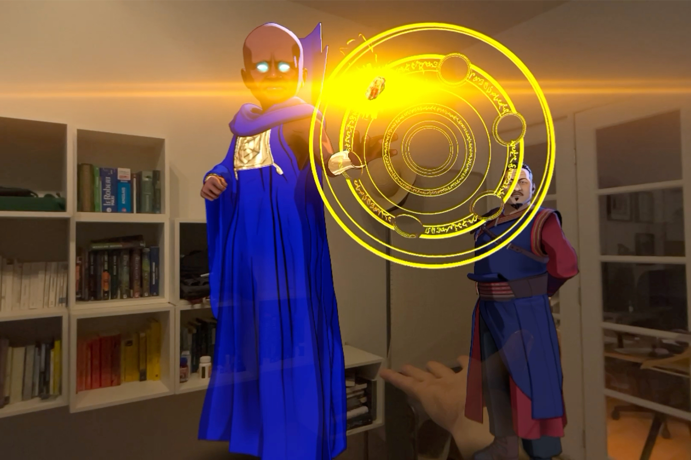
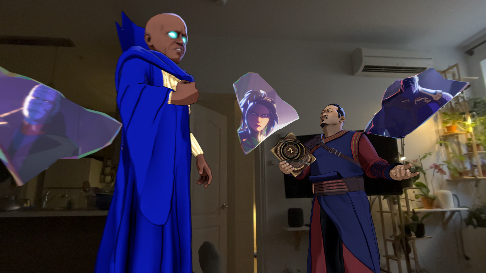
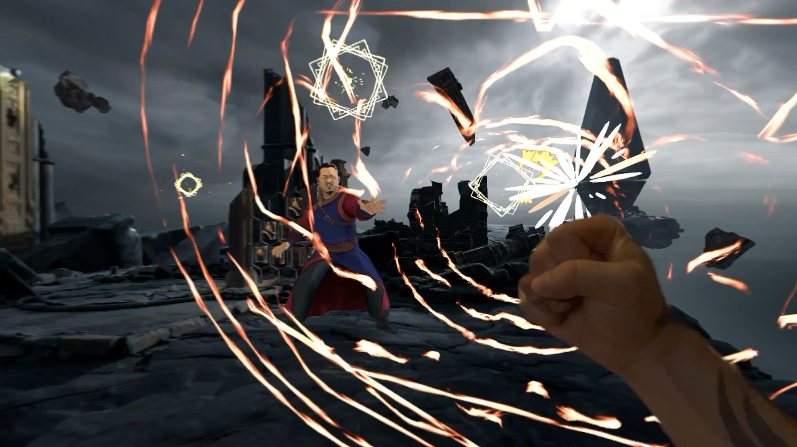
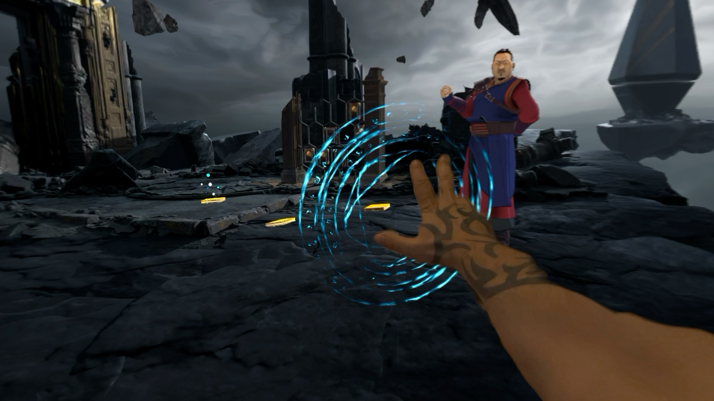
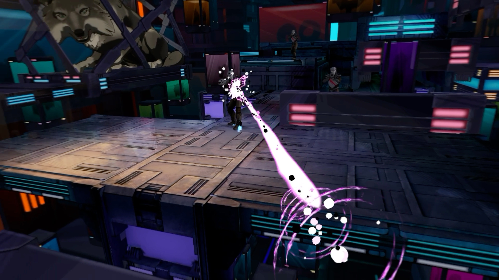

+++
title = "Test de What If…? An Immersive Story : un multivers plus contemplatif que ludique"
date = 2024-06-03T07:00:00+01:00
draft = false
author = "Mickael"
tags = ["Test"]
type = "une"
image = "https://nostick.fr/articles/2024/juin/0306-test-what-if-an-immersive-story/marvel1.jpg"
+++

 

**Contrairement à [*Hellblade 2* qui ne sait pas sur quel pied danser](https://nostick.fr/articles/2024/mai/2705-test-de-senua-saga-hellblade-2/), *What If…?* annonce tout de suite la couleur, dès son titre : il s'agit moins d'un jeu que d'une « histoire immersive », autrement dit il ne faut pas s'attendre à une interactivité débridée.** 

Ce jeu, ou cette app, est singulière par bien des aspects. D'une part, il a été développé avec une seule plateforme en tête, ou plutôt sur la tête : le Vision Pro. Les autres casques VR/XR n'ont pas été invités à la fête, et pour une bonne raison : le gameplay est entièrement basé sur les gestes de la main. Alors c'est entendu, le Quest 3 aussi sait reconnaitre ces gestes, mais chez Apple c'est la principale (et unique) façon d'interagir avec le contenu, pour le meilleur comme pour le pire.

Et d'autre part, *What If…? An Immersive Story* est la première histoire interactive originale signée Disney+ Original. Elle s'inscrit complètement dans l'univers de la série, à tel point qu'il pourrait s'agir d'un épisode bonus. 

## What If…? An Immersive Story, ça parle de quoi ?

Une fois encore, c'est le bazar dans le multivers. Et puisque tous les autres super-slips sont occupés à sauver le monde ailleurs, il vous revient de faire le ménage avec l'aide des pierres d'Infinité ! Uatu, le Gardien du multivers, vous confie le boulot mais fort heureusement, vous ne serez pas seul : Wong, le Sorcier Suprême, sera là pour vous filer un coup de main et vous apprendre à vous servir des fameuses caillasses magiques.

 

Tout au long de l'aventure, multivers oblige, on retrouvera quelques uns des plus grands héros Marvel, mais sous un jour un peu différent. La série Disney+ *What If… ?* s'amuse en effet à chambouler les réalités en posant des hypothèses inédites — que ce serait-il passé si Thanos n'avait pas été le Titan fou mais juste un type qui veut sauver sa planète ? Et si la transformation de Steve Rogers s'était mal passée ?

Tout au long de cette « histoire immersive », on fera la rencontre de plusieurs personnages bien connus (que je ne vais pas spoiler) dont les destins sont quelque peu différents de ceux qu'on leur connait dans le MCU.

## Comment ça se joue ?

Pas beaucoup en fait ! Le jeu consiste surtout à suivre l'histoire et à faire les bons gestes au bon moment. Le jeu démarre à la maison (littéralement : Uatu et Wong débarquent dans votre salon), puis après un échange de blagues typiques des films du MCU, le Sorcier Suprême vous emmène dans un New York dévasté par le pouvoir d'une pierre d'Infinité.

 

Wong va alors vous apprendre à contrôler vos pouvoirs : fermer le poing pour créer un bouclier, viser un objet pour le transporter, enfermer quelque chose dans la dimension de poche de la pierre de l'Âme. Au fil de l'aventure, vous découvrirez de nouveaux gestes tout aussi pratiques. Tout cela pour récupérer les six pierres de l'Infinité, qui permettront en bout de course de choisir une des deux fins possibles — en claquant des doigts, bien évidemment.

L'histoire saute d'un multivers à un autre, dans lequel il faudra regarder un petit passage animé, puis faire preuve de ses pouvoirs. Cela pourra par exemple être une baston entre Red Guardian et un mystérieux homme cagoulé, puis charge au joueur de détruire des canons avant de récupérer un caillou.

Le jeu en lui-même n'est vraiment pas compliqué. Avant de vous laisser la main, si on peut dire, *What If… ?* vous indique clairement la marche à suivre. Et le titre est suffisamment généreux pour vous éviter de mourir bêtement. On se retrouve en fait devant le lointain descendant de *[Dragon's Lair](https://www.youtube.com/watch?v=P_W5T5LUKNo)*, le fameux dessin animé interactif du début des années 80 (sur LaserDisc !) qui indiquait à l'écran la touche de la télécommande à appuyer.

 

*What If… ?* se déroule majoritairement en réalité virtuelle, c'est à dire que vous êtes plongé dans l'univers de chaque saynète. Mais il y a des passages en réalité mixte, avec des personnages et des objets qui apparaissent dans votre douillet intérieur. Ça fait toujours quelque chose de voir Wong se balader dans le salon. Dommage que ça ne soit pas plus souvent le cas !

Le jeu vous tiendra occupé une bonne heure mine de rien, ce qui est plus que tout le contenu immersif produit jusqu'à présent par Apple pour son Vision Pro.

## Qu’est-ce qui est bien ?

*What If… ?* a le mérite d'exister. C'est une des rares expériences immersives et interactives disponibles pour le Vision Pro ; il existe bien sûr des jeux pour le casque d'Apple, mais généralement ils se déroulent dans des écrans 2D. L'app de Marvel Studios, développée avec l'aide d'ILM Immersive, exploite non seulement les capacités VR et XR de l'appareil, mais aussi les interactions digitales (les doigts, quoi) mises au point par Apple.

 

Quand ça marche, c'est épatant : il n'y a rien de plus satisfaisant que de se protéger des projectiles adverses avec le bouclier généré en serrant le poing ; ou encore de tirer sur des adversaires en les visant avec la main. On touche du doigt (vous l'avez ?) cette « magie » de l'« informatique spatiale » chère à Apple, où les objets virtuels sont manipulables avec rien d'autre que les mains.

L'application bénéficie aussi du soin apporté à l'animation, ce qui est la moindre des choses avec un tel pedigree. C'est bien simple, les séquences animées sont de même qualité que la série Disney+. Et lorsqu'il est temps de jouer, les passages interactifs basculent l'animation en mode cel-shading de bon aloi.

Enfin, les fans de l'univers Marvel seront aux anges, avec de nombreux clins d'œil. Pour profiter au maximum du jeu, mieux vaut d'ailleurs avoir suivi un minimum le MCU, certains personnages et références risquant d'être obscurs pour le béotien.

## Qu’est-ce qui est moins bien ?

Pour le Vision Pro, Apple a mis le paquet sur les interactions gestuelles et pour cause : avec le suivi du regard, l'interface de visionOS ne peut pas être manipulée autrement qu'avec les mains et les doigts. La plupart du temps, les gestes sont bien reconnus, mais la fiabilité n'est pas assurée à 100 % ; et il en va de même dans *What If… ?*, où il arrive que les gestes soient mal interprétés.

C'est particulièrement pénible dans une séquence du jeu en particulier, où il faut assaisonner des soldats de rafales magiques. L'app ne sait parfois plus où donner de la tête et ne reconnait plus les gestes. Ce n'est pas très grave, sachant que que l'on ne meurt jamais. Néanmoins, le fait de ne pas vraiment être sûr à 100 % que le Vision Pro prendra bien en compte les gestes est une source de perpétuelle frustration qui empêche de s'immerger complètement dans un jeu.

 

On regrette amèrement que le Vision Pro ne prenne pas en charge les contrôleurs VR tiers, comme ceux du Quest 3 ou d'autres marques. Cette absence empêche le casque d'Apple de se transformer en plateforme vidéoludique viable, et en alternative crédible à la proposition de Meta. On ne va pas refaire le match : Apple et les jeux, [ça restera toujours un problème](https://nostick.fr/articles/2024/mars/2603_applearcade/)[^1].

Le jeu en lui-même a du potentiel, qui n'aimerait pas avoir entre les mains les pouvoirs des pierres d'Infinité ? Malheureusement, il n'en fait pas grand chose, et en tout cas pas suffisamment longtemps — les séquences véritablement interactives sont trop courtes. De plus, *What If… ?* ne fait jamais vraiment au confiance au joueur et à son instinct : il faut toujours qu'il indique quoi faire comme à un enfant.

On a bien compris qu'il s'agissait avant tout d'une histoire à suivre passivement, mais il y a là l'ébauche inachevée de quelque chose qui pourrait être beaucoup plus ludique et… immersif, pour le coup. 

Un mot pour finir sur le casting vocal : on comprend que toutes les vedettes qui interprètent les personnages du MCU sont trop chères ou pas disponibles pour prêter leur voix, mais c'est dommage que Jeffrey Wright ne reprenne pas son rôle pour Uatu. Son timbre si particulier donne toute sa personnalité au Gardien, qu'on ne retrouvera pas dans le jeu.

## C’est oui ou c’est non ?

Difficile de se plaindre. Non seulement *What If…? An Immersive Story* est une des très rares applications à tirer parti des capacités du Vision Pro, mais encore l'app est gratuite (même si bizarrement Disney a précisé que ça n'allait durer qu'un temps). Pouvoir profiter d'une heure de contenu original avec des morceaux d'interactivité dans cet univers, c'est une proposition qui ne se refuse pas !

Malgré tout, c'est vrai qu'on aurait aimé plus d'interactivité et davantage de jeu, surtout qu'elles ne sont pas nombreuses les applications véritablement conçues pour le Vision Pro. Ce n'est pas un coup pour rien, enfin, on l'espère ! Disney et Apple sont des partenaires de longue date et cette première expérimentation en appelle d'autres.

En tout cas, si vous faites partie des quelques uns à posséder un Vision Pro, il est temps de le dépoussiérer (parce qu'il ne sert pas à grand chose, soyons honnêtes) pour tester quelque chose d'inédit !

*Testé sur un Vision Pro. L'app est disponible à cette [adresse](https://apps.apple.com/us/app/what-if-an-immersive-story/id6479251303).*

[^1]: Si l'iPhone est devenu un poids lourd du jeu vidéo, c'est plus par défaut que par la volonté affichée d'Apple de faire de son smartphone une console de poche.