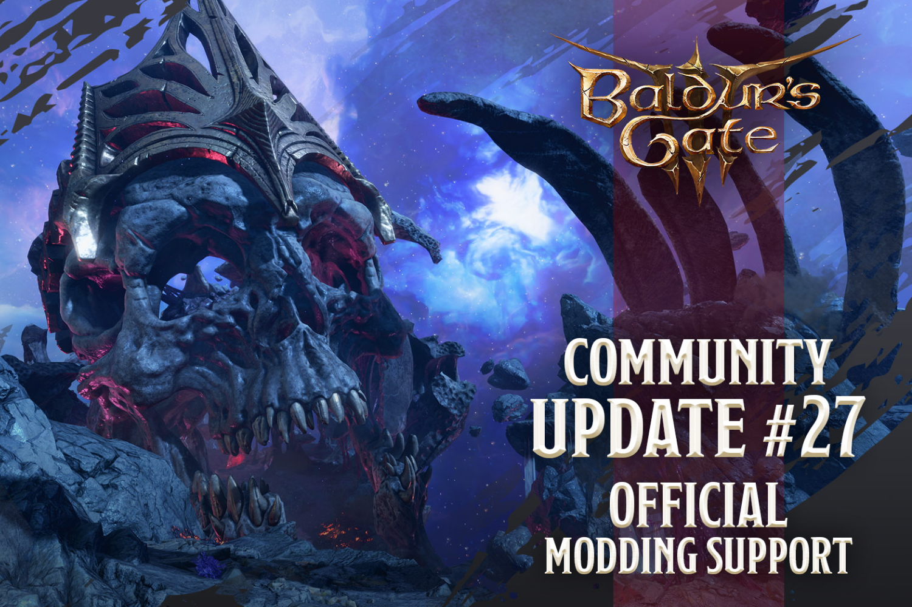

+++
title = "Le mod officiel arrive dans Baldur's Gate 3"
date = 2024-06-03T10:47:32+01:00
draft = false
author = "Mickael"
tags = ["Actu"]
image = "https://nostick.fr/articles/2024/juin/0306-mod-officiel-baldurs-gate-3/baldur.jpg"
+++

 

Un peu moins d'un an après sa sortie, *Baldur's Gate 3* continue de régaler les amateurs de jeux de rôle et de lancers de dés icosaèdres, qui n'ont pas fini d'arpenter les terres de Faerûn à la recherche de tous les secrets que le jeu a à offrir. Et ce n'est pas près de s'arrêter !

Le studio Larian a en effet [annoncé](https://x.com/baldursgate3/status/1797586744088621138) que le Patch 7 contiendra la boîte à outils nécessaire pour modder le jeu. Une alpha fermée débute dès aujourd'hui, une bêta tout aussi fermée (mais ouverte à davantage de bidouilleurs) ouvrira en juillet. Le patch au complet sera livré à tous les joueurs PC et consoles en septembre.

Attention, seuls les joueurs PC seront en mesure de créer des mods ; leurs collègues sur consoles se contenteront de fouiller dans le catalogue des mods — qui seront dûment validés avant de leur être proposés — pour les télécharger. Il s'agit d'éviter d'éventuels incompatibilités avec les consoles. Si Larian a bien l'intention de garder un œil sur ce qui se passera au sein de la communauté, tout semble indiquer que le studio donnera les coudées franches aux modders.

Boules de feu roses, arme-saucisse qui provoque d'énormes dégâts, nouvelles coupes de cheveux… Toutes les excentricités seront autorisées, ainsi que des modifications plus profondes pour le gameplay : création de classes et de sous-classes, nouveaux sorts et armes, personnalisation des skins de dés…

*Baldur's Gate 3* se déroulant selon les règles de *Donjons & Dragons*, licence officielle à la clé, Larian devra s'assurer de l'intégrité de l'univers. « *Ceci dit, nous voulons supporter autant de liberté créative que possible* », ajoute l'entreprise dans sa [FAQ](https://store.steampowered.com/news/app/1086940/view/4179982568653520452).

Les plus habiles n'ont pas attendu Larian pour expérimenter des mods pour *Baldur's Gate 3*. Il en existe déjà un certain nombre, mais leur installation peut parfois créer des conflits dans le jeu et les empêcher de fonctionner correctement. Cette passerelle officielle permettra d'assurer la meilleure compatibilité possible ; Larian assure par ailleurs ne pas avoir l'intention de brider le modding non officiel. Mieux encore, le studio cherche à mieux intégrer les mods alternatifs.