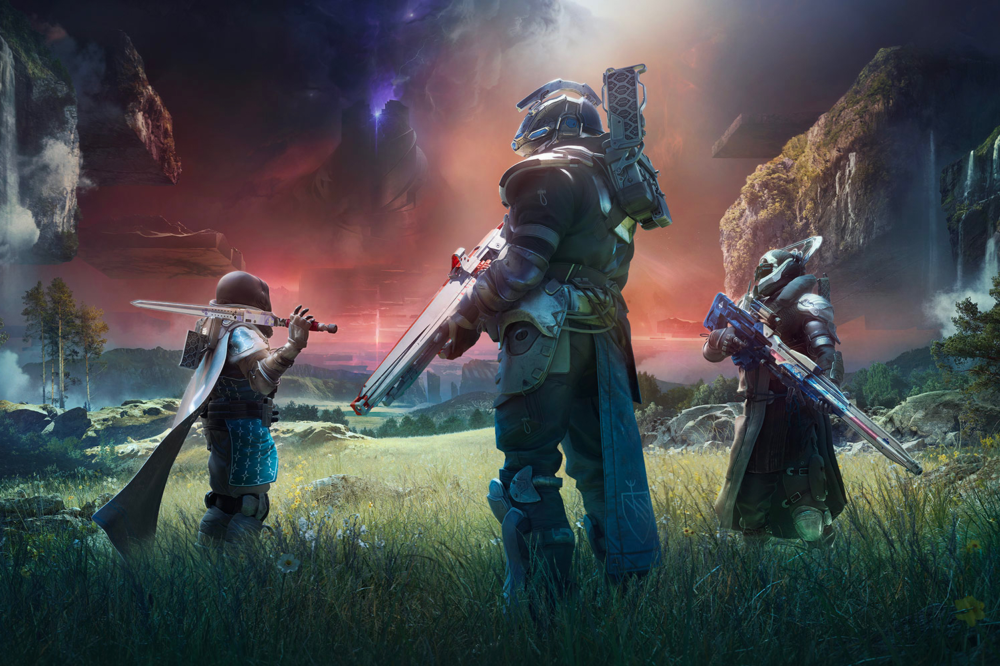

+++
title = "Destiny 2 : Bungie foire le lancement de The Final Shape"
date = 2024-06-05T10:47:32+01:00
draft = false
author = "Mickael"
tags = ["Actu"]
image = "https://nostick.fr/articles/vignettes/nostick.jpg"
+++

 

Comme on pouvait s'y attendre, Sony et Bungie ont complètement merdé le lancement de *The Final Shape*, l'ultime extension de *Destiny 2* ! La nouvelle aventure lancée hier, mardi 4 juin, est un cauchemar pour de nombreux joueurs qui [butent](https://x.com/tomwarren/status/1798064189963227611) sur des problèmes de serveurs, des files d'attente démesurées et autres erreurs.

Ça n'étonnera pas grand monde, Bungie ayant toujours eu du mal à  dimensionner son infrastructure à chaque extension. Mais on aurait pu croire que l'attente autour de *The Final Shape* — que le studio a lourdement promue — aurait poussé l'entreprise à activer quelques serveurs en plus histoire d'éviter les goulots d'étranglement. Mais en fait, non. Et Sony, le proprio de Bungie, n'a pas retenu les leçons des premières heures de *Helldivers 2* qui avait lui aussi rencontré de sérieux soucis de connexion.

 

Il faut dire que l'extension a ravivé l'intérêt autour de *Destiny 2*, sept ans après sa sortie. Le jeu multi a dépassé les 315 000 joueurs simultanés sur Steam, et bien sûr ce chiffre ne prend pas en compte les joueurs Xbox et PlayStation. Histoire de faire patienter (et de se faire pardonner), Bungie a [posté](https://x.com/Destiny2Team/status/1798195541291188323) des excuses pour les problèmes de connexion, en affirmant que beaucoup d'entre eux ont été résolus. 

« *Nous avons conçu The Final Shape comme une aventure passionnante, cathartique et axée sur l'histoire, pour que tout le monde puisse en profiter* », explique le studio. « *Nous sommes vraiment désolés si des problèmes de connexion et d'instabilité perturbent cette expérience, et nous promettons de continuer à travailler jusqu'à ce que ces problèmes soient résolus* ».

Pour les joueurs qui ont loupé les cinématiques, une solution temporaire a été [trouvée](https://x.com/Destiny2Team/status/1798195548278964315) : les séquences sont visibles depuis un des menus du jeu. L'équipe est sur le pont pour régler les soucis. En revanche, il n'est pas question (pas encore) d'une compensation sonnante et trébuchante avec la monnaie du jeu. Ça arrivera peut-être si les serveurs continuent de merdouiller.

Les problèmes volent en escadrille : *Destiny 2* avait en effet fuité la semaine dernière pendant quelques heures… Il a en effet été possible d'y jouer en streaming depuis le nuage de Sony, qui avait appuyé sur le gros bouton vert avec quelques jours d'avance. De fait, les spoilers ont pullulé avant la sortie officielle de *The Final Shape*…