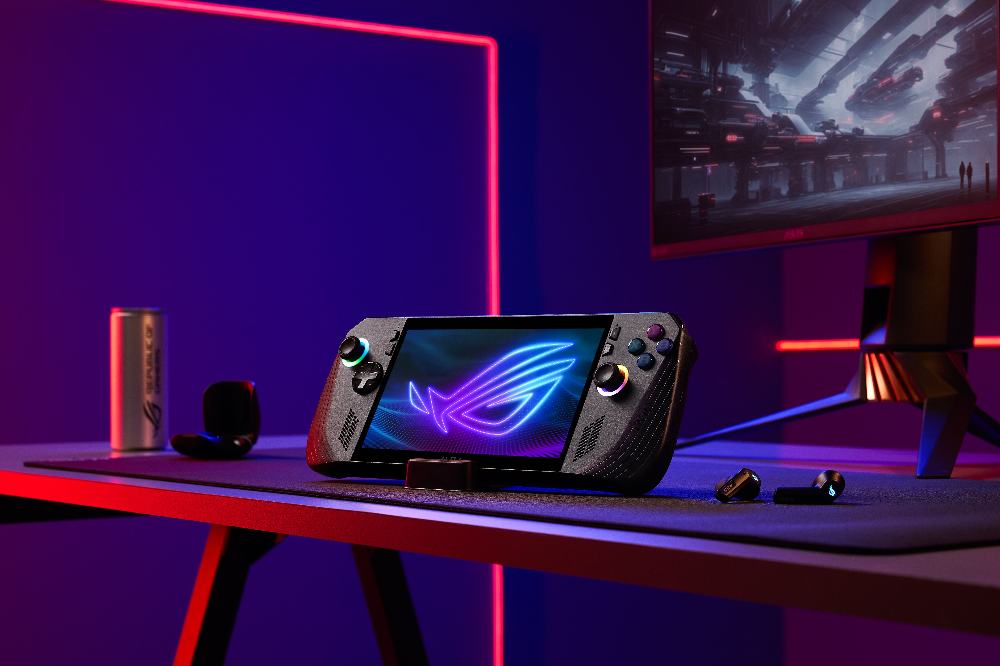

+++
title = "ROG Ally X : première révision pour la console portable sous Windows d’Asus"
date = 2024-06-05T18:00:00+01:00
draft = false
author = "Félix"
tags = ["Actu"]
image = "https://nostick.fr/articles/2024/juin/0605-rog-ally-x-premiere-revision/rog1.jpeg"
+++ 

 

Cela fait déjà presque un an qu’est sorti la ROG Ally d’Asus, une petite console portable se voulant être une alternative sous Windows au Steam Deck. Le fabricant taïwanais a profité du Computex pour [lever le voile](https://rog.asus.com/fr/gaming-handhelds/rog-ally/rog-ally-x-2024/) sur une première révision, qui ne change pas drastiquement l’expérience mais qui promet de l’améliorer sur pas mal de points.

Gros coup de pouce côté stockage : la ROG Ally « X » passe de 512 Go de SSD à 1 To. Elle embarque aussi une RAM plus rapide grimpant à 24 Go de LPDDR5X-7500. Deux bons points, mais c’est surtout l’autonomie qui progresse étant donné que la capacité de la batterie a doublée en passant à 80 Wh. Asus ne donne pas de chiffre, mais il  devrait  être difficile de faire pire que la première génération qui tient à peine l’heure et demie en fond de cinquième. On nous promet une dissipation thermique améliorée (6° de moins sous l’écran tout de même), ce qui devrait permettre aux ventilos de se faire plus discrets.  

La console se paye un petit ravalement de façade avec un nouveau design noir moins original qui la fait ressembler à tous les autres acteurs du domaine. Asus a également revu les joysticks et affirme avoir amélioré l’ergonomie ici et là, par exemple avec des poignées plus profondes ou un D-Pad plus précis. Les boutons sont inclinés sous un angle légèrement différent pour plus de confort. Les touches personnalisables à l’arrière sont désormais plus petites, ce qui est une bonne chose tant elles me gênent sur la première génération. Malgré sa plus grosse batterie, la machine ne s’empote que de 70 grammes par rapport au modèle précédent.

Avec cette révision, Asus améliore la forme, mais ne change pas le fond : la machine garde son processeur Z1 Extreme ainsi que son écran 7 pouces 120 Hz 1080p LCD. On y trouve en revanche une carte mère avec un SSD M.2 2280, un format plus standard qu’auparavant. Le port propriétaire pour GPU externe Asus (et seulement Asus) est remplacé par du Thunderbolt laissant une meilleure compatibilité. Le port de carte SD a été revu pour éviter les problèmes de chauffe.

Tout cela donne envie jusqu’à ce qu’on se penche sur la question du prix : [899,99 € TTC](https://rog.asus.com/fr/gaming-handhelds/rog-ally/rog-ally-x-2024/), soit 241 € de plus que le Steam Deck OLED 1 To. Certes, les machines sont différentes sur plusieurs points, mais tout de même. On peut espérer que les promos arriveront vite et que cela fera baisser le tarif de la première génération, qui ne sera pas un mauvais choix si elle venait à tomber dans les 500 €.