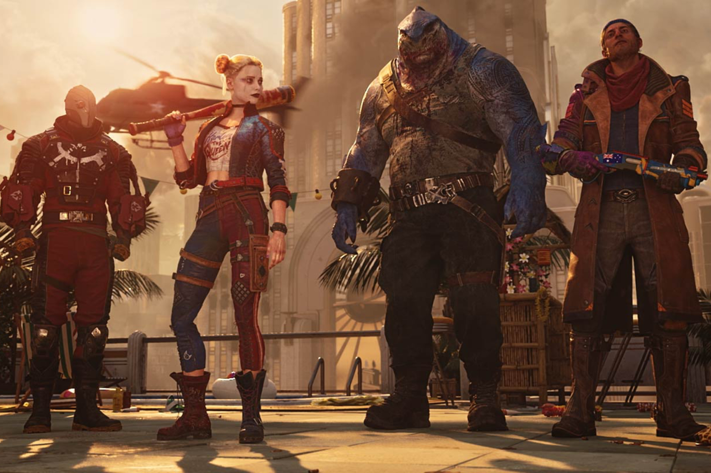

+++
title = "Suicide Squad n'a pas enterré Rocksteady"
date = 2024-06-06T10:48:32+01:00
draft = false
author = "Mickael"
tags = ["Actu"]
image = "https://nostick.fr/articles/vignettes/nostick.jpg"
+++

 

Rocksteady peut-il revenir dans le cœur des joueurs après le fiasco *Suicide Squad* ? Le jeu de tir en coop dopé aux microtransactions a [fait un four](https://nostick.fr/articles/2024/mars/suicidesquad/), à tel point que Warner Bros., la maison-mère, a inscrit une perte sèche de 200 millions de dollars. Du jamais vu dans l'histoire du jeu vidéo !

Autant dire qu'on pouvait craindre le pire pour Rocksteady, qui s'est lancé la fleur au fusil dans ce projet de jeu service, alors que le studio était reconnu pour ses jeux solo — au premier rang desquels, bien sûr, la saga *Batman: Arkham*. Le budget de développement de *Suicide Squad* est inconnu, mais on imagine sans peine qu'il doit être colossal : le jeu a en effet demandé 7 années de travail durant lesquelles Rocksteady a dû apprendre les ficelles du live service et du multi.

Dans quelle galère Rocksteady s'est-il fourré ? À la lecture des indiscrétions de Jason Schreier publiées dans *[Bloomberg](https://www.bloomberg.com/news/articles/2024-06-06/-suicide-squad-warner-bros-s-200-million-flop-haunts-the-gaming-industry)*, les torts sont partagés : certes, Warner Bros. poussait au développement d'un jeu service qui pouvait rapporter de l'argent longtemps après sa sortie, mais les dirigeants du studio — dont les cofondateurs, Jamie Walker et Sefton Hill — étaient manifestement partants pour l'aventure. 

Le développement, débuté en 2016 sur les cendres d'un projet avorté de *Suicide Squad* réalisé par WB Montréal, a été émaillé de problèmes. Dans son papier, Schreier rapporte que Sefton Hill, directeur du jeu, mettait des semaines, voire des mois, pour jeter un œil sur les travaux des développeurs. De quoi en décourager et en frustrer quelques uns… À un moment donné, il voulait que les héros du jeu puissent se déplacer dans des véhicules, une idée étrange sachant qu'ils sont déjà équipés de jetpacks et autres systèmes de traversées dans les airs.

Après des mois de tests, l'idée a été abandonnée. Beaucoup de ressources investies dans un projet qui ne tenait pas la route dès le départ, et le signal que la direction prise par le jeu n'était pas claire… Et ce n'est qu'un exemple des difficultés rencontrés en interne.

Malgré tout, ce n'est pas la fin de l'histoire pour Rocksteady. Même si les deux fondateurs ont quitté le navire pour créer un nouveau studio ([et bosser pour Microsoft](https://nostick.fr/articles/2024/juin/0106-semaine-folle-jeu-video/#xbox-met-la-main-sur-le-nouveau-projet-des-créateurs-de-batman-arkham)), il reste encore du jus : les employés donnent actuellement un coup de main sur le director's cut de *Hogwarts Legacy*. En miroir inversé de *Suicide Squad*, le jeu solo basé sur l'univers de Harry Potter a tout fracassé l'an dernier, avec 24 millions de copies vendues.

Surtout, les nouveaux dirigeants de Rocksteady auraient déjà commencé à proposer un nouveau titre auprès de Warner Bros., un jeu… solo. De quoi effacer la tache *Suicide Squad*, c'est du moins ce qu'on peut espérer.