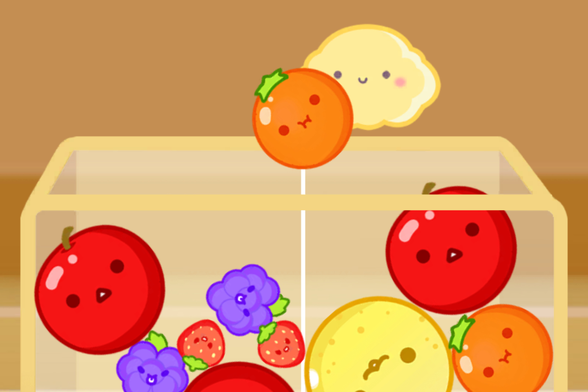
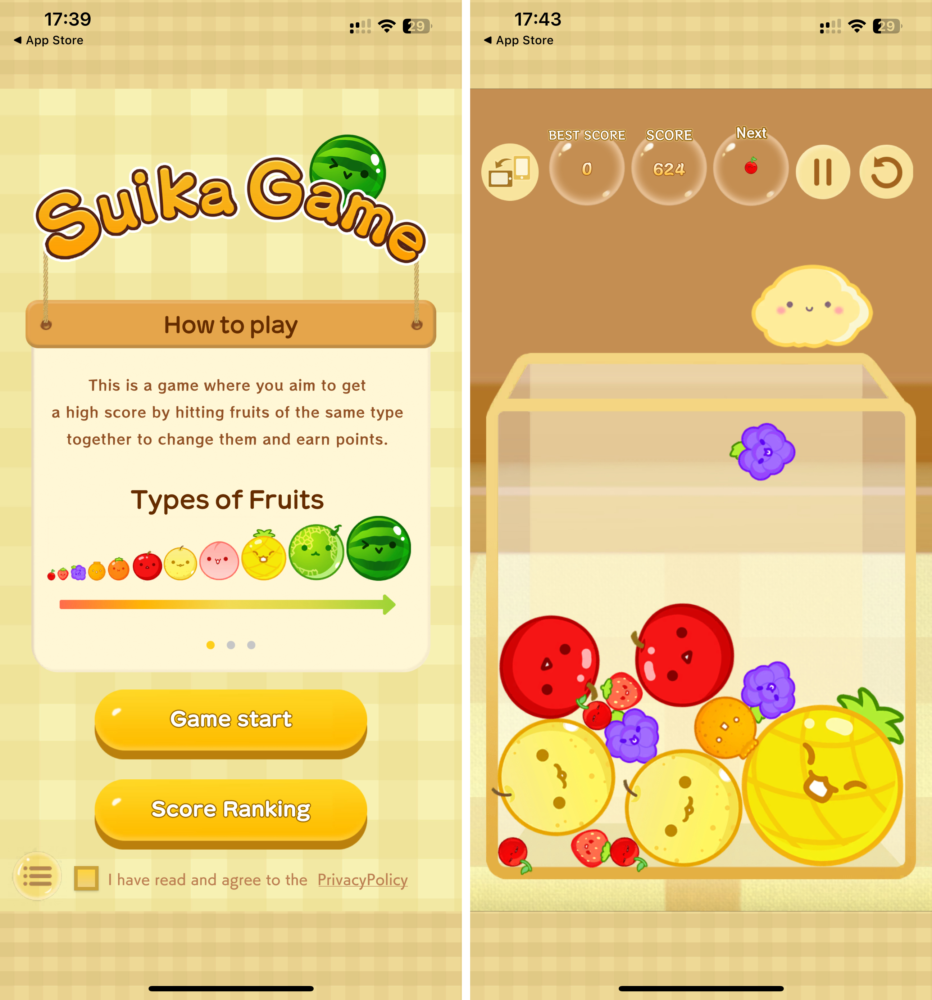
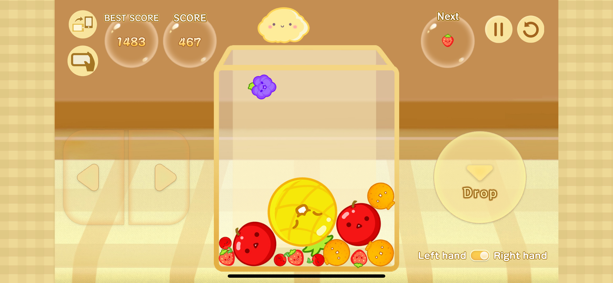

+++
title = "Vous pouvez enfin jouer au vrai Suika Game sur iPhone !"
date = 2024-06-06T08:45:32+01:00
draft = false
author = "Mickael"
tags = ["C’est dispo"]
image = "https://nostick.fr/articles/vignettes/Suika-game-3.jpg"
+++

 

Nous y voilà, le moment tant attendu de l'année, à savoir le début du mois de juin synonyme d'~~E3~~ de showcases tous azimuts ! On a eu droit à [celui de PlayStation la semaine dernière](https://nostick.fr/articles/2024/mai/3105-sony-paquet-pc/), la grosse présentation de Xbox se tiendra dimanche, il y a le Forward d'Ubisoft lundi prochain, sans oublier le Summer Games Fest de ce vendredi. Et puis évidemment il y aura un Nintendo Direct dans le courant du mois, peut-être même dès la semaine prochaine.

On va en prendre plein les yeux et plein les oreilles entre les nouveautés, les blockbusters attendus, tous les flonflons et les pirouettes de nos éditeurs et constructeurs préférés. Mais vous savez quoi ? C'est trop tard messieurs mesdames, vous pouvez remballer. Fallait arriver avant. Car le jeu de l'année est finalement arrivé : *Suika Game* est ENFIN disponible sur l'App Store ! Oui, l'original et pas les clones, le vrai Watermelon Game…

 

Bon, dans les faits, le jeu d'Aladdin X pouvait déjà être téléchargé sur l'iPhone, mais uniquement au Japon. Il a fini par dépasser les frontières de l'archipel, et on pourra dès à présent se l'offrir pour la modique somme de 2,99 €, à cette [adresse](https://apps.apple.com/fr/app/スイカゲーム-aladdin-x/id6469114836). Une version pour Android est prévue pour le mois prochain, courage ça vient. Et oui c'est payant mais en échange, il y a zéro pub, pas d'achats intégrés, pas de minuteur idiot qui vous empêche de jouer, pas d'abonnement… Comme au bon vieux temps !

Sous ses airs de jeu Flash (rappelez-vous), *Suika Game* est un petit chef d'œuvre de simplicité qui peut rapidement se transformer en addiction. Il s'agit de faire tomber stratégiquement des fruits dans une espèce d'aquarium : deux fruits identiques créent un plus gros fruit (deux cerises = une fraise, vous voyez le genre). L'objectif étant d'arriver à une pastèque, et c'est plus facile à dire qu'à faire.

Et le titre peut se pratiquer quasiment à l'infini : lorsque deux pastèques se touchent, elles s'annulent tout simplement. Mais enfin pour arriver à ce niveau, il faut un master certifié de *Suika Game*… Le jeu propose des classements en local et en ligne, et c'est à peu près tout ce qu'il a à offrir : pas de mode supplémentaire, rien, pas même le multi sorti en février sur Switch (croisons les doigts pour ça vienne sur mobile).

Le jeu, qui est donc né sur Switch, se contrôle avec un seul doigt pour guider le nuage Poppy qui tient le fruit. En mode paysage, on joue avec des gros boutons virtuels.

 

*Suica Game* n'est pas localisé en français mais enfin, ça ne devrait pas être trop compliqué à comprendre… Allez, encore une petite partie discrétos pendant le boulot !