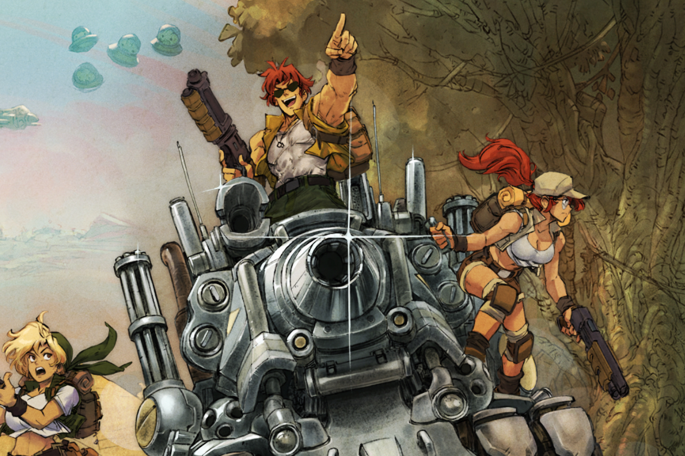
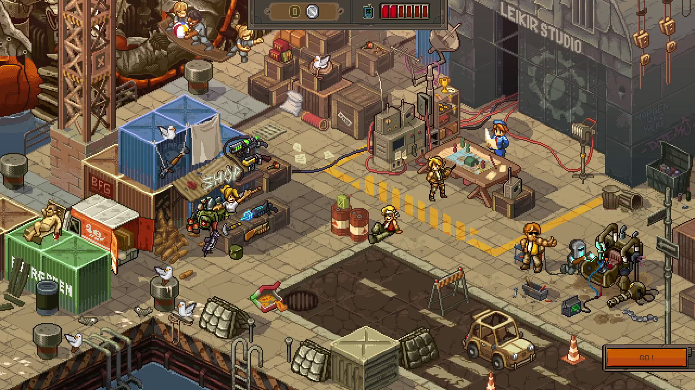
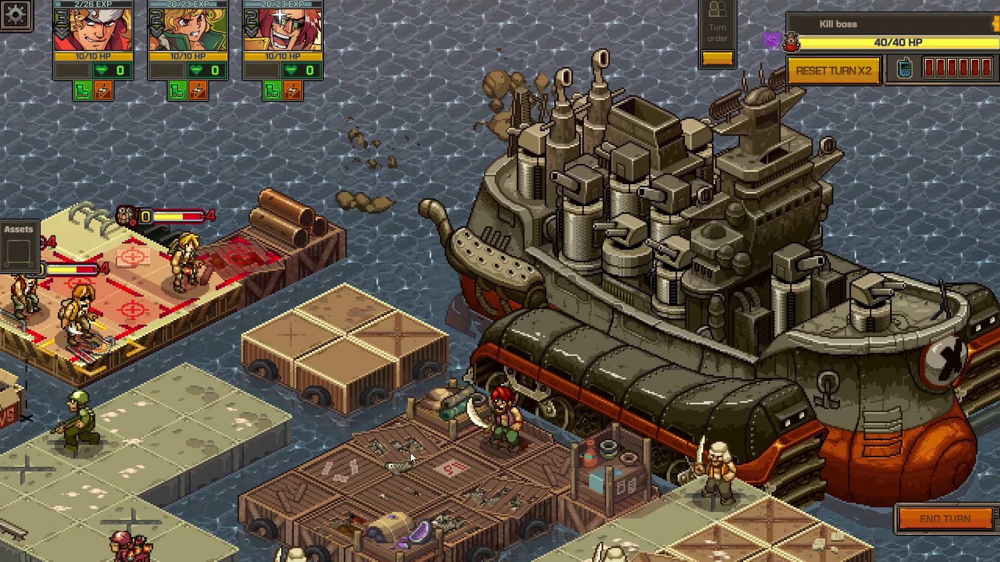
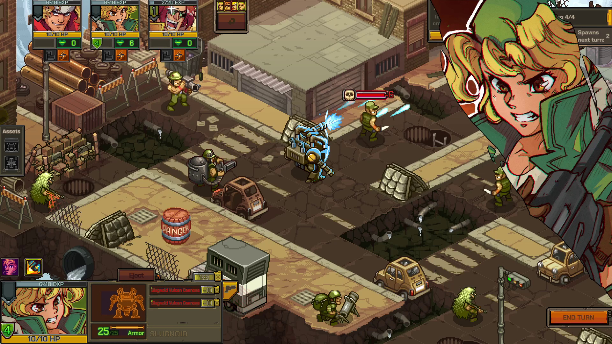

+++
title = "Comme Metal Slug, mais en Tactics"
date = 2024-06-07T16:00:32+01:00
draft = false
author = "Mickael"
tags = ["Trailer"]
image = "https://nostick.fr/articles/2024/juin/0706-metal-slug-tactics/Metal-Slug-Tactics-4.jpg"
+++

Trois ans après son annonce (à l'E3, comme le temps passe), voici enfin des nouvelles de *Metal Slug Tactics* dont la sortie est désormais prévu pour cet automne. On a attendu si longtemps que quelques mois de plus ou de moins, ce n'est pas bien grave. Pour les oublieux, le titre reprend les personnages et l'univers de *Metal Slug* bien sûr, mais en mettant de côté l'aspect complètement bourrin des jeux d'action originaux.

 

Ici, tout est affaire de placement de ses combattants, de stratégie, de connaissance du terrain et des capacités de ses armes. Le tout en 3D isométrique ! Aux antipodes des run & gun de la Neo Geo. Et vous savez quoi ? Ça a l'air de marcher d'enfer. L'excellent studio français Dotemu, à qui l'on doit *Windjammers 2*, *Streets of Rage 4*, et qui édite *TMNT: Shredder's Revenge*, est aux manettes et c'est extrêmement prometteur.

*Tactics* propose 110 maps (!) et 20 types de missions, à vaincre avec 9 personnages tirés de la saga que l'on pourra équiper avec un arsenal de 36 armes. Et la rejouabilité devrait être assurée avec une progression de type roguelite. Le jeu sera dispo sur PC (Steam), Switch, et consoles de salon à un prix encore inconnu.