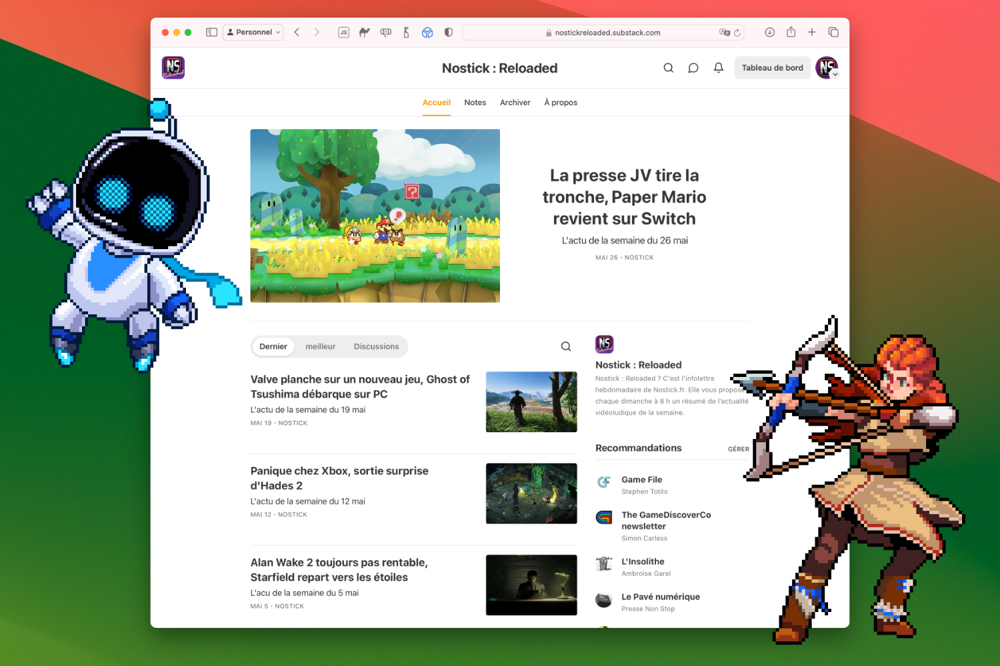

+++
title = "Nostick Reloaded : une infolettre hebdomadaire résumant l’actualité du jeu vidéo !"
date = 2024-06-07T15:00:00+01:00
draft = false
author = "Félix"
tags = ["Actu"]
image = "https://nostick.fr/articles/2024/mai/3105-nostick-reloaded/nostick-reloaded.jpg"
+++

 

Le saviez-vous ? Nostick, ce n’est pas qu’un site web : c’est aussi une infolettre ! Une infolettre hebdomadaire même, baptisée [Nostick Reloaded](https://nostickreloaded.substack.com) et livrée chaque dimanche à 8 h pétantes. Elle résume les grosses actualités de la semaine ainsi que les sorties du moment, ce qui sera pratique pour ceux qui suivent le sujet de loin.

Si vous avez l’habitude de nous lire uniquement via le site ou vos flux RSS, il s’agit en fait d’un condensé de nos articles du week-end (Les sorties de la semaine / La folle semaine du JV). On y glisse aussi un lien vers nos autres papiers récents au cas où vous seriez passé à côté.

Tout cela passe par Substack : vous pouvez retrouver nos archives [à ce lien](https://nostickreloaded.substack.com) histoire de voir si le contenu vous intéresse avant de vous abonner. Nous n’envoyons qu’un unique mail le dimanche, c’est sans pub et vous pouvez vous désabonner quand vous voulez. Déjà 300 lecteurs conquis, alors pourquoi pas vous ?