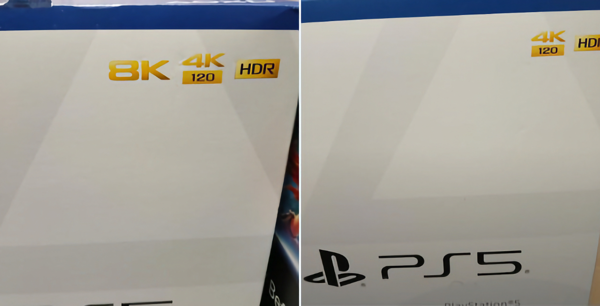
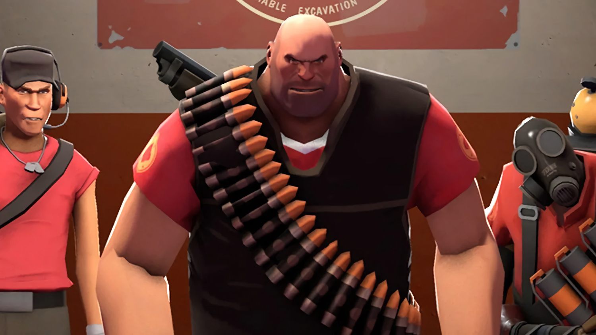

+++
title = "Originale, spéciale, un peu asociale : la folle semaine du jeu vidéo (08/06)"
date = 2024-06-08T07:15:00+01:00
draft = false
author = "Mickael"
tags = ["Actu"]
image = "https://nostick.fr/articles/vignettes/Lego-horizon-adventures.jpg"
+++

L’actualité du jeu vidéo ne s’arrête pas à la poignée d’articles publiés sur *Nostick* ! Histoire de rattraper le retard accumulé, voici un retour rapide sur quelques unes des infos les plus importantes (ou insignifiantes) de la semaine.

## Un été aux manettes avec LEGO Horizon Adventures, Civilization VII, Metaphor: ReFantazio, Slitterhead…

Le Summer Game Fest n'est certainement pas l'E3, mais vu que le grand salon du jeu vidéo ne reviendra [plus jamais](https://nostickreloaded.substack.com/p/fin-de-le3-annulation-du-jeu-multi), on ne va pas faire la fine bouche ! Ce d'autant que la petite sauterie de Geoff Keighley a proposé pas mal de nouveautés plutôt sympas, pas de grosses révélations non plus, mais quelques titres ont retenu notre attention.

 

À commencer par *LEGO Horizon Adventures*, première incursion d'une franchise PlayStation sur Switch (!), et aussi sur PC, mais pas sur Xbox car n'allons pas trop loin tout de même. Le cocktail est connu maintenant : des briquettes mélangées à une grosse licence, saupoudrez-moi ça d'une dose d'humour et voilà ! Le jeu a l'air vraiment amusant, mais il faudra attendre Noël pour pouvoir y mettre les mains.

 

Autre franchise fameuse qui revient aux affaires : *Civilization VII* ! L'increvable jeu de stratégie 4X développé par Firaxis sortira l'année prochaine sur PC et consoles. Il était temps, le dernier opus datant de 2016.

 

Annoncé il y a plus de 6 ans (!), *Metaphor: ReFantazio* refait parler de lui. Il s'agit d'un jeu de rôle développé par le Studio Zero et édité par Atlus, dont les designer et directeur artistique Shigenori Soejima et Katsura Hashino ont donné un coup de main. Et il est indéniable qu'on reconnait la patte de *Persona* ! Il sortira sur consoles et PC le 11 octobre.

 

*Slitterhead* a un petit air de *Silent Hill*, et pour cause : il s'agit dans les deux cas de jeux signés Keiichiro Toyama ! Au sein de son studio Bokeh Game, il planche sur ce nouveau titre qui combine horreur avec une bonne dose d'action dans lequel le joueur doit prendre possession de différents personnages. Le jeu sera dispo le 8 novembre sur consoles et PC.

Probablement pour faire pardonner des Games Awards 2023 calamiteux où Geoff Keighley a fait comme si l'industrie du jeu vidéo se portait très bien (des licenciements ? Où ça ?), l'hôte de la soirée a cette fois reconnu que le secteur n'était pas au mieux de sa forme. Entre deux trailers de grosses franchises, l'événement a aussi mis en lumière des jeux indés, dont deux français !

 

Le jeu de plateformes *Deer & Boy* réalisé par une petite équipe parisienne s'annonce ainsi complètement craquant avec cette aventure mettant en scène, et bien… un garçon et un cerf qui apprennent à devenir amis et à grandir ensemble. Cette amitié inattendue va leur permettre de résoudre des énigmes et franchir tous les obstacles. Sortie prévue sur PC prochainement.

 

Les montpelliérains de The Games Bakers ont eu droit à leur heure de gloire avec le trailer de *Cairn*, une simulation d'alpinisme doublée d'un survival. Rendez-vous l'année prochaine pour en savoir plus sur ce jeu PC.

 

Toujours au rayon des indés, deux initiatives notables ont été présentées hier soir. D'abord du côté d'Innersloth, le studio créateur d'*Among Us*, qui a décidé d'investir les sous gagnés avec leur hit dans le soutien aux développeurs indépendants via une nouvelle structure, Outersloth. Six jeux sont en développement, ils sortiront dans les prochains mois.

 

Dans un genre complètement différent, le studio de cinéma spécialisé dans l'horreur Blumhouse (*Paranormal Activity*, *Get Out*, *M3GAN*…) a lancé une division jeux vidéo ! Six titres indépendants sont en cours de production, avec une stratégie copiée/collée sur le succès de l'entreprise dans les salles obscures : des jeux originaux à petit budget.

Difficile de faire le tour de toutes les annonces de la soirée en quelques minutes, mais sachez par exemple que *Valorant* sortira sur consoles et très rapidement, puisqu'une bêta est programmée la semaine prochaine. On saura très bientôt de quel bois se chauffe *Kunitsu-Gami: Path of the Goddess*, le dernier jeu étrange de Capcom : il sortira le 19 juillet sur consoles et PC (et le même jour sur le Game Pass).

*New World: Aeternum*, le MMO d'Amazon revu et enrichi, sera disponible sur PC et consoles le 15 octobre. *Mighty Morphin' Power Rangers: Rita's Rewind* (ouf !) est un beat'em up rétro 16 bits avec les fameux héros colorés, il sortira on ne sait pas trop quand cette année sur PC. La saison 2 de *Street Fighter 6* comptera 4 nouveaux combattants, dont M. Bison, Elena, et… deux experts de la bagarre venus de *Fatal Fury* : Terry Bogard et Mai Shiranui !

## Google a de sérieuses fuites

YouTube est devenu le terrain de jeu préféré des constructeurs de consoles et des éditeurs qui s'en servent pour diffuser leur showcase, State of Play, Direct ou appelez-ça comme vous voulez. Ces événements sont préenregistrés et uploadés en avance, et en mode « privé », ce qui empêche quiconque de pouvoir y jeter un œil avant l'heure. Quiconque ? Pas tout à fait.

D'abord, le ou les admins de la chaîne YouTube peuvent bien sûr  y accéder. Mais c'est manifestement le cas aussi d'employés de Google, qui enfreignent gaillardement leurs contrats de confidentialité en se rendant furtivement dans le *backend* pour y piquer des informations.

Le site *[404 Media](https://www.404media.co/google-leak-reveals-thousands-of-privacy-incidents/)* a pu mettre la main sur une base de données de Google portant sur la période courant de 2013 à 2018. Quelqu'un du moteur de recherche a espionné la chaîne YouTube de Nintendo et a fait fuiter les nouveautés. Ça a été le cas en 2017 quand des visuels de *Yoshi’s Crafted World* se sont [retrouvés](https://www.404media.co/google-leak-reveals-thousands-of-privacy-incidents/) dans la nature avant l'annonce officielle du jeu.

Google a confirmé qu'un employé — en fait, un sous-traitant — avait bien eu accès à cette information et qu'il avait « *délibérément* » fait fuiter l'info à un ami. L'incident a pourtant été qualifié de « *non intentionnel* ». Il n'est pas interdit de penser que la pratique a toujours cours : invariablement ou presque, les noms des jeux apparaissent en ligne avant chaque showcase de Nintendo ou d'un autre. Ça a d'ailleurs été le cas du dernier State of Play de PlayStation. Charge à Google de trouver des réponses car pour les éditeurs, une fuite est un cauchemar marketing…

## La 8K, c'est terminé pour (le carton de) la PS5

Allez, on va arrêter se mentir : l'autocollant 8K sur la boîte de la PS5, c'était un peu du chiqué. Oh, techniquement parlant, oui la console de Sony est certainement capable de pulser une définition 8K (7 680 x 4 320), soit quatre fois plus que de la 4K. Mais qui veut vraiment de ça ? Et surtout, qui a un téléviseur 8K chez lui ?

Il existe certainement des frappadingues qui possèdent un tel monstre dans le salon, mais du côté de PlayStation, le contenu est rachitique. En fait, il n'existe qu'un seul jeu, *[The Touryst](https://store.playstation.com/en-us/concept/10002492/)*, dont le style graphique tout en voxel n'exige pas vraiment de la 8K pour donner le meilleur de lui-même. Quant aux contenus vidéo, ils sont tout aussi inexistants.

Sony a probablement mis la charrue avant les bœufs en affichant aussi ostensiblement le support de la 8K dans son argumentaire marketing (au lancement de la console, du moins), et aussi sur les cartons de la PS5. C'est maintenant terminé : la mention 8K a disparu des emballages, comme le [rapporte](https://x.com/dark1x/status/1798377023162999196) John Linneman de *Digital Foundry*.

Verra-t-on la 8K avec la prochaine génération de consoles ? Rien n'est moins sûr, mais au lancement de la Xbox Series X, elle aussi compatible (en théorie), Phil Spencer avait [affirmé](https://www.wired.com/story/future-of-xbox-game-pass-xcloud-strategy/) qu'il faudra plusieurs années avant que la 8K ne devienne un standard pour l'industrie du jeu vidéo… si jamais cela devait arriver un jour.

## Valve ne fait rien contre les bots de Team Fortress 2 

Valve a un gros problème *Team Fortress 2*. Et plus précisément, un problème de bots ! La communauté de joueurs, toujours très active pour le jeu de tir (17 ans d'âge !), en a plein son casque des foutus bots qui pourrissent tout. À tel point que le jeu est devenu tout simplement injouable : les bots s'emparent les premiers des objets gratos, ils envahissent les serveurs…

Il y en aurait des dizaines de milliers, qui au passage gonflent les stats du jeu, toujours solidement ancré dans le top 10 des titres les plus populaires de Steam. Et Valve continue d'alimenter *TF2* avec du contenu frais très régulièrement (une version 64 bits est disponible depuis… avril). Mais par contre, nada sur le problème des bots.

Exaspérés par l'apathie de l'éditeur, les joueurs ont donc décidé de prendre les choses en main en balançant des notes et des commentaires négatifs sur le jeu. Résultat : *TF2* est désormais en territoire « *extrêmement négatif* », avec des joueurs déplorant la présence des bots et l'absence de réaction de Valve.

La campagne ne s'arrête pas là : une [pétition](https://save.tf), qui compte plus de 250 000 signatures, exige de Valve l'extermination des aimbots. L'entreprise semble plus intéressée à compter les millions de dollars que lui rapporte sa gagneuse, même si elle est gangrenée par la chaude-pisse…

## En vrac !

**Un dernier The Last of Us pour la route —** Hein que vous aimez ça, *The Last of Us* ! Naughty Dog, le studio créateur de la franchise aussi (et Sony également, on imagine), mais Neil Druckmann prépare les esprits : lui et ses équipes ne sont pas condamnés à pondre éternellement de nouveaux épisodes de *The Last of Us* ! Le patron du studio l'a [rappelé](https://www.latimes.com/l-a-influential/story/2024-06-02/neil-druckmann-the-last-of-us-video-game) avec force auprès du *LA Times*, même si l'entreprise a consacré ces dernières années à des remakes, remasters et autres collections de sa saga. On sait que Naughty Dog travaille sur un nouveau jeu depuis mars 2023, mais en revanche nul ne sait s'il s'agit d'une Part 3 ou de quelque chose de complètement différent (ou d'un nouvel *Uncharted*, l'autre licence phare du développeur).

 

**Cry me a Riven —** 27 ans (!) après l'original, *Riven* est de retour pour votre ordinateur moderne ! Oui, *Riven*, la suite de *Myst* avec ses énigmes à s'arracher les cheveux a été complètement retravaillé et ce nouveau titre se présente comme une expansion de l'univers original. Toujours développé par le studio Cyan avec l'Unreal Engine 5, ce nouveau monde sera dispo le 25 juin sur PC, sur Mac et Meta Quest pour une quarantaine d'euros.

