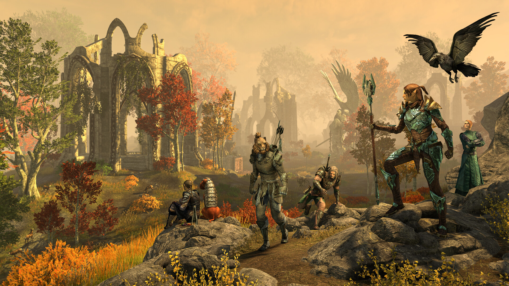
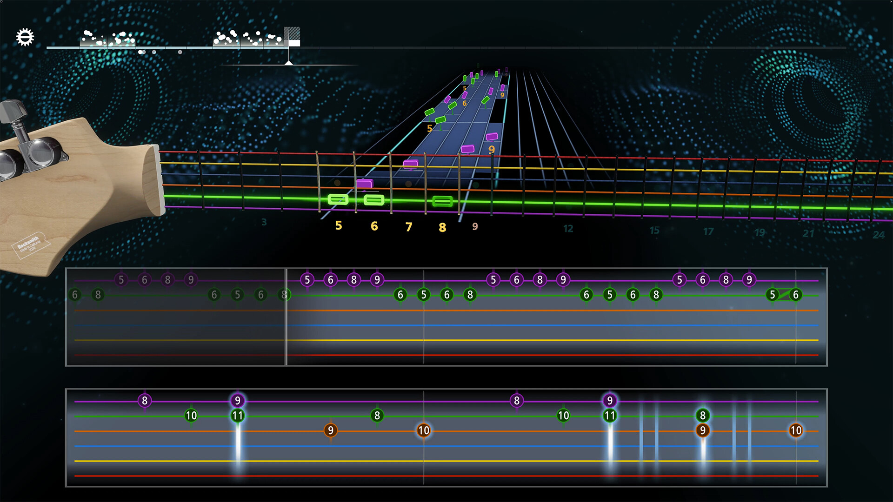

+++
title = "Les sorties de la semaine (09/06)"
date = 2024-06-09T07:00:01+01:00
draft = false
author = "Félix"
tags = ["C’est dispo"]
image = "https://nostick.fr/articles/2024/juin/020624-les-sorties-de-la-semaine/rpop.jpg"
+++

Entre le boulot, les courses et ce colis Amazon perdu qui vous fait passer des heures au téléphone avec différents SAV, vous n’avez peut-être pas eu le temps de vous intéresser aux nouveautés du moment. Qu’à cela ne tienne : voici les sorties de ces derniers jours qui ont retenu notre attention.

## Le dernier des Meuporg

Malgré le bal des *showcase* de cette semaine, ces derniers jours ont été plutôt calmes niveau sorties. Preuve en est : on commence avec l’extension ***Gold Road*** pour l’increvable *The Elder Scrolls Online*. On ne va pas s’attarder des masses parce que franchement 1) osef 2) ça a pas l’air terrible. Le pitch est assez simple (un méchant prince revient menacer l’humanité) et prétexte à explorer le Weald Occidental, une région vue dans *Oblivion* « *menacée par les jungles de Val-Boisé et les incursions daedriques* ». On nous promet une nouvelle épreuve réunissant jusqu’à 12 joueurs appelée la Citadelle Lumineuse ainsi qu’un nouveau système apportant un peu de neuf côté gameplay. *[TheGamer](https://www.thegamer.com/the-elder-scrolls-online-gold-road-review-disappointingly-tone-deaf/)* explique que les nouvelles zones sont chouettes et les boss intéressants, mais que l’histoire reste assez plan-plan. Au vu des évaluations « moyennes » sur Steam je vous conseillerais bien d’attendre, mais ceux qui continuent de jouer à *TES : Online* 10 ans après sa sortie auront sûrement déjà dégainé la CB. 40 € sur [Steam](https://store.steampowered.com/app/2662630/The_Elder_Scrolls_Online_Gold_Road/).

## Ne soyez plus le seul clown triste

Vous avez aimé *Dead By Daylight*, mais lâché l’affaire face au nombre effarant de DLC chelous et de mises à jour qui cassent tout du jour au lendemain ? Peut être devriez vous vous pencher sur ***Killer Klowns from Outer Space: The Game***, un nouveau jeu d’horreur asymétrique en multi. L’univers repose sur le nanard *[Les Clowns tueurs venus d'ailleurs](https://fr.wikipedia.org/wiki/Les_Clowns_tueurs_venus_d'ailleurs)* sorti en 1988. L’ambiance est volontairement idiote, faisant s’affronter plusieurs clowns-tueurs-aliens aux chaussures qui font *couic-couic* avec une bande d’ados. La formule change un peu étant donné qu’elle oppose 3 clowns contre 7 humains avec tout un tas de classes et d’armes différentes. Après, ça reste quand même 39 € pour un jeu qui tourne visiblement en rond après quelques heures, donc on réservera ça aux fans du genre. Les autres peuvent attendre une grosse promo et quelques patchs ajoutant des cartes et persos. Dispo sur [Steam](https://store.steampowered.com/app/1556100/Killer_Klowns_from_Outer_Space_The_Game/), PS4/PS5 et Xbox. 

 

## Fin de carrière douloureuse pour l’ancienne rockstar

Je serais prêt à payer cher pour revenir en 2007, époque bénie ou il n’était pas ringard de passer ses soirées à s’acharner sur une guitare en plastique pour faire péter les high score sur *Guitar Hero*. Si le concept est passé de mode, il n’est pas complètement mort et j’étais tout content d’apprendre que ***Rocksmith+*** arrivait cette semaine [sur Steam](https://store.steampowered.com/app/2834910/Rocksmith/). Malheureusement, le lancement est catastrophique : le jeu est un free-to-play facturé 20 balles par mois qui nécessite un compte Uplay. *Rocksmith+* se fait donc copieusement review-bomber, d’autant plus qu’Ubi a supprimé la version 2014 (sans abonnement) [en fin d’année dernière](https://nostickreloaded.substack.com/i/137536106/en-vrac). Si vous êtes prêts à outrepasser ce détroussage un peu crado, c’est apparemment un bon outil pour apprendre à jouer de la gratte même si le catalogue ne sera peut-être pas aux goûts de tous. Notons qu’il vous faudra une vraie guitare électrique ainsi qu’un adaptateur [vendu 30 €](https://www.amazon.fr/Câble-Rocksmith-pour-connecter-guitare/dp/B007KGISK6/) pour jouer. Les esthètes sans le sou pourront toujours dénicher une vieille guitare *Guitar Hero* sur Leboncoin avant d’aller installer *[Clone Hero](https://clonehero.net)*, un freeware prenant en charge les mods et avec une grosse communauté.

## Ciel, mon wookie

On entre dans la section fond de tiroir avec ***Star Wars Hunters***, un free-to-play pour mobiles et Switch. Ne partez pas, le concept est un peu rigolo étant donné qu’il s’agit d’un jeu de combat à la *Overwatch*. Deux équipes de cinq personnages se castagnent à la troisième personne sur de petites maps pour des parties de quelques minutes. C’est clairement du jeu pour smartphone simple à prendre en main, pas bien compliqué, mais plutôt fun d’après les quelques tests que j’ai lu. Le fait d’incarner des personnages de la licence donne envie et les graphismes sont corrects : ça peut valoir un téléchargement si vous êtes fan de Star Wars. Dispo sur [iOS](https://apps.apple.com/fr/app/star-wars-hunters/id1549708141), [Android](https://play.google.com/store/apps/details?id=com.zynga.starwars.hunters&hl=en) et [Switch](https://www.nintendo.com/fr-fr/Jeux/Jeux-a-telecharger-sur-Nintendo-Switch/STAR-WARS-Hunters--1923769.html).

 

## Un peu de rab’ 

Les fans de cyclisme seront ravis d’apprendre la sortie de **[Tour de France 2024](https://store.steampowered.com/app/2494340/Tour_de_France_2024/)** et de **[Pro Cycling Manager 2024](https://store.steampowered.com/app/2494350/Pro_Cycling_Manager_2024/)**. Bon, ils ne doivent pas être nombreux étant donné que ces jeux n’atteignent même pas les 15 critiques à eux deux, mais ça a le mérite d’exister. Dans un tout autre genre, ***Bodycam*** est disponible en accès anticipé : il s’agit d’un FPS ultra-réaliste sous UE5 qui n’est pas sans rappeler *Unrecord*, dont le trailer avait fait un tabac à sa sortie. Pas de raison de sauter dessus au vu des évaluations moyennes et du tarif costaud de 33 € [sur Steam](https://store.steampowered.com/app/2406770/Bodycam/). Notons au passage que les deux ***[Octopath Traveler](https://store.steampowered.com/app/921570/OCTOPATH_TRAVELER/)*** sont désormais dispos sur la plateforme de l’oncle Gaben, ce qui sera une bonne occasion de vous y mettre si vous avez loupé la version Switch. Le très chouette jeu de yakuzas ***Fading Afternoon*** a été [porté](https://www.nintendo.com/fr-fr/Jeux/Jeux-a-telecharger-sur-Nintendo-Switch/Fading-Afternoon-2548511.html) sur la console de Nintendo d’ailleurs, ce qui pourra vous occuper si vous aimez la thématique et les jeux un peu arty. Enfin, Sony et Bungie ont mis en ligne l’ultime extension de **Destiny 2**, mais ça vous le saviez déjà étant donné que vous avez lu [l’excellent article de Mickael](https://nostick.fr/articles/2024/juin/0506-destiny-2-bungie-foire-lancement-the-final-shape/) sur son lancement catastrophique.

**Breaking** : La première extension pour Alan Wake 2 est sortie par surprise hier, on reviendra peut-être dessus la semaine prochaine. C'est dispo sur consoles et PC, et vous pouvez jeter un coup d'œil à [ce trailer](https://www.youtube.com/watch?v=O_-4XH79B7U) pour vous faire une idée.

