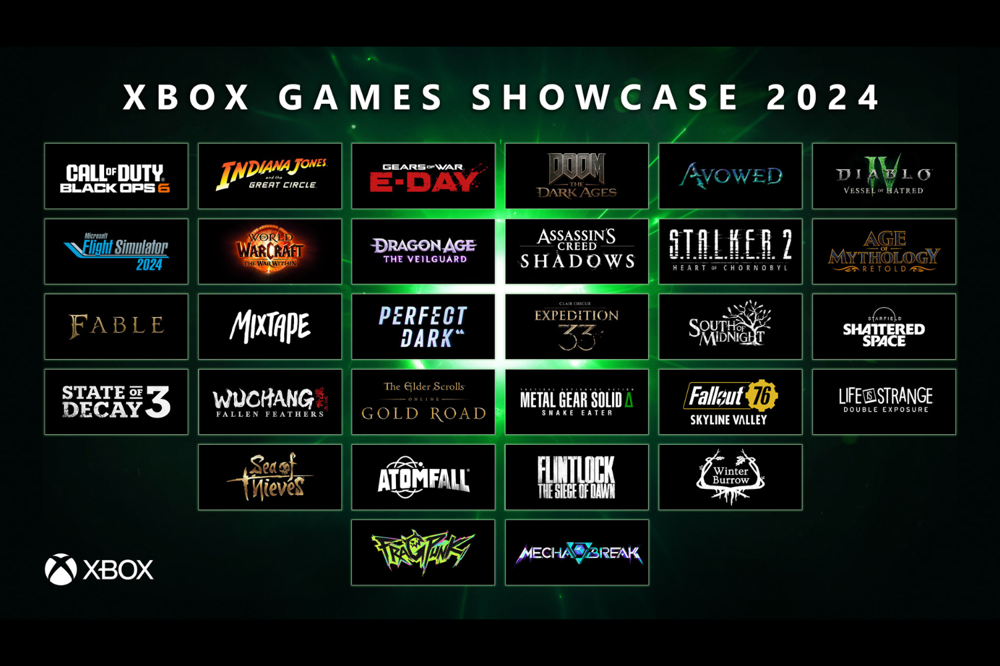

+++
title = "Doom, Gears of War, Perfect Dark… Xbox sort l'artillerie lourde"
date = 2024-06-09T17:47:32+01:00
draft = false
author = "Mickael"
tags = ["Une"]
image = "https://nostick.fr/articles/2024/juin/0906-doom-gears-of-war-perfect-dark-xbox-artillerie-lourde/xbox-showcase-2024.jpg"
+++

On ne va pas se mentir, ça ne sent pas très bon autour de Xbox depuis le début de l'année. Entre [les rumeurs alarmistes et les décisions incompréhensibles](https://nostick.fr/articles/2024/mai/1505-bonjour-tristesse-chez-xbox/) (la [fermeture du studio Tango](https://nostick.fr/articles/2024/mai/0705-fin-de-partie-pour-arkane-austin-et-tango-gameworks/), créateur du seul hit de la plateforme l'an dernier), Microsoft avait une montagne à gravir lors de son gros showcase annuel. Par l'extraordinaire, la mission semble réussie et Xbox a probablement regagné pas mal de points auprès des fans avec plusieurs annonces mastocs. Espérons que ça tiendra jusqu'au prochain drama !

 

Et ça a commencé plutôt fort avec l'annonce de *Doom: The Dark Ages*, qui va plonger le slayer dans un Moyen-Âge bien gorasse. Ça a l'air extrêmement prometteur au rayon viande, avec des armes qui font mal rien qu'à les voir ! Le jeu sortira l'année prochaine sur Xbox, PC… et PS5.

 

Microsoft n'a pas pu jouer l'effet de surprise à cause des rumeurs, mais on ne boudera pas son plaisir : un nouveau *Gears of War* a bel et bien été annoncé ! Sous-titré *E-Day*, on y retrouve l'ami Marcus Fenix et Dom Santiago qui font face à la horde locuste, le tout avec l'Unreal Engine 5 comme il se doit. Ça va sortir sur PC et Xbox. Pas de date annoncée.

 

On commençait à franchement s'inquiéter pour *Perfect Dark*, quatre ans après l'annonce du reboot sans nouvelle depuis. Xbox a rassuré avec un trailer qui donne aussi une petite idée du gameplay et ma foi, ça donne fichtrement envie. Le jeu tire son inspiration des deux titres originaux, tout en y ajoutant une nouvelle histoire et un nouvel univers. Hélas, pas de date annoncée pour le moment.

 

Dans le genre très attendu, *Fable* se pose un peu là. Cela fait 14 ans (!) que la franchise végétait dans un coin. Courage, l'attente est bientôt terminée avec une fenêtre de tir programmée pour l'année prochaine. Quant à la bande annonce qui révèle un peu de gameplay, elle promet le cocktail d'exploration et d'aventures qu'on est en droit d'attendre de la licence, sans oublier une bonne dose d'humour.

 

Ça fait un petit moment que les fans de la saga *State of Decay* languissaient pour connaitre la suite de leur jeu préféré de démasticage de zomblards. C'est chose faite ! *State of Decay 3*, en développement depuis 2020, a de l'allure avec son monde ouvert, mais en revanche il va falloir se montrer patient : aucune date n'a été annoncée.

 

*South of Midnight* impressionne beaucoup avec ses cinématiques en stop motion et un gameplay où les traversées ariennes sont à l'honneur. Hazel et son pote le gros poisson Catfish vont devoir traverser ce qui ressemble fort au delta du Mississippi, au milieu des bestioles dangereuses dont un alligator albino. Hé, on n'est pas là pour juger. Ça doit sortir l'année prochaine.

 

Les joueurs qui préfèrent se triturer la cervelle se feront plaisir avec *Age of Mythology Retold*, qui se présente comme la version définitive du fameux jeu de stratégie. Sortie prévue le 4 septembre sur PC et Xbox.

Il y a eu beaucoup, beaucoup d'annonces ce soir du côté de Xbox, et il serait bien vain de ma part de toutes les reprendre ici. Mais vite fait, sachez que l'extension *Shattered Space* pour *Starfield* sortira bien cette année (ça vous fait une belle jambe). Surfant sur le carton de la série télé, *Fallout 76* aura droit également à une extension, *Skyline Valley*, qui va rajouter un gros bout de map. Sortie le 12 juin !

Du côté de *World of Warcraft*, la prochaine extension *The War Within* est programmée pour le 26 août. *Vessel of Hatred*, premier DLC pour *Diablo 4*, va inaugurer la saison des horreurs le 8 octobre. L'incroyable *Flight Sim 2024* reviendra titiller votre envie de piloter des gros navions le 12 novembre sur PC et Xbox. *Avowed* est toujours prévu pour cette année, *Indiana Jones et le Cercle ancien* pour décembre.

 

Microsoft avait réservé une petite place pour les éditeurs tiers, à l'image de BioWare et Electronic Arts qui ont dévoilé *Dragon Age: The Veilguard*, qui s'inscrit dans la lignée de la franchise. Sortie programmée cet automne.

 

Difficile de ne pas évoquer l'intriguant *Clair Obscur: Expedition 33*, un jeu de rôle au tour par tour qui se déroule dans un monde surréaliste inspirée de la France de la Belle-Époque. Hé, c'est toujours plus sympa que la France d'aujourd'hui qui sent le renfermé ! Sortie prévue l'année prochaine sur PC, Xbox et PS5.

 

Il y en a certainement parmi vous qui kiffez l'atome, alors voici venir *S.T.A.L.K.E.R. 2: Heart of Chornobyl*, avec une bande annonce qui donne une petite idée de ce à quoi s'attendre. Les ukrainiens de GSC Game World savent ce que les fans attendent ! Par contre, ils ne disent pas quand ça sera dispo.

 

Pour finir, impossible de ne pas reprendre le trailer de *Metal Gear Solid Δ [Delta, ndr]: Snake Eater*, remake de *MGS3* avec le moteur Unreal Engine 5 et qui donne fichtrement envie de replonger dans la gadoue avec ce bon vieux Snake. Malheureusement, toujours pas de date.

Et n'oubliez pas de [jeter un œil sur la nouvelle gamme Xbox](https://nostick.fr/articles/2024/juin/0906-microsoft-revoit-sa-gamme-xbox/) dévoilée ce soir !