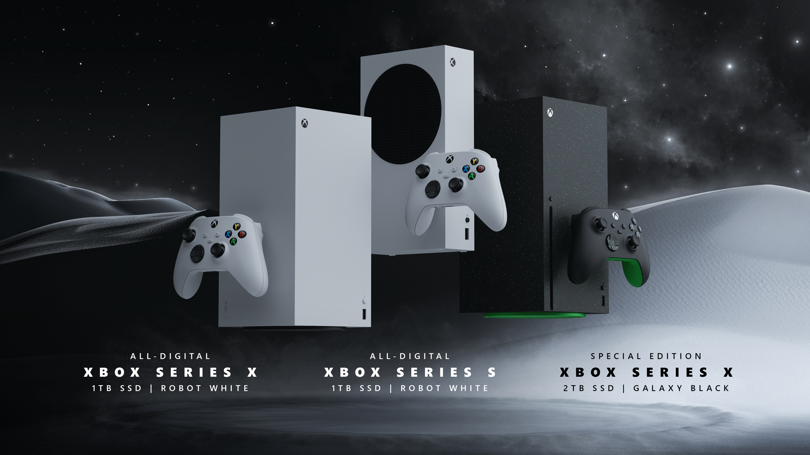

+++
title = "Microsoft revoit un peu sa gamme Xbox et lance une Series X sans lecteur CD"
date = 2024-06-09T19:30:00+01:00
draft = false
author = "Félix"
tags = ["Actu"]
image = "https://nostick.fr/articles/2024/juin/0906-microsoft-revoit-sa-gamme-xbox/seriesX2to.jpg"
+++ 

Il y a un peu de neuf dans la gamme Xbox. Microsoft a profité de son grand showcase pour [présenter](https://news.xbox.com/en-us/2024/06/09/xbox-series-x-s-new-console-options/) une nouvelle version de la Series X, qui écope d’une robe blanche que l’on avait déjà vue sur la Series S. Cette révision est identique au modèle actuel, mais fait l’impasse sur le lecteur CD. Le prix de cette version « low cost » n’a pas encore été annoncé, mais on nous promet une sortie pendant l’été.

La Series X actuelle va être déclinée dans une « Special Edition » avec un SSD deux fois plus gros de 2 To. Elle gagne aussi une finition originale avec plein de petites paillettes vertes. Une manette assortie sera évidemment incluse dans le carton. Comptez 650 € tout de même pour mettre la main dessus, là où la version classique 1 To coûte 100 balles de moins.

Enfin, une nouvelle Series S va être mise en vente en coloris « Robot White ». Celle-ci embarque 1 To de SSD et va venir remplacer le modèle noir lancé l’année dernière. La console sera toujours affichée à 350 €, donc pas de quoi sauter au plafond.