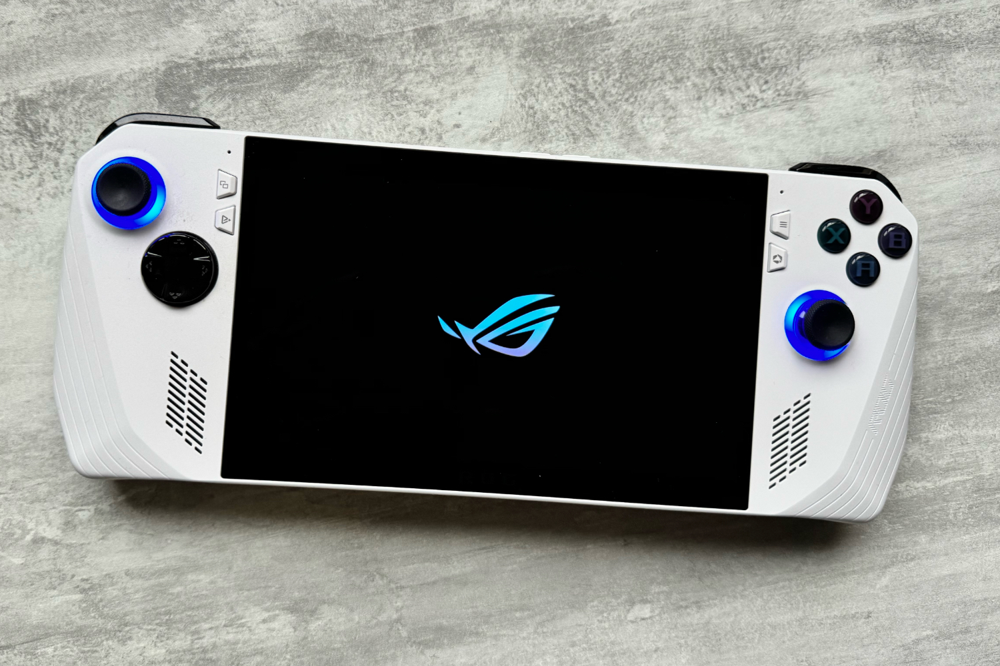

+++
title = "Microsoft veut sa Xbox portable"
date = 2024-06-10T10:47:32+01:00
draft = false
author = "Mickael"
tags = ["Actu"]
image = "https://nostick.fr/articles/2024/mars/2503_xboxconsole/ROG_Ally.jpg"
+++

[Des jeux, des jeux, encore des jeux…](https://nostick.fr/articles/2024/juin/0906-doom-gears-of-war-perfect-dark-xbox-artillerie-lourde/) et une mise à jour mineure pour la gamme de consoles. Xbox a fait son show hier et il faut bien reconnaitre qu'au rayon des jeux en eux-mêmes, Microsoft n'a pas déçu. En revanche, du côté du matos, c'est un peu la déception. Mais où est la console PC portable ?!

Malgré les rumeurs de dernière minute qui prédisaient un premier lever de rideau pour une console PC portable griffée aux couleurs de Xbox, rien n'est venu. On a bien eu droit à [un toilettage des consoles de salon](https://nostick.fr/articles/2024/juin/0906-microsoft-revoit-sa-gamme-xbox/), mais rien de franchement transcendant. Pourtant, il est à peu près clair que Microsoft veut sa part du gâteau de ce marché.

« *Je pense que nous devrions avoir une console portable, nous aussi* », a ainsi affirmé Phil Spencer, le grand patron de la division gaming. Dans une interview à *IGN*, il [dresse](https://www.ign.com/articles/the-big-phil-spencer-ign-live-interview-on-the-health-of-xbox-handhelds-and-more) en creux le portrait de cet appareil, en affirmant que cette console devrait faire fonctionner les jeux en local, ce qui exclut donc des produits comme le Portal de PlayStation et tous les appareils spécialisés dans le cloud gaming sortis ces derniers mois.

 

« *J'aime mon ROG Ally, ma Legion Go de Lenovo, mon Steam Deck. Pouvoir jouer en local est vraiment important* », poursuit-il. C'est prometteur, car cela signifie que Xbox ne se contentera pas d'un simple écran connecté à internet, mais d'un appareil complet et aussi puissant que possible. « *L'avenir qui nous attend dans le domaine du matériel est vraiment fantastique. Le travail que l'équipe effectue sur différents formats, différentes manières de jouer, m'enthousiasme énormément* ».

Mais quand est-ce que tout ça sera disponible, bon sang de bois ? Malheureusement, le dirigeant n'en dit rien mais il laisse penser que ça pourrait ne pas tarder : « *Aujourd'hui [au Xbox Showcase, ndr], il s'agissait des jeux… mais il viendra un moment où nous parlerons davantage de la plateforme, et nous avons hâte de vous la présenter* ».

Ce n'est pas la première fois que Phil Spencer fait miroiter une console portable chez Xbox. En mars dernier déjà, il confirmait déjà que [Microsoft travaillait sur le sujet](https://nostick.fr/articles/2024/mars/2503_xboxconsole/).

## La petite entreprise de Phil Spencer

Sur une note beaucoup moins légère, Spencer a aussi réaffirmé qu'il était le boss et qu'il avait un business à gérer. Interrogé sur [la fermeture de Tango Gameworks et d'Arkane Austin](https://nostick.fr/articles/2024/mai/0705-fin-de-partie-pour-arkane-austin-et-tango-gameworks/) il y a quelques semaines (une annonce qui avait provoqué un électrochoc au sein de la communauté des joueurs), il a convenu que c'était « *difficile* », pour les personnes concernées et pour l'équipe.

« *C'est évidemment une décision qui est très difficile et je veux m'assurer, à travers les indemnités de départ et autres, que nous faisons ce qu'il faut pour les personnes de l'équipe* », assure-t-il. Mais au bout du compte, « *je dois gérer une entreprise [au sein de Microsoft] et la développer. Et cela signifie parfois que je dois prendre des décisions difficiles qui, franchement, ne sont pas des décisions que j'aime, mais des décisions que quelqu'un doit prendre* ». Voilà qui a le mérite de la franchise, même si cette déclaration ne réconfortera personne chez les fans de *Hi-Fi Rush*.