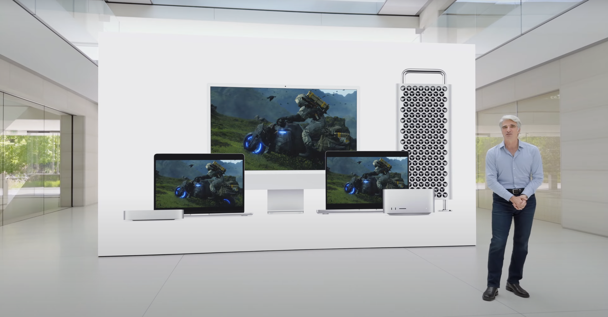

+++
title = "Envers et contre tous, le catalogue de jeux Mac continue de s’étoffer"
date = 2024-06-13T11:30:00+01:00
draft = false
author = "Félix"
tags = ["Actu"]
image = "https://nostick.fr/articles/vignettes/macgaming.png"
+++ 

Vous l’ignoriez sans doute, mais Apple veut faire de ses Mac des machines de joueurs. Oui oui, ces mêmes Mac dont on rigole allègrement depuis des années pour leur bibliothèque de jeux rachitique et leur GPU aux fraises. Le géant de Cupertino a profité de son grand raout annuel lundi dernier pour [présenter](https://www.apple.com/newsroom/2024/06/macos-sequoia-takes-productivity-and-intelligence-on-mac-to-new-heights/) une dizaine de jeux qui sortiront sur macOS prochainement. Rien de bien frais, mais tout de même quelques surprises.

Les joueurs Mac vont pouvoir découvrir (avec un peu de retard) *Resident Evil 7* (2017) et le remake de *Resident Evil 2* (2019). On notera aussi l’arrivée prochaine de *Sniper Elite 4*  (2017) et de *Control* (2019). Un peu plus frais, citons également *Robocop : Rogue City* ou *Dead Island 2* qui datent tous deux de 2023. Et au niveau des sorties à venir ? Il y a quelques titres, comme le futur *[Assassin’s Creed Shadows](https://nostick.fr/articles/2024/mai/1505-premier-trailer-pour-assassins-creed-japon-qui-sortira-le-15-novembre/)*, *Frostpunk 2*, Riven ou encore la dernière extension de *Wow* (*The War Withing*). Le gacha *Wuthering Waves* va aussi avoir droit à son portage. Tout cela sortira dans les mois qui viennent.

Depuis quand Apple fait elle de la jambe aux joueurs ? Eh bien depuis pas si longtemps : les Mac ont abandonné Intel en 2020 pour passer aux puces maison Apple Silicon, qui ont pour avantage d’être relativement puissantes tout en ne consommant pas beaucoup d’énergie. Ce sont sur le papier des puces correctes pour des jeux récents… pour peu que les développeurs portent leur moteur. Apple a visiblement fait un chèque à Ubisoft et Capcom, qui ont optimisé le RE : Engine et l’Ubi Anvil pour macOS. On a ainsi vu arriver *RE:4 Remake* ou *Assassin’s Creed Mirage* sur les différents appareils d’Apple.

Du côté des développeurs, la sauce prend doucement. *Valheim* vient tout justement d’arriver [sur le Mac App Store](https://apps.apple.com/us/app/valheim/id1554294918?mt=12), *Baldur’s Gate 3* est dispo sur macOS et le futur Civilization VII aura également droit à son portage. Les performances sont loin d’être incroyables pour des machines à plus de mille balles, mais l’entreprise ne lâche pas l’affaire en faisant régulièrement des cadeaux aux joueurs. Elle a profité de sa conférence pour annoncer la deuxième version d’un outil permettant de faire tourner des jeux Windows sur Mac : on peut désormais jouer à des titres comme *Horizon Forbidden West, Ratchet & Clank: Rift* ou *Hi-Fi Rush* avec [un peu de bidouille](https://www.imore.com/gaming/you-can-now-play-these-5-aaa-ps5-games-on-your-mac-game-porting-toolkit-2-gives-apple-gamers-a-huge-boost-on-mac). Pas de quoi vous faire lâcher votre PC Gamer, mais largement de quoi occuper pendant une semaine de vacances. 

