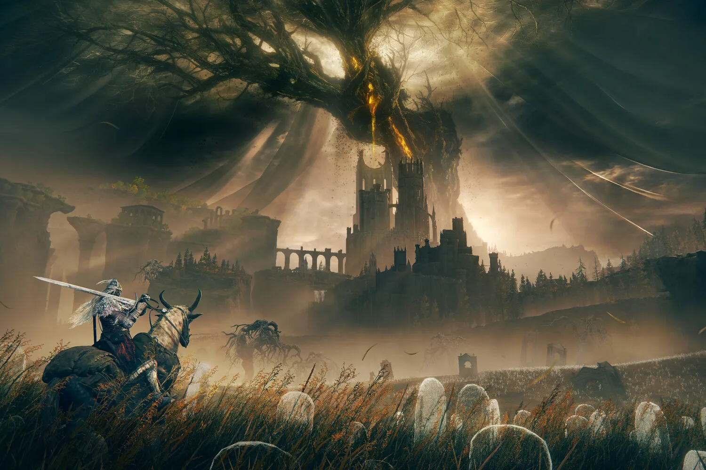

+++
title = "Ouf, FromSoftware n'a rien contre les soluces"
date = 2024-06-13T14:47:32+01:00
draft = false
author = "Mickael"
tags = ["Actu"]
image = "https://nostick.fr/articles/2024/juin/1306-fromsoftware-soluces/elden-ring.jpg"
+++

À moins d'être un dieu du jeu vidéo ou un sacré masochiste, il est à peu près vain de vouloir franchir tous les obstacles du velu *Elden Ring* sans un guide sous les yeux. Les jeux FromSoftware exigent un engagement total du joueur ainsi que de solides ressources externes — soluces, wiki, vidéos YouTube… — pour espérer en voir le bout sans finir zinzin.

Et l'éditeur le sait bien. « *Bien sûr que les joueurs vont consulter des guides* », [confirme](https://www.pcgamer.com/games/rpg/elden-rings-developers-know-most-players-use-guides-but-still-try-to-cater-to-those-who-go-in-blind-if-they-cant-do-it-then-theres-some-room-for-improvement-on-our-behalf/) son président Hidetaka Miyazaki à *PC Gamer*. « *Et il y a beaucoup d'information sur internet et dans les communautés où ils auront accès aux secrets et aux stratégies. Nous nous y attendons* ». Pour autant, est-ce souhaitable ?

« *Nous ne faisons rien, et on ne planifie rien en ayant [les guides] comme prérequis. Nous essayons de répondre aux besoins des joueurs qui ignorent tout du jeu et qui veulent progresser de manière organique* ». S'ils n'y arrivent pas et qu'ils ont besoin du coup de main d'une soluce, « *cela signifie qu'il y a des améliorations à apporter de notre côté* », indique-t-il. « *Nous aimerions essayer de mieux accueillir ces joueurs à l'avenir* ».

 

Si FromSoftware va peut-être engager une réflexion sur la jouabilité de ses jeux pour éviter d'effrayer les newbies ou ceux qui n'aiment pas trop se faire du mal[^1], le studio ne condamne pas ceux qui utilisent des guides : « *bien sûr, c'est un style de jeu tout à fait valide, et nous respectons ceux qui préfèrent jouer avec un guide à portée de main* », explique Hidetaka Miyazaki. 

Le studio veut simplement faire passer le message que ce n'est pas un prérequis. Plus facile à dire qu'à faire !

[^1]: Ça n'empêche pas Elden Ring de tout cartonner : le jeu a [dépassé](https://x.com/fromsoftware_pr/status/1800891340374642989) les 25 millions de copies vendues juste avant la sortie du DLC *Shadow of the Erdtree*.