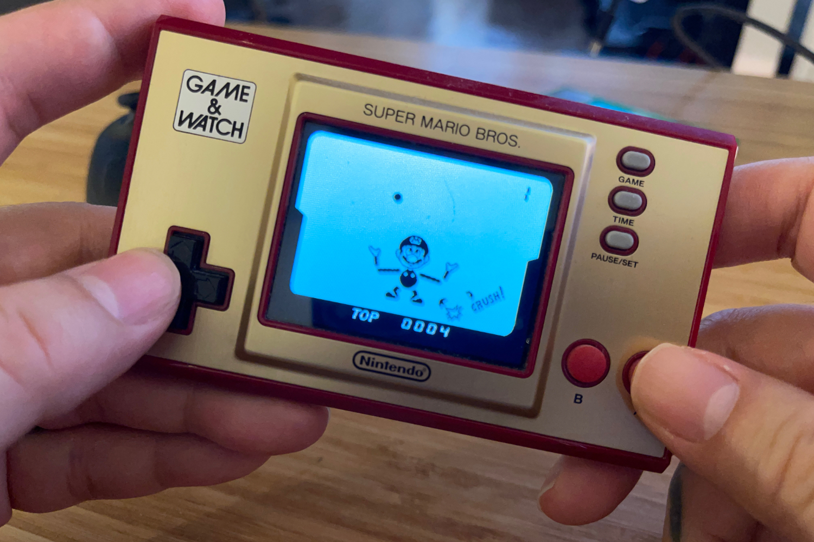

+++
title = "Retour en 1980 avec une pub remastérisée pour l'ancêtre du Game Boy et de la Switch"
date = 2024-06-14T07:47:32+01:00
draft = false
author = "Mickael"
tags = ["Trailer"]
image = "https://nostick.fr/articles/2024/juin/1306-retour-1980-pub-remasterisee-ancetre-game-boy-switch/Game-watch-nintendo.jpg"
+++

Aujourd'hui, jouer n'importe où c'est comme respirer : on le fait sans réfléchir. Entre les smartphones, la Switch, le Steam Deck et toutes les consoles PC portables, il est impossible de s'ennuyer entre deux arrêts de bus ou dans une file d'attente ! Mais à une époque pas si lointaine (bon OK, il y a plus de quarante ans…), c'était tout simplement de la science-fiction.

Au début des années 80, Nintendo connait son premier succès sur le marché du jeu vidéo (encore balbutiant) avec les [Game & Watch](https://en.wikipedia.org/wiki/Game_%26_Watch), de petits appareils à glisser dans la poche qui proposent des jeux très simples, mais pas simplistes pour autant : un tout petit écran LCD, deux ou trois boutons, et voici des heures d'amusement pour s'occuper dans le métro.

Mais Nintendo n'a pas immédiatement envahi le monde avec ses petits jeux. Aux États-Unis, c'est l'entreprise Mego qui s'est lancée en obtenant la licence de plusieurs Game & Watch. Le fabricant de jouets fondé dans les années 50 jette son dévolu sur quatre titres : *Ball* (rebaptisé *Toss-Up*), *Vermin* (devenu *Exterminator*), *Fire* (*Fireman Fireman*) et Flagman (*Flag Man*).

Le problème auquel se heurte Mego est de taille : il faut faire comprendre au public américain qu'il est possible de jouer à l'extérieur, loin des consoles branchées à la télé ou des bornes d'arcade. La pub va jouer un grand rôle dans l'acceptation de ces petits appareils ! Un spot produit en 1980 a été remastérisé en 2K dans une qualité impeccable à apprécier ci-dessous :

 

La réclame de trente secondes explique des concepts basiques : « *il y a un jeu facile et un jeu difficile* », un classement des scores, et même… une horloge. Mais encore une fois, c'était quelque chose de très nouveau et il fallait prendre les consommateurs par la main. Ce témoignage assez inédit de la manière dont on lançait un nouveau produit dans les années 80 fait aussi une fixette un peu étrange sur les athlètes blessés !

Cette pub n'existait jusqu'à présent que sous des formes très dégradées. Comme l'explique *[ArsTechnica](https://arstechnica.com/gaming/2024/06/gaming-historians-preserve-whats-likely-nintendos-first-us-commercial/)*, c'est le collectionneur et ancien journaliste Chris Kohler qui a mis la main sur le film 16 mm lors d'enchères. Il l'a apporté à la fondation de l'histoire du jeu vidéo (VGHF), qui l'a confié aux bons soins des spécialistes de la restauration Movette Film Transfer.

Mego a mis la clé sous la porte en 1983 (l'entreprise est revenue en piste en 2018), puis Nintendo a repris la main sur la distribution des Game & Watch. Le modèle le plus connu n'est autre que le *Donkey Kong* de 1982, pour lequel a été inventé le D-Pad en forme de croix ! Il s'est vendu à 8 millions d'exemplaires dans le monde. Récemment, Nintendo a commercialisé des versions spéciales de Game & Watch pour *Super Mario Bros.* et *The Legend of Zelda*.