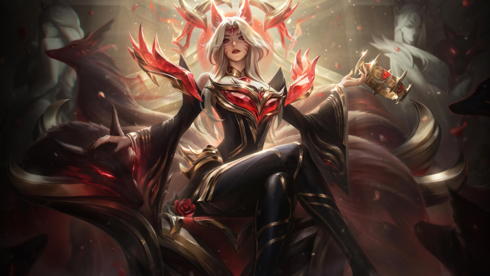

+++
title = "La semaine du jeu vidéo : retour sur Dragon Age: The Veilguard et Star Wars Outlaws, Obsidian croit en sa bonne étoile"
date = 2024-06-15T10:47:32+01:00
draft = false
author = "Mickael"
tags = ["Actu"]
image = "https://nostick.fr/articles/vignettes/juin/Star-wars-Outlaws.jpg"
+++

L’actualité du jeu vidéo ne s’arrête pas à la poignée d’articles publiés sur *Nostick* ! Histoire de rattraper le retard accumulé, voici un retour rapide sur quelques unes des infos les plus importantes (ou insignifiantes) de la semaine.

## Le retour (réussi ?) de BioWare avec Dragon Age: The Veilguard

Après un développement chaotique débuté en 2015, *Dragon Age: The Veilguard* a finalement été dévoilé en long, large et travers par BioWare durant le Summer Game Fest (SGF). Ce quatrième épisode de *Dragon Age*, qu'on a longtemps connu sous le nom *Dreadwolf*, va opposer le joueur et son équipe à Solas, apparu dans le précédent opus, *Inquisition*. Le problème des méchants c'est qu'ils ne disparaissent jamais tout à fait…

Ceux qui s'accrochaient à l'idée d'un RPG classique avec combat au tour par tour seront déçus : comme son prédécesseur, *Dragon Age: The Veilguard* est un action RPG. Il faut en effet jouer de la manette durant les combats, même s'il est possible de mettre sur pause pour donner des instructions à ses camarades. Les joueurs qui cherchent une expérience RPG plus traditionnelle peuvent toujours relancer une petite partie de *Baldur's Gate 3* !

 

D'après la vidéo de gameplay montrée par BioWare, on risque bien de passer beaucoup de temps à fracasser des méchants et des créatures ! Le développeur promet néanmoins que les joueurs moins portés sur la bagarre ne seront pas oubliés, ils pourront aussi se plonger dans les délices stratégiques autant qu'ils le veulent.

Parmi les petites indiscrétions sorties ces derniers jours sur le jeu, Gary McKay le directeur général du studio a [expliqué](https://blog.bioware.com/2024/06/06/TheVeilguard/) que son équipe avait testé la possibilité d'un mode multi. Finalement, il a jeté son dévolu sur une aventure en solo. 

Les petits coquinous que vous êtes se demandent probablement ce qu'il en sera de la romance dans le jeu. Corinne Busche, la directrice du jeu, a [précisé](https://www.ign.com/articles/dragon-age-the-veilguard-confirmed-to-let-you-romance-any-companion-you-want-will-include-nudity-it-gets-pretty-spicy) que tous les compagnons du joueur sont pansexuels : ils sont attirés par les personnes indépendamment de leur sexe, de leur identité de genre, ou de leur race dans le jeu (humain, nain, elfe, qunari…). 

Il sera donc possible de faire la cour (et plus si affinités) à n'importe qui, alors que dans les volets précédents certains héros étaient certes pansexuels, mais il y en avait d'autres qui n'étaient attirés que par les personnes de même sexe, du sexe opposé, voire de la même race. Il sera possible de flirter assez rapidement dans l'aventure, par contre les choses sérieuses ne commenceront réellement que plus tard dans le jeu. Hé oui il va falloir donner de sa personne… *Dragon Age: The Veilguard* sortira cet automne sur PC, PS5 et Xbox Series S/X.

## Star Wars Outlaws : la démo qui déçoit

Ubisoft a le chic pour provoquer la polémique à chacun de ses gros jeux. On passera sur la campagne orchestrée par les trolls racistes, [toujours les mêmes](https://www.bfmtv.com/tech/gaming/il-ne-fait-qu-alimenter-la-haine-ubisoft-s-en-prend-a-elon-musk-apres-la-polemique-sur-assassin-s-creed-shadows_AV-202406140643.html), qui essaient de pourrir le lancement d'*Assassin's Creed Shadows* (pensez donc, un Noir samouraï… alors que le personnage a [vraiment existé](https://fr.wikipedia.org/wiki/Yasuke) ! ). Non, cette fois c'est moins grave mais cela n'en reste pas moins un revers pour *Star Wars Outlaws*.

 

L'open world a été présenté plus en détails pendant le SGF et la démo présentée par Ubisoft n'a pas remporté tous les suffrages. Malgré les qualités esthétiques du jeu, qui sont indéniables, des testeurs ont noté que le gameplay avait un air de famille avec *Uncharted*. Un compliment pour certains, un reproche pour d'autres, sachant que la saga de Naughty Dog n'est pas de la dernière fraîcheur.

Julian Gerighty, le directeur créatif du jeu, a [réagi](https://www.videogameschronicle.com/news/responding-to-some-negative-previews-star-wars-outlaws-director-says-demo-was-just-an-appetiser/) à cette comparaison dans *VGC*. « *Pour moi, [Uncharted] n'était pas nécessairement notre point de référence* », explique-t-il. « *C'est un jeu merveilleux, donc si vous devez vous comparer à quelqu'un, autant que ce soit le meilleur de l'industrie (…) Mais ce n'était pas notre point de départ* ».

Le problème rencontré par les testeurs, c'est qu'on leur a vendu un jeu en monde ouvert et qu'ils sont tombés sur une démo de 20 minutes censée présenter rapidement plusieurs aspects du jeu et de ses systèmes. « *Nous avons dû choisir quelque chose de 20 minutes, facile à consommer, avec beaucoup de variété, de nombreux systèmes représentatifs, mais pas l'expérience en monde ouvert* », détaille le responsable. *Star Wars Outlaws* sera beaucoup plus vaste que les quelques activités proposées par la démo. Il faudra une trentaine d'heures pour venir à bout du jeu, le double pour les complétistes. [Et c'est bien suffisant.](https://nostick.fr/articles/2024/avril/0404-les-jeux-trop-longs-sont-trop-longs/)

## League of Legends : rira bien qui Ahri le dernier

L'économie des skins dans les jeux, et pas que les free to play, est hors de contrôle. Les éditeurs cherchent à rentabiliser à tout prix, quitte à régulièrement provoquer une saine colère des joueurs las de se faire presser comme des citrons. Riot est allé probablement un cran trop loin avec une skin vendue la bagatelle de 500 $ (!) pour rhabiller de pied en cap l'héroïne Ahri dans *League of Legends*.

Attendez, quoi, 500 $ pour un jpg ?! Il s'agissait pour l'éditeur de saluer l'introduction du joueur Faker dans son Hall of Legends, le premier du genre. Une explication un peu courte pour les autres joueurs qui se sont étranglés devant le montant de l'étiquette. « *Il y a beaucoup de gens contrariés à propos de cette skin* », a [admis](https://www.pcgamer.com/games/moba/according-to-the-games-director-the-dollar500-league-of-legends-ahri-skin-wasnt-meant-for-the-average-fan-but-instead-players-who-are-willing-to-spend-dollar200-a-month-on-their-hobbies/) Pu Liu, le directeur du jeu.

L'éditeur s'était déjà justifié dans une [vidéo](https://www.youtube.com/watch?v=6zOUaLKqwaA), expliquant que le prix élevé de la skin visait à couvrir le coût des compétitions d'esport organisées autour de LoL. Un peu léger, alors que les prix des packs de cosmétiques tournent autour de 20 à 35 $. C'est cher certes, mais on est loin de la somme folle demandée pour Ahri.

Pu Liu, qui a réitéré que la skin ne conférait aucune capacité supplémentaire au joueur, a donné une explication plus convaincante : « *il y a des joueurs prêts à dépenser 200 $ par mois pour leurs loisirs. Dieu sait combien j'ai dépensé pour des figurines Warhammer. Mais il est vraiment important que nous capturions cette volonté et cette capacité à dépenser* ». Il s'agit tout simplement de faire cracher au bassinet les *whales*, ces joueurs pleins aux as et accros au jeu.

## Une plainte à 777 millions d'euros pour Valve 

Valve a t-il abusé de sa position dominante au Royaume-Uni ? Comme partout ailleurs, Steam domine la distribution de jeux vidéo outre Manche, mais des consommateurs représentés par Vicki Shotbolt estiment que l'éditeur a poussé le bouchon trop loin. 

Dans sa plainte, la militante des droits numériques [affirme](https://steamyouoweus.co.uk/) que Valve a « *exclu injustement* » la concurrence sur les jeux PC et les achats intégrés, en obligeant les éditeurs à « *accepter des restrictions de prix qui dictent un prix minimum auquel les jeux  peuvent être vendus sur des plateformes concurrentes* »

Autrement dit, les joueurs britanniques auraient donc payé trop cher pour ces logiciels. Valve prélève 30 % sur les jeux vendus dans Steam, une commission jugée excessive. L'affaire, qui pourrait mettre des années à aboutir, risque de coûter très cher à l'opérateur de Steam : la class action inclut tous les joueurs habitant au Royaume-Uni ayant acheté un jeu ou des contenus depuis juin 2018 ! Soit quelque chose comme 14 millions de joueurs.

Chacun d'entre eux recevraient entre 22 et 44 livres, soit un total qui se monterait à 656 millions de livres, l'équivalent de 777 millions d'euros.

## Obsidian croit en sa bonne étoile pour ne pas fermer

Le [succès du dernier showcase Xbox](https://nostick.fr/articles/2024/juin/0906-doom-gears-of-war-perfect-dark-xbox-artillerie-lourde/) n'a pas complètement oblitéré des mémoires [la fermeture d'Austin Arkane et de Tango Gameworks](https://nostick.fr/articles/2024/mai/0705-fin-de-partie-pour-arkane-austin-et-tango-gameworks/) début mai. Microsoft, tout à sa recherche effrénée de rentabilité, n'en a sans doute pas terminé avec les mauvaises nouvelles du même genre. Et on redoute le pire pour les studios qui n'ont pas d'énormes franchises sous le coude comme *Doom* ou *Call of Duty*, des titres assurés d'empiler les billets verts.

Ça avait été le cas pour Ninja Theory qui sort tout juste de  *Hellblade II* ; le succès (tout relatif a priori) du jeu faisait craindre une fermeture précoce mais fort heureusement, le studio a [reçu le feu vert pour développer un nouveau projet](https://nostick.fr/articles/2024/mai/2105-la-sortie-de-hellblade-2-ne-condamne-pas-ninja-theory/). Rebelote pour Obsidian, dont le prochain RPG *Avowed* va faire face à la redoutable concurrence de *Dragon Age*. Le hic, c'est que le studio a un peu de mal à expliquer ce qu'est le jeu, son gameplay, voire l'univers dans lequel il baigne.

 

Peut-être qu'*Avowed*, en gestation depuis des années et qui doit sortir d'ici la fin 2024, sera un carton monumental, mais peut-être pas. Carrie Patel, la directrice du jeu, ne « *vit pas dans la peur* », [affirme](https://www.eurogamer.net/i-dont-believe-in-living-in-fear-obsidian-talks-avowed-release-date-prospects-and-xbox-studio-closures)-t-elle pourtant chez *Eurogamer*. Et l'épée de Damoclès que Microsoft fait planer autour de ses studios *first party* n'a pas eu de conséquence sur le processus créatif : « *Vous devez vous investir dans ce que vous faites, et vous devez y croire* ».

Matt Hansen, le directeur artistique, se sent « *profondément supporté, aussi bien en interne chez les développeurs et les fans, mais aussi par Microsoft* ». Durant ces 20 dernières années, Obsidian a livré de gros jeux comme *Fallout: New Vegas*, mais aussi *Pentiment* et *Grounded*.

