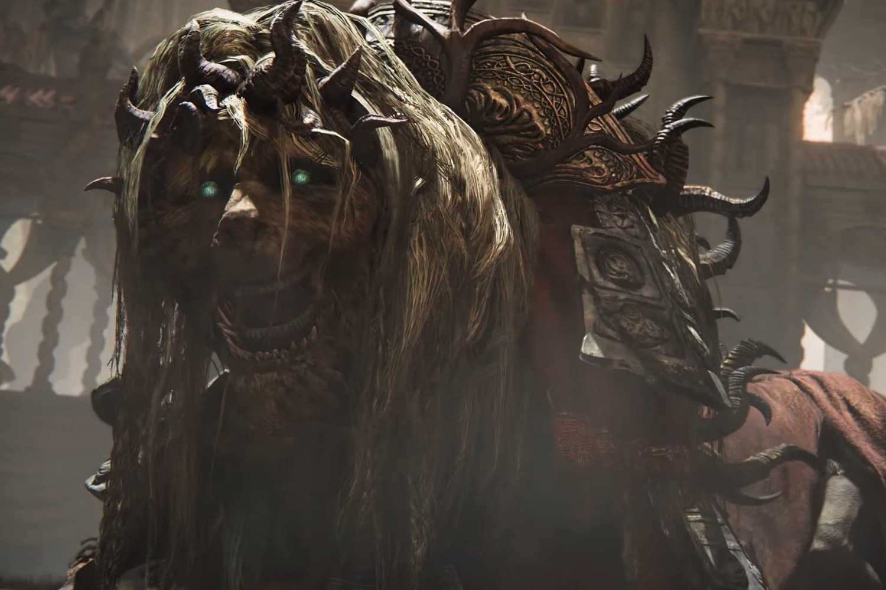

+++
title = "En vrac cette semaine : le DLC qui coince d'Elden Ring, Aloy chez Smash, Black Ops 6 un peu lourdingue…"
date = 2024-06-15T10:46:32+01:00
draft = false
author = "Mickael"
tags = ["Actu"]
image = "https://nostick.fr/articles/vignettes/juin/Shadow-of-the-Erdtree.jpg"
+++

Y a un peu plus d'actus cette semaine, je vous les mets quand même !

**Pas de DLC pour Elden Ring avant de battre le boss—** Tous les joueurs d'*Elden Ring* qui attendent impatiemment la sortie du DLC *Shadow of the Erdtree* sont cordialement invités à se bouger les fesses pour aller battre Mohg, le seigneur du sang ! Remporter la victoire contre ce boss optionnel est en effet indispensable pour accéder au contenu de l'extension. Hidetaka Miyazaki, le directeur du jeu, et son éditeur Bandai Namco l'ont [notifié](https://x.com/BandaiNamcoUS/status/1800330011171496440) aux joueurs cette semaine. Ce qui n'est pas une mauvaise idée : d'après les stats de Steam, plus de 62 % des joueurs d'Elden Ring n'ont [pas](https://x.com/CohhCarnage/status/1800313422535364790) décroché le trophée qui récompense la défaite de Mohg… Vous avez encore quelques jours pour vous y mettre, le DLC sortant le 21 juin.

**Le bouclier de Doom: The Dark Ages déjà moddé —** Le bouclier en métal dentelé du Slayer a fait sensation dans *Doom: The Dark Ages*. L'arme, qui permet de se protéger mais qui peut également être balancé contre les créatures de l'Enfer, a une classe folle, et puisqu'il est trop cruel d'attendre 2025 pour pouvoir jouer avec, le modder Craneo l'a tout simplement intégré dans l'arsenal de *Doom* 2 ! 



Le bouclier remplace la tronçonneuse du jeu, mais ce n'est pas qu'une skin : non seulement il découpe les ennemis en petits bouts, mais on peut aussi l'envoyer valdinguer au loin. Sans oublier qu'il pourra aussi défendre le joueur. Pour les amateurs, le fichier .wad est disponible [ici](https://x.com/CreeperOfSteam/status/1800033699867820402).

**Smash est-il l'horizon d'Aloy ? —** On peut toujours rêver. Tim Symons, producteur chez Guérilla Games, [adorerait](https://kotaku.com/horizon-lego-adventures-hands-on-ps5-nintendo-switch-1851535713) voir Aloy, l'héroïne de la saga *Horizon*, dans *Super Smash Bros.* ! Après tout, *LEGO Horizon Adventures*, le prochain gros jeu du studio propriété de Sony, sortira sur PS5 et sur Switch, une première pour une franchise PlayStation. Et *Smash* est le jeu le plus ouvert jamais développé par Nintendo : on peut y incarner Steve de *Minecraft*, *Cloud* de FF7, Terry de *King of Fighter*, *Pac-Man*… Malheureusement, cela fait des années que Nintendo n'a pas livré de nouveaux packs de persos pour *Smash*, et tout ce qu'on a eu ces derniers temps étaient des esprits. Mais qui sait, peut-être qu'il y aura de la place dans le roster du prochain *Smash*…

**Black Ops 6, c'est du lourd —** Quasiment 310 Go, c'est le poids éléphantesque de *Call of Duty: Black Ops 6* qu'annonçait la page de préco sur le Xbox Store. Quand on sait qu'une Xbox Series S a 512 Go de stockage, ça commence à peser lourd dans la balance. Fort heureusement, Activision a [précisé](https://x.com/CODUpdates/status/1800273804389941699) qu'il s'agissait du jeu dans son ensemble, qui contient *Modern Warfare II* et *III*, *Warzone* et tous les packs de langues : la grande majorité des joueurs se contenteront de *Black Ops 6* tout court, dans la langue qui les concernent. Le studio ne précise pas malheureusement le poids de l'épisode tout seul.