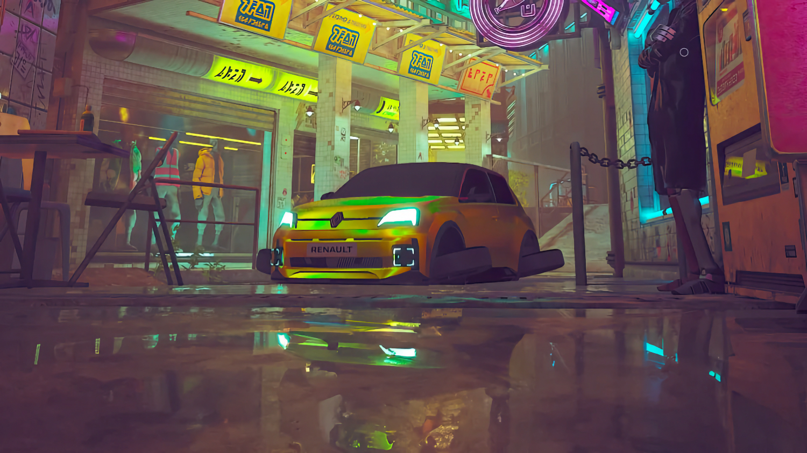

+++
title = "Renault case sa R5 E-Tech dans tous les jeux"
date = 2024-06-17T07:07:32+01:00
draft = false
author = "Mickael"
tags = ["Actu"]
image = "https://nostick.fr/articles/vignettes/juin/palworld-r5-renault.jpg"
+++

.") 

La pub dans les jeux vidéo, bon, personne n'aime trop ça même si certains genres s'y prêtent mieux que d'autres. Personne n'ira reprocher aux constructeurs de bagnoles de donner des licences de leurs véhicules aux simulations de courses, par exemple. Mais bien souvent, le sponsoring se voit comme le nez au milieu du visage : le produit n'est pas à sa place, c'est mal intégré, on se croirait devant TF1 avant le film du dimanche soir.

Pour faire de la retape pour sa R5 électrique E-Tech, Renault a mis les petits plats dans les grands en mettant en scène la voiture dans tout un tas de jeux chéris des moddeurs, comme *Fortnite*, *Roblox*, *The Sandbox* ou encore *Garry's Mod*, mais les équipes du constructeur sont allés un peu plus loin, comme l'explique *[PCGamer](https://www.pcgamer.com/gaming-industry/game-development/while-other-companies-do-expensive-crossovers-with-fortnite-renaults-been-modding-its-little-electric-car-into-garrys-mod-palworld-and-stardew-valleyand-the-mods-actually-look-good/)*.

 

Dans *Fortnite*, 20 joueurs se retrouvent sur une île dédiée : ils devront jouer une partie de cache-cache où ils pourront se déguiser en R5 (bon courage, c'est une voiture jaune). *Roblox* propose une chasse au trésor où il faudra récupérer des éléments pour personnaliser sa caisse.

 

Tout cela est assez banal, mais Renault s'est vraiment creusé le ciboulot pour certains jeux. Dans *Stray*, le héros félin n'est autre que la R5 avec des roues à l'horizontale qui lui permettent de flotter et de s'envoler. Les fans de James Bond et sa Lotus Esprit amphibie seront ravis de prendre le volant d'une R5 sous-marin dans *Subnautica*.

 

Le constructeur est allé jusqu'à concevoir un Pal reprenant le design de la R5, à aller chasser dans *Palworld* ! Le mod de *Stardew Valley* est probablement le plus surprenant, avec un garage (celui de Louis) avec plusieurs quêtes à accomplir. Et du contenu supplémentaire est dans les tuyaux ! Vous retrouverez la liste des jeux et des mods à cette [adresse](https://www.renault.co.uk/electric-vehicles/r5-e-tech-electric/renault5-modding11.html).

Alors bien sûr, ça reste de la réclame qui n'a sûrement pas dû coûter bien cher à Renault, mais on peut saluer l'effort pour éviter de tomber dans le piège de la réclame facile. Maintenant, si on pouvait avec la R5 E-Tech dans *Forza* ?