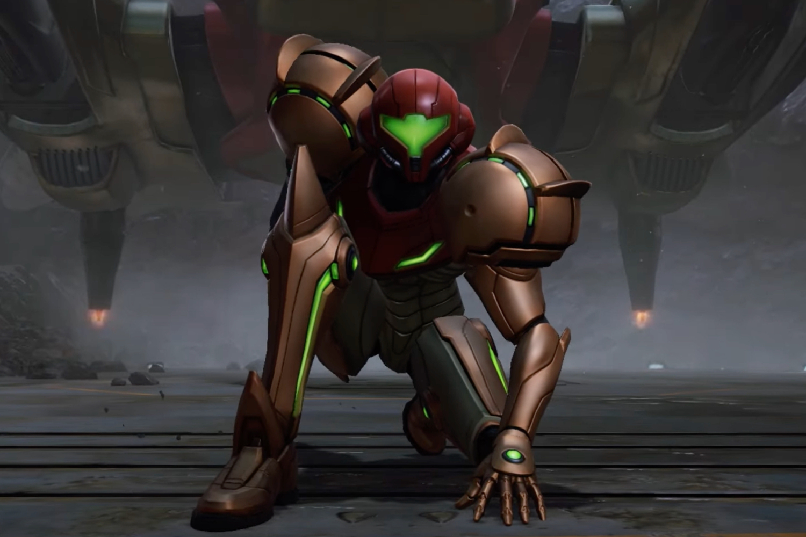

+++
title = "Metroid Prime 4, Zelda, Mario & Luigi : la Switch en a encore sous la pédale !"
date = 2024-06-18T15:47:32+01:00
draft = false
author = "Mickael"
tags = ["Actu"]
image = "https://nostick.fr/articles/vignettes/nostick.jpg"
+++

La bonne vieille Switch a encore un peu de jus ! Pour le  Direct estival, on s'attendait à ce que Nintendo racle les fonds de tiroir en multipliant les remakes — et ça a été le cas avec une térachiée de jeux pas tout jeunes. Mais Nintendo en avant gardé sous la pédale… à commencer bien sûr par le monstre *Metroid Prime 4: Beyond*.

Ce nouvel épisode des aventures 3D de Samus avait fini par prendre la forme d'un vaporware : cela fait plus de 7 ans qu'il a été annoncé (à l'E3 2017 !), puis le développement a été repris des mains de Bandai Namco par le studio Rare deux ans plus tard. Depuis, plus aucune nouvelle, jusqu'à aujourd'hui ! Nintendo a diffusé la première bande annonce qui dévoile un jeu au gameplay logiquement très proche de ce qu'on connait de la saga.



Ce trailer de *Metroid Prime 4: Beyond* rassurera les fans qui n'en pouvaient plus d'attendre. Malheureusement, ils vont devoir encore poireauter : le jeu sortira en effet en 2025, et il y a fort à parier qu'il sera aussi disponible sur la Switch 2.

La rumeur disait vrai : elle nous promettait à la fois un Zelda 2D traditionnel, et un jeu centré non pas sur Link, mais sur la princesse Zelda. Avec *The Legend of Zelda: Echoes of Wisdom*, on a effectivement les deux ! Le joueur incarnera donc Zelda dont le pouvoir est de reproduire des objets et des créatures.



Le jeu mêle aventures et casse-tête dans un style qui rappelle le remake de *Link's Awakening* (sans les ralentissements, espérons-le !). Sortie annoncée pour le 26 septembre. Pour l'occasion, Nintendo proposera aussi une édition spéciale de la Switch Lite aux couleurs d'Hyrule.

Nintendo s'est probablement rendu compte qu'il y avait une clientèle pour les jeux de rôle. Après les remakes de *Paper Mario* et de *Super Mario RPG*, voici une aventure originale pour *Mario & Luigi* ! Les deux frangins repartent donc à l'aventure sur l'île Shipshape — moitié île, moitié bateau — avec des combats au tour par tour qui ont l'air très dynamiques. Il y a même des séquences qui rappellent *Mario Striker*…



*Mario & Luigi: Brothership* sera un des gros jeux de la Switch de la fin de l'année. Sortie le 7 novembre.

Pour ceux qui aiment jouer avec leurs potes sur le canapé, Nintendo a aussi présenté un nouveau et énième *Mario Party*. 110 mini-jeux jusqu'à 20 joueurs, faites de la place dans le salon ! *Super Mario Party Jamboree* sera dispo le 17 octobre.



Le Direct a aussi été l'occasion pour Nintendo de multiplier les  annonces de remakes, franchement il y a en trop pour tous les citer ici mais l'un des plus intéressants est certainement *Donkey Kong Returns HD*, qui passe de la Wii à la Switch (et prend avec lui les niveaux 3DS). Par contre, la sortie est prévue pour le… 15 janvier 2025 !



Capcom a réservé une belle surprise avec la collection *Marvel vs Capcom*, qui compte 7 classiques de la bagarre donc *Marvel vs. Capcom 2 New Age of Heroes*, *X-Men Children of Atom* ou encore le beat'em up *The Punisher*. Pas de date de sortie précise, si ce n'est dans l'année.



Parmi les autres annonces qui ont retenu notre attention : *LEGO Horizon Adventures* sortira bien sur Switch en fin d'année, *Perfect Dark* est dispo sur le NSO dès aujourd'hui (le jeu N64), *Stray* a été adapté à la Switch et sera jouable à Noël, *Darkest Dungeon II* sera lancé le 15 juillet, et il va y avoir des remakes HD-2D de *Dragon Quest I* et *II* (en 2025) et *III*  (le 14 novembre).