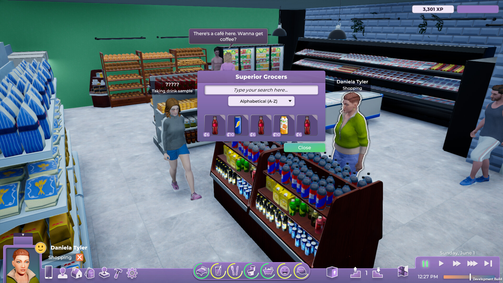

+++
title = "Surprise : Paradox annule Life by You, son alternative aux Sims"
date = 2024-06-18T08:00:00+01:00
draft = false
author = "Félix"
tags = ["Actu"]
image = "https://nostick.fr/articles/2024/juin/1806-surprise-paradox-annule-life-by-you-son-alternative-aux-sims/lifebyyou.jpg"
+++ 

 

Coup de tonnerre pour ceux qui cherchaient un moyen de couper le cordon avec *Les Sims* et EA : *Life by You* part à la benne. Ce sims-like de Paradox avait été annoncé en mai 2023  avant de voir son early-access repoussée à plusieurs reprises. Le jeu se présentait comme une ambitieuse alternative aux *Sims* permettant de jouer dans une ville évoluant entièrement en temps réel, tout cela sans chargements. La page Steam est [toujours en ligne](https://store.steampowered.com/app/2358660/Life_by_You/) à l’heure actuelle. 

Les promesses du studio Paradox Tectonic (dont c’est le premier jeu) étaient grandes. On nous annonçait une partie construction très personnalisable avec une grande variété d'outils de création, un système de conversation poussée et une simulation de vie aux petits oignons. Si les quelques bandes-annonces dévoilaient un projet bien avancé, elles ne rassuraient pas vraiment d’un point de vue technique : 



« *Malheureusement, nous avons décidé d'annuler la sortie de notre simulateur de vie Life by You* », a annoncé le directeur général adjoint de Paradox Mattias Lilja dans un message partagé sur [ses forums](https://forum.paradoxplaza.com/forum/threads/life-by-you-is-cancelled.1688889/). Il explique que le projet avait quelques failles qu’il aurait été bien compliqué de boucher sur le long terme, même avec un temps de développement supplémentaire. « *C'est évidemment difficile et décevant pour tous ceux qui ont consacré du temps et de l'enthousiasme à ce projet, surtout lorsque notre décision intervient si tard dans le processus* [de production] », ajoute-t-il.

C’est une mauvaise surprises pour les fans du genre : les increvables *Sims 4* sortis il y a plus de dix ans en sont quasiment à leur vingtième extension, tandis que les *Sims 5* n’ont pas donné de nouvelles depuis un bout de temps. On pourra se consoler avec *[inZoi](https://inzoi.online)*, attendu en fin d’année : ce sims-Like coréen très prometteur met lui aussi en avant des possibilités de personnalisation folles et une simulation de vie poussée. Tout cela tournera sur l’Unreal Engine 5, ce qui devrait mettre à genoux bon nombre de PC. On se remet le premier trailer pour le plaisir :

