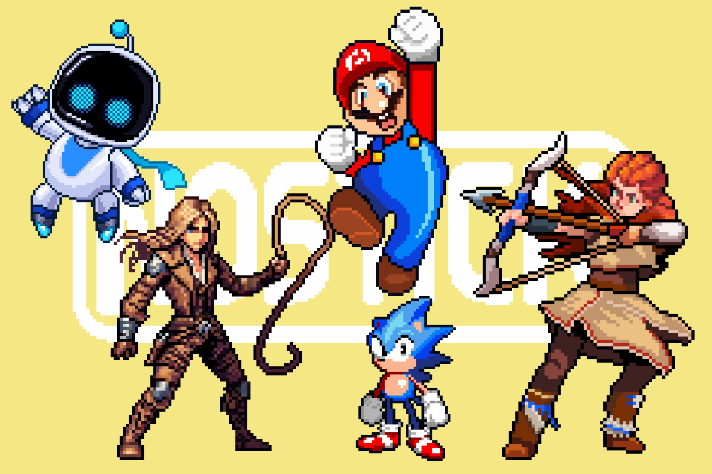

+++
title = "Bienvenue sur le nouveau Nostick !"
date = 2024-06-18T19:47:32+01:00
draft = false
author = "Mickael"
tags = ["Actu"]
image = "https://nostick.fr/articles/vignettes/nostick.jpg"
+++

**Bienvenue sur *Nostick.fr* ! Votre site préféré sur les jeux vidéo (dites oui, soyez chic) a eu droit à un gros coup de pinceau cette nuit : le design a évolué, en version de bureau comme sur mobile !**

Depuis la mise en route du site, dont la naissance remonte au 29 février (on a fait exprès), *Nostick* s'est enrichi avec le contenu que nous avions envie de vous partager, Félix et moi. Bien sûr, on continue de parler de jeux vidéo, des nouveautés, des vieilleries, de l'état de l'industrie aussi, en essayant de publier chaque jour une ou deux bêtises, voire plus quand le boulot à côté nous en laisse le temps.

Cette v2 reflète l'apport d'articles, il est désormais plus facile de naviguer dans la pagination, avec un effort accru sur les illustrations. Exit le côté blog sympathique, *Nostick* prend le chemin d'un « vrai » site avec des catégories qui vont bien (allez-y jeter un œil, par exemple nos [actus](https://nostick.fr/tags/actu/) ou nos papiers [XXL](https://nostick.fr/tags/xxl/)). Et puis très bientôt un nouveau format va apparaitre, à savoir des brèves qui vont nous permettre d'être un peu plus réactif.

Nous avons aussi voulu mettre un tout petit plus l'emphase sur notre newsletter du dimanche matin. Elle est gratuite, sans pub et pas chiante (à l'image du site 😁), [alors abonnez-vous ça nous fera plaisir](https://nostickreloaded.substack.com/) !

Évidemment, tout n'est pas parfait. Si on sait à peu près écrire, nous ne sommes pas des codeurs ni des spécialistes des interfaces web. Il y a certainement des tas de choses qui ne tiennent pas vraiment debout ! Si vous tombez sur un truc bizarre, n'hésitez pas à poster un petit commentaire ci-dessous.

Nous voulions enfin vous remercier de passer nous lire de temps en temps ou assidûment, nous voyons que ce que nous faisons semble plaire à de plus en plus de monde alors bien sûr, ça fait zizir. Bonne découverte de cette v2 !

 
