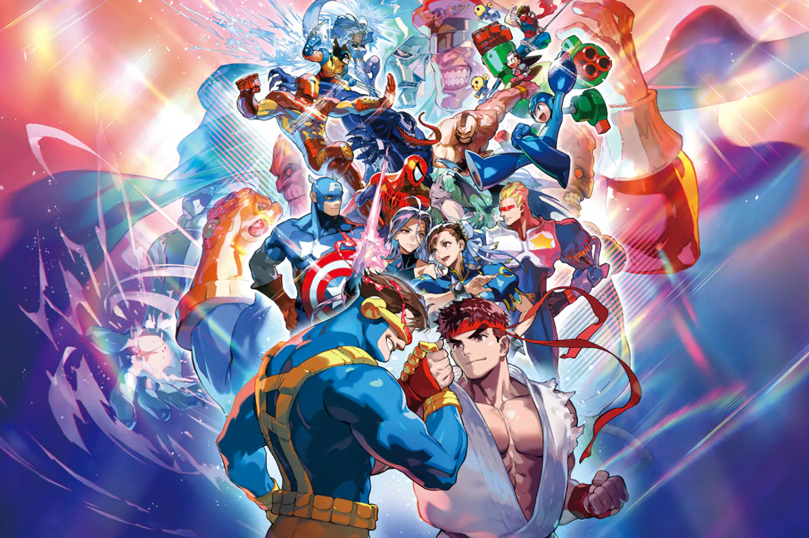

+++
title = "Capcom n'a plus de jus dans son moteur pour porter Marvel vs Capcom sur Xbox"
date = 2024-06-20T10:47:32+01:00
draft = false
author = "Mickael"
tags = ["Actu"]
image = "https://nostick.fr/articles/vignettes/nostick.jpg"
+++

Ne cherchez pas [le jeu le plus attendu du dernier Nintendo Direct](https://nostick.fr/articles/2024/juin/1806-metroid-prime-4-zelda-mario-luigi-switch/). Il ne s'agit ni de *Zelda: Echoes of Wisdom* (ridicule !) ni même de *Metroid Prime 4* (qui ?), mais bien évidemment… de *Marvel vs Capcom Fighting Collection Arcade Classics* ! 

Capcom a mis les petits plats dans les grands avec une compile' de ce qui se faisait de mieux dans les salles d'arcade des années 90 et 2000 en regroupant des hits comme *X-Men vs Street Fighter* ou encore l'introuvable *Marvel vs Capcom 2: New Age of Heroes*. Pour faire bonne mesure, l'éditeur a même remis la main sur le beat'em up méconnu *The Punisher*.

On peut se réjouir de constater que Capcom a trouvé un accord avec Marvel pour ressortir tous ces classiques sur PC et 
consoles modernes (on imagine aisément le casse-tête au niveau des droits). Enfin, quand on dit « *les consoles* », il y en a une qui manque à l'appel : la Xbox brille par son absence, ce qui plonge les joueurs de la team green dans un désarroi profond.

 

Capcom n'a pas expliqué cette absence mais d'après *Windows Central*, le problème [serait](https://www.windowscentral.com/gaming/capcom-skips-xbox-with-another-game-as-square-enix-steps-up-with-several-new-titles) lié au MT Framework, le moteur développé par l'éditeur et dont le fameux RE Engine est le successeur bien connu. Lancé en 2006, ce moteur a été utilisé pour concevoir de nombreux jeux issus des sagas *Resident Evil*, *Dead Rising*, et d'autres encore.

Capcom n'aurait à sa disposition aucune passerelle permettant de porter sur Xbox d'anciens titres conçus avec le MT Framework, ce qui rend les portages bien plus coûteux que sur PC, Switch ou PS4. Et c'est peut-être la raison qui explique pourquoi la PS5 n'est pas non plus sur la liste des plateformes compatibles (heureusement, la rétrocompatibilité est assurée entre les deux générations de consoles).

Capcom se montre cependant assez sélectif dans ses compilations. *Ace Attorney Investigations Collection*, annoncé également durant le Nintendo Direct, sera ainsi compatible PS4, Switch, PC, et Xbox… One. Microsoft pourrait peut-être donner un petit coup de coude à l'éditeur (ou un chèque) pour faire en sorte que sa console puisse prendre part à la bagarre généralisée.