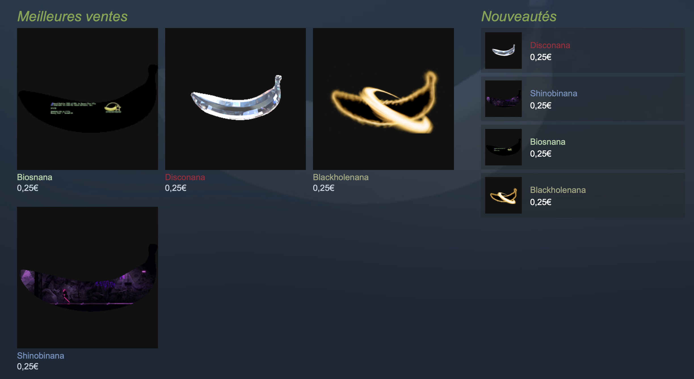

+++
title = "C’est quoi cette histoire du jeu avec la banane là ?"
date = 2024-06-21T12:00:00+01:00
draft = false
author = "Félix"
tags = ["Actu"]
image = "https://nostick.fr/articles/vignettes/banane.png"
+++ 

*[Banana](https://store.steampowered.com/app/2923300/Banana/)* est un *clicker-game* dans lequel il faut cliquer le plus possible sur une image de banane pour débloquer d’autres images de bananes. Un jeu bizarre comme on en a vu tant d’autres qui a aurait toute sa place dans les tréfonds de Steam, perdu entre un obscur visual novel chinois et un FPS indé en early-access. Sauf que *Banana* n’est pas en train de moisir dans les caniveaux de la plateforme et est actuellement le deuxième jeu le plus joué sur Steam, confortablement installé entre *Counter-Strike 2* et *Dota 2*. Est-ce que c’est une arnaque ? Pas vraiment.

Contrairement à *Cookie Clicker* ou à *Curiosity*, il n’y a ici rien à voir : pas d’amélioration à débloquer au fil du temps, pas de grande révélation après un certain nombre de clics ou de blagues cachées. Le seul et unique intérêt du jeu vient du fait qu’il vous récompensera d’une banane aléatoire après quelques heures, qui s’ajoute à votre inventaire Steam. Il n’y a même pas besoin de cliquer et laisser la fenêtre ouverte suffit à récolter des bananes. 

*Jauwn* a [enquêté](https://www.youtube.com/watch?v=aitVHsg0rWA) sur ce free-to-play qui n’est pas bourré de malwares ou une obscure arnaque à la crypto. L’intérêt est ailleurs : les bananes virtuelles peuvent être revendues sur la plateforme pour une poignée de centimes, avec certaines plus rares que d’autres logiquement revendables plus chères. Les développeurs ont flairé le bon filon étant donné qu’ils vendent des bananes shinny directement en achat in-app, avec un catalogue qui évolue au fil du temps.

Pourquoi des gens lancent-ils ce truc bidouillé sur la version gratos d’Unity ? Dans l’espoir de se faire un peu d’argent facilement. Il n’est pas compliqué de laisser le jeu tourner toute la journée et d’espérer avoir récupéré une banane rare quand le soleil se couche, qu’on peut revendre quelques centimes. Le marché est peuplé de collectionneurs, de gosses, de fans de *memes* et de bots qui rachètent/revendent à la pelle, ce qui ne manquera pas de rappeler des souvenirs aux joueurs de *TF2*.

Valve ne vient pas siffler la fin de la récré étant donné qu’elle touche une commission sur chaque vente passant par le marché de la communauté. Si certaines sont vendues des sommes délirantes, la majorité des bananes sont vendues au tarif minimum de 0,03 € : 1 centime de commission revient à Steam, 1 centime va aux développeurs et 1 centime finit dans les poches du vendeur. *[IGN](https://www.ign.com/articles/banana-clicking-game-not-a-scam-developer-insists)* a sorti la calculette et estime que Valve s’est fait environ 20 000 $ pour la vente d’**une seule** banane sur une journée, et sans doute à peu près la même chose pour les développeurs. 

Les affaires tournent, le fond n’est pas complètement pourri, mais tout cela reste fort louche. Un des développeurs a déjà traîné dans une arnaque aux objets Steam qui lui a valu un ban VAC. Un autre a avoué que le jeu avait un [gros problème de bots](https://www.polygon.com/gaming/24173617/banana-clicker-game-steam-egg), ce qui flingue le marché. Il n’est pas impossible que les devs soient assis sur un tas de bananes rares et qu’ils attendent juste le moment opportun pour se tirer avec la caisse. En attendant, tenez-vous éloigné de ce truc qui vous fera dans le meilleur des cas gagner une dizaine de centimes. 

