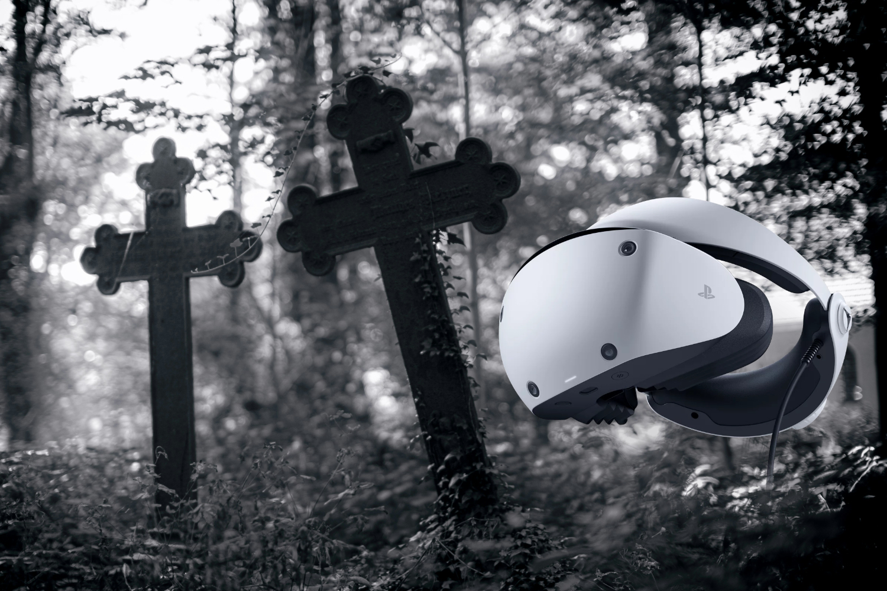

+++
title = "Ça sent très fort le sapin pour le PSVR2"
date = 2024-06-21T15:10:32+01:00
draft = false
author = "Mickael"
tags = ["Actu"]
image = "https://nostick.fr/articles/2024/juin/2106-sony-sapin-psvr2/sony-psvr2.jpg"
+++

 

Sony s'est lassé très vite du casque de réalité virtuelle de la PS5. Un peu plus d'un an après son lancement, le PSVR2 n'intéresserait plus du tout le constructeur, au désespoir de tous ceux qui l'ont acheté au prix fort (c'est un accessoire qui coûte plus cher que la console).

Sony aurait purement et simplement coupé le robinet des financements pour les jeux VR, selon des [indiscrétions](https://www.androidcentral.com/gaming/virtual-reality/sony-no-longer-cares-about-the-psvr-2-and-you-shouldnt-either) d'*Android Central*. Aucun studio interne ne recevra de sous pour concevoir de nouveaux jeux pour le casque. En fait, il ne resterait plus que deux titres actuellement en cours de développement, et il n'est même pas certain qu'ils sortiront.

Pour le dire autrement, cela signe une mort quasi-certaine pour ce produit qui a absolument besoin du soutien de son créateur : les développeurs et éditeurs de jeux VR, déjà fortement sollicités ailleurs (par Meta qui investit sans compter dans sa gamme Quest), n'ont pas les moyens de soutenir seuls la plateforme de Sony. D'ailleurs, les jeux PSVR2 [présentés durant le récent State of Play](https://nostick.fr/articles/2024/mai/3105-sony-paquet-pc/), ne sont pas des exclusivités : *Alien : Rogue Incursion* et *Behemoth* sortiront aussi sur Quest et SteamVR…

En février dernier, le groupe japonais avait déjà fermé ses studios londoniens spécialisés dans la VR, ce qui n'était pas de très bon augure. Histoire de sortir par le haut, [Sony va commercialiser un adaptateur PC au mois d'août](https://nostick.fr/articles/2024/juin/0306-le-psvr2-sera-bientot-compatible-pc-grace-a-un-adaptateur-a-60/), mais là aussi la concurrence est rude. Le PSVR2 n'a pas vraiment d'arguments à opposer à un Quest 3 aussi doué pour les jeux PCVR qu'en utilisation autonome.