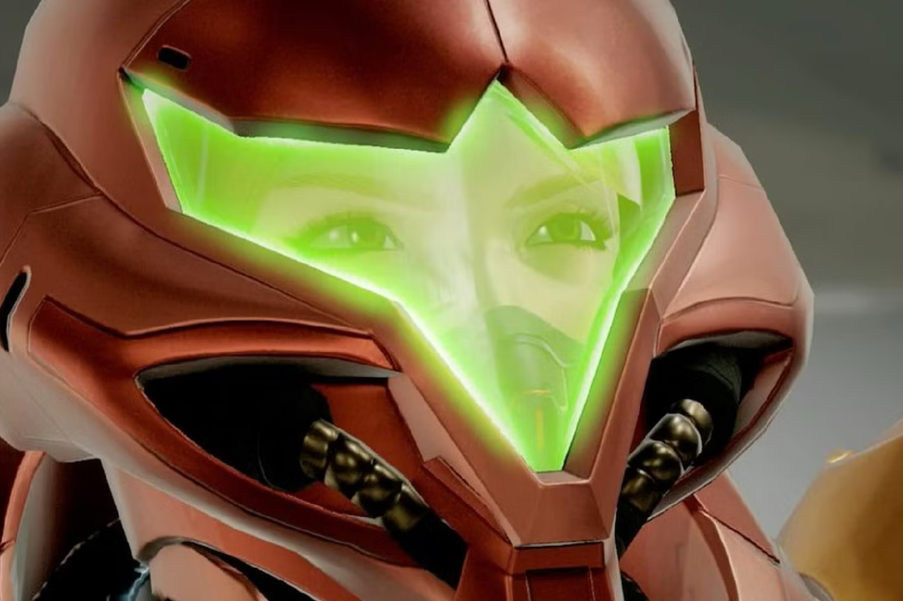
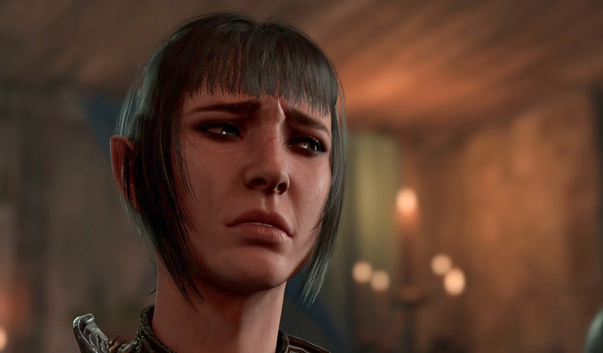
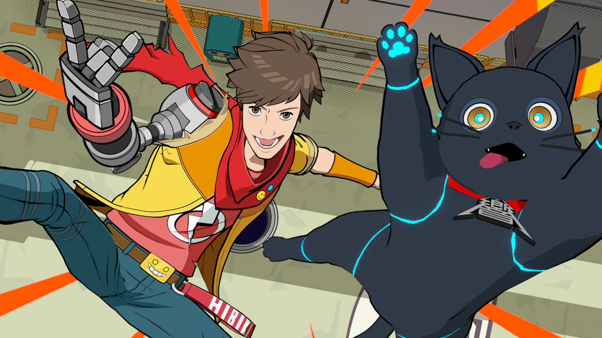
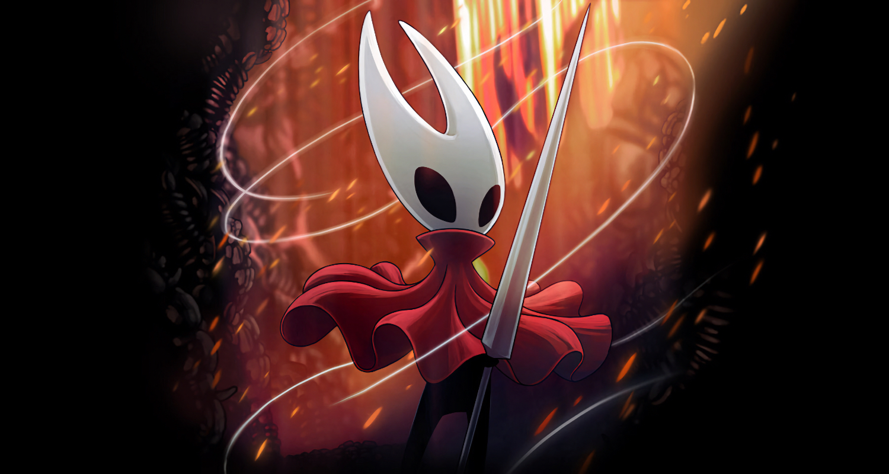

+++
title = "Baldur's Gate 3 entre les mains des joueurs, Bethesda s'accroche à Starfield, l'enfer de Hollow Knight: Silksong et la semaine du jeu vidéo"
date = 2024-06-22T10:47:32+01:00
draft = false
author = "Mickael"
tags = ["XXL"]
image = "https://nostick.fr/articles/vignettes/juin/metroid-prime.jpg"
+++

L’actualité du jeu vidéo ne s’arrête pas à la poignée d’articles publiés sur *Nostick* ! Histoire de rattraper le retard accumulé, voici un retour rapide sur quelques unes des infos les plus importantes (ou insignifiantes) de la semaine.

## Larian laisse Baldur's Gate 3 entre les mains des joueurs

Larian est pressé de passer à la suite. Après avoir porté *Baldur's Gate 3* pendant toutes ces années, le studio belge veut s'extirper du carcan *Donjons & Dragons* pour tenter de nouvelles choses ! Et on imagine qu'avec le carton galactique de leur jeu, il a les coudées franches et tous les sous du monde pour de futurs projets — plusieurs sont déjà en route.

Mais en attendant, les développeurs de Larian continuent de bûcher sur Baldur's Gate 3 « *comme si le jeu venait tout juste de sortir* », a [expliqué](https://www.eurogamer.net/mod-support-in-baldurs-gate-3-will-be-final-handover-moment-to-players-says-larian-ceo) Swen Vincke, le patron du studio, durant un événement aux BAFTA. Le prochain gros morceau, c'est le patch 7 qui sera livré dans le courant du mois de septembre, avec dans sa besace [le support officiel des mods](https://nostick.fr/articles/2024/juin/0306-mod-officiel-baldurs-gate-3/).

Du lourd donc, mais cette livraison sera la dernière et ultime pour le jeu. Cette possibilité laissée aux joueurs de patouiller dans le bac à sable de *Baldur's Gate 3* « *sera le moment où nous pourrons dire "d'accord, maintenant, c'est entièrement à vous"* » ! L'équipe « *veut vraiment aller de l'avant et faire de nouvelles choses* », même si elle reste vigilante pour corriger les bugs critiques.

Une page va se tourner pour Larian, mais ça ne veut pas dire que *Baldur's Gate 3* va s'encroûter. Les joueurs sont encore très nombreux à explorer les Royaumes oubliés et les mods vont continuer à les faire évoluer.

## Bethesda s'accroche à Starfield

Pour certains joueurs, c'est rien que du bonheur, mais pour d'autres c'est carrément une menace. *Starfield*, le gros jeu Xbox de l'an dernier, pourrait bien connaitre une seconde année de contenus supplémentaires ! Todd Howard, le grand manitou de Bethesda, a fait le point sur son jeu spatial auprès de MrMattyPlays, d'abord pour faire de la retape pour l'extension *Shattered Space* attendue d'ici la fin de l'année.

 

Mais l'histoire est loin d'être terminée pour *Starfield*. Le studio prévoit en effet d'autres extensions et mises à jour, le dirigeant ayant annoncé qu'une « year two » était dans les tuyaux. Et « *nous voulons quelque chose comme des extensions annuelles, plus ou moins* ». Gloups. Todd Howard ne dit pas combien de temps ce petit jeu peut durer, « *espérons que ce soit pour très longtemps* » !

Après tout, tant mieux pour les 14 millions de joueurs — un chiffre donné par le même Howard durant l'interview — qui ont tenté l'expérience Starfield. Ils sont probablement nombreux à vouloir s'y replonger au rythme des futurs DLC et extensions… Il faudra toutefois que Bethesda revoit certaines de ses pratiques, comme de faire payer des missions camouflées sous des mods.

Le studio a posté le 9 juin dernier une mise à jour qui comprend non seulement des outils de mod pour le jeu — le Creation Studio — mais aussi des missions pour l'alliance des Traqueurs, des chasseurs de primes, disponibles uniquement sous la forme de « créations Starfield ». La première est gratuite, mais la seconde est payante (7 $). Et ça passe mal auprès des joueurs, qui ont fait plonger le jeu dans l'enfer des mauvaises notes de Steam (« plutôt négatives »).

 

Ce n'est pas la première fois que Bethesda tente de faire les poches des joueurs avec des mods payants. « *Tout d'abord, je dirais que les prix sont basés sur des choses que nous avons faites auparavant, à la fois dans le Creation Club et Fallout 76, et nous essayons toujours de voir ce qui se fait ailleurs pour nous assurer que nous offrons de la valeur à tout le monde* », a réagi Todd Howard. Qui promet dans la foulée un « *ajustement* ».

Pour l'alliance des Traqueurs, il s'agissait d'« enrober » dans une quête des tenues et des armes spéciales créées avec le Creation Studio. « *Je pense que nous allons voir comment nous livrons ce type de contenu, et si nous devons changer les prix ou le diviser* », poursuit-il. Pas question pour autant d'abandonner l'idée des mods payants. Beaucoup des créateurs « *sont passés d'amateurs à professionnels. Et c'est en partie notre travail de nous assurer qu'ils peuvent le faire, qu'ils sont payés et qu'ils soient récompensés financièrement s'ils créent du contenu exceptionnel* ».

## Enfin une explication pour la fermeture de Tango Gameworks

Mais pourquoi bon sang de bois est-ce que Xbox a fait fermer Tango Gameworks ? L'unique studio détenu par Microsoft au Japon était l'auteur du seul hit Xbox certifié véritable de l'an dernier, *Hi-Fi Rush*… et c'est par une fermeture pure et simple que le géant américain l'a récompensé. La décision, [annoncée début mai](https://nostick.fr/articles/2024/mai/0705-fin-de-partie-pour-arkane-austin-et-tango-gameworks/), reste toujours aujourd'hui en travers de la gorge d'une bonne partie de la communauté.

Pour justifier le coup de balai, qui a également emporté avec lui Arkane Austin (*Redfall*), la direction de Xbox s'est réfugiée derrière des arguments très *corporate* qui l'enfonce dans le rôle du méchant de service. Matt Booty, le patron des studios Xbox Game, a fini par donner une explication qui tient davantage la route.

« *Je pense qu'il faut considérer que pour nous, c'est autant une situation tournée vers l'avenir qu'une réflexion sur un jeu en particulier* », a-t-il [expliqué](https://variety.com/2024/gaming/news/xbox-studios-matt-booty-podast-game-pass-fallout-studio-closures-1236038120/) au podcast *Strictly Business* de *Variety*. « Il *peut y avoir eu des facteurs ou des situations qui ont conduit précédemment au succès. Mais ils ne sont peut-être plus tous présents lorsque vous regardez ce que vous faites à l'avenir* », poursuit-il.

Les facteurs qui contribuent au succès d'un jeu comme *Hi-Fi Rush* sont nombreux : « *quel leadership avez-vous, quel leadership créatif avez-vous, l'équipe est-elle la même que celle qui a précédemment lancé quelque chose de réussi ?* ». Sans le nommer, Matt Booty semble confirmer que le départ en 2023 du fondateur de Tango, Shinji Mikami, a joué un rôle dans la décision de Microsoft de fermer le studio.

Shinji Mikami a été essentiel dans le succès au moins critique des précédents jeux de Tango (*The Evil Within*, *Ghostwire*…). Son départ a sans aucun doute eu un impact sur la feuille de route du studio ; au moment de faire des économies, Microsoft a pris tout ça en compte, secoué bien fort, et décidé d'arrêter les frais. 

D'autres options ont néanmoins été envisagées, comme la possibilité de redonner son indépendance à Tango Gameworks. Cela a été le cas pour Toys for Bob ([désormais sous contrat avec un certain… Microsoft](https://nostick.fr/articles/2024/mars/2403_spyrothedragon/)) auparavant sous la coupe d'Activision. Ces explications ne réconforteront pas les fans des jeux Tango, mais elles sont au moins plus nuancées que [les larmes de crocodile de Sarah Bond](https://nostick.fr/articles/2024/mai/1105-semaine-du-jeu-video/#les-larmes-de-crocodile-de-xbox) et [les déclarations coupées à l'eau tiède de Phil Spencer](https://nostick.fr/articles/2024/juin/1006-microsoft-veut-xbox-portable/#la-petite-entreprise-de-phil-spencer).

## Hollow Knight: Silksong n'est pas en enfer

Et voilà ! Le Nintendo Direct de cette semaine a clos une saison estivale débordante en annonces excitantes et en jeux qui claquent chez Microsoft, Sony et tous les autres éditeurs. Tous… sauf un ! La Team Cherry n'a en effet donné aucune nouvelle d'*Hollow Knight: Silksong* alors qu'[il y avait tout lieu de croire au miracle](https://nostick.fr/articles/2024/avril/0204-des-nouvelles-de-hollow-knight-silksong/) — ne serait-ce que sous la forme d'un trailer avec une fenêtre de tir. On a même cru à un moment que l'annonce allait sortir durant le Nintendo Direct…

Mais évidemment, il n'y a eu aucune communication autour du jeu, rien, zip, que dalle. Le désespoir des fans d'*Hollow Knight* est palpable, comme on dit sur *BFM*, et les développeurs ne sont d'aucun secours puisqu'ils ne parlent pas… et ça fait depuis 2022 et un trailer durant le showcase Xbox que c'est comme ça (le jeu a été annoncé en 2019).

Évidemment, à force de poireauter comme des idiots, les joueurs en ont leur claque et beaucoup parlent de vaporware. Du moins jusqu'à cette semaine, durant laquelle Graig alias « le chef testeur » du jeu, est [sorti](https://www.gamesradar.com/games/action/hollow-knight-silksong-is-not-in-dev-hell-says-tester-who-finds-fan-cynicism-disheartening-but-agrees-developer-team-cherry-should-be-better-at-communicating/) de sa torpeur : « *Salut les gars, je sais [que Hollow Knight: Silksong] n'est pas dans l'enfer du développement* », a-t-il assuré sur Discord.

Un petit rayon d'espoir donc, mais attention à ne pas s'emballer. Même si sa petite phrase confirme que le jeu n'est pas mort, Graig n'a pas la meilleure relation du monde avec la communauté : ses petites blagues sont restées en travers de la gorge de pas mal de joueurs. Et puis le testeur a certes été associé avec la Team Cherry par le passé, mais on ignore son véritable statut aujourd'hui. Mais enfin, c'est toujours bon d'y croire…

## Dans l'actu déchaînée de la semaine

- Nintendo n'a pas fait semblant pour son Direct de juin : entre deux remakes et portages de jeux mobiles sans intérêt, le constructeur a balancé du très très lourd qui montre que [la Switch en a encore sous la béquille](https://nostick.fr/articles/2024/juin/1806-metroid-prime-4-zelda-mario-luigi-switch/).
- Sera-t-il un jour possible de voir débouler un rival aux increvables *Sims* ? Il faut croire que non : *Life by You* a été finalement annulé et son studio fermé ! P[ar ici la mauvaise nouvelle](https://nostick.fr/articles/2024/juin/1806-surprise-paradox-annule-life-by-you-son-alternative-aux-sims/).
- La bande annonce de *Metroid Prime 4: Beyond* a fait tourner bien des têtes, mais elle est tellement belle qu'on se demande si elle a bien été tournée sur Switch… ou sur la Switch 2. [Réponse ici](https://nostick.fr/articles/2024/juin/1906-metroid-prime-4-switch-2/) !
- Jouer à des vieilleries, certes, mais en streaming sur iPhone et iPad ? Ce sera bientôt possible grâce au service Antstream qu'[on vous présente ici](https://nostick.fr/articles/2024/juin/1906-antstream-premier-service-cloud-gaming-app-store/).
- Surprise : *Perfect Dark*, le jeu N64, a rejoint le catalogue du Switch Online. Surprise (non) : l'émulateur marche mal. [On se perce les yeux ici](https://nostick.fr/articles/2024/juin/2006-perfect-dark-loin-parfait-nso/).
- Personne n'y croyait et pourtant, c'est enfin arrivé : Ubisoft va lancer l'édition 20e anniversaire de *Beyond Good & Evil* ! Cerise sur le gâteau, en plus d'un gros travail de remise à niveau : une mission liée au mythique *Beyond Good & Evil 2*. [Retour vers le futur par ici](https://nostick.fr/articles/2024/juin/2006-une-edition-anniversaire-pour-beyond-good-evil-le-25-juin/).
- C'est évidemment le titre de l'année : la compile *Marvel vs Capcom Fighting Collection Arcade Classics*, avec notamment le très rare *Marvel vs Capcom 2: New Age of Heroes* va sortir cette année ! Mais pas sur Xbox : [voici (peut-être) pourquoi](https://nostick.fr/articles/2024/juin/2006-capcom--moteur-porter-marvel-vs-capcom-xbox/).
- Impossible d'y échapper si vous trainez de temps en temps sur Steam : le jeu *Banana* squatte les classements, mais c'est quoi ce jeu ? Et pourquoi ça ressemble à une arnaque digne d'un truc de crypto-gogo-boys ? [On a jeté un œil](https://nostick.fr/articles/2024/juin/2104-cest-quoi-cette-histoire-du-jeu-avec-la-banane-la/).
- Sony serait à deux doigts de planter le dernier clou dans le cercueil du PSVR2 : le constructeur aurait tout simplement coupé les fonds pour financer de futurs jeux VR ! [Ça sent le sapin](https://nostick.fr/articles/2024/juin/2106-sony-sapin-psvr2/).
