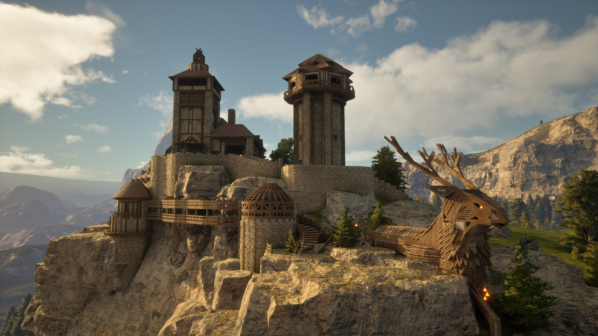

+++
title = "Les sorties de la semaine (23/06)"
date = 2024-06-23T08:00:00+01:00
draft = false
author = "Félix"
tags = ["C’est dispo"]
image = "https://nostick.fr/articles/vignettes/juin/bge.png"
+++

  

Entre le boulot, les courses et la chaleur qui commence à faire vrombir les ventilos de votre PC, vous n’avez peut-être pas eu le temps de vous intéresser aux nouveautés du moment. Qu’à cela ne tienne : voici les sorties de ces derniers jours qui ont retenu notre attention.

## A l’ombre, des jeunes joueurs en pleurs

La grosse sortie de la semaine c’était évidemment ***Shadow of the Erdtree***, l'énorme (et unique) extension pour *Elden Ring*. Les petits gars de chez FromSoftware ne réinventent pas la roue avec ce DLC qui ajoute une nouvelle région regorgeant de donjons, d’ennemis, d’armes et d’objets inédits. On ne va pas spoiler mais les retours sont globalement très positifs, la plupart des testeurs louant une chouette partie exploration et des combats intéressants. Seul *[Eurogamer](https://www.eurogamer.net/elden-ring-shadow-of-the-erdtree-review)* regrette une narration un poil trop explicite, mais que voulez vous ma bonne dame, on ne peut pas plaire à tout le monde. Les fans d'*Elden Ring* ne devraient donc pas être déçus et ont sûrement déjà sorti la CB de toute façon. 40 € sur [Steam](https://store.steampowered.com/agecheck/app/2778580/), aussi dispo sur consoles. Attention parce qu’apparemment [ça merdouille sur le Steam Deck](https://www.pcgamer.com/games/action/elden-rings-big-patch-is-causing-big-problems-for-steam-deck-players/), mais les développeurs sont sur le coup. 

## Marée noire

Si certains studios cherchent à appâter le chaland avec des univers festifs sortant le joueur de son quotidien morne et déprimant, les développeurs de The Chinese Room ont fait le pari inverse : leur dernier jeu se déroule sur une plateforme pétrolière au large de l’Écosse au milieu des années 70. Le pitch de ***Still Waves the Deep*** ressemble à celui d’un *Penumbra* étant donné qu’on va explorer la structure de fond en comble en vue FPS, sur laquelle il n’y a évidemment pas âme qui vive, de nombreux monstres chelous et une météo pourrie. C’est plutôt joli (*UE5 inside*) et les retours sont globalement positifs. Après ça reste un jeu d’horreur sur rails : très bien si vous êtes fans de train fantôme ou que le scénario vous intrigue, un peu moins si vous aimez l’exploration et l’action à 100 à l’heure. L’histoire se boucle en 5 ou 6 heures, donc ça peut sûrement passer quelques semaines dans votre *wishlist* si vous n’êtes pas un aficionado du genre. Dispo sur [Steam](https://store.steampowered.com/app/1622910/Still_Wakes_the_Deep/), PS5 et Xbox pour 35 €.

 

## Les pieux du stade

On va parler un petit peu de **#BLUD**, un dungeon crawler dont la bande-annonce ne dénoterait pas entre deux dessins animés *Cartoon Network*. On y incarne une lycéenne qui descend d'une longue lignée de chasseurs de vampires et qui va devoir massacrer tout un tas de morts-vivants. Dans l’idée, on accepte une mission sur les réseaux sociaux avant d’attraper sa crosse de hockey pour aller zigouiller les différents monstres qui arpentent les rues, les couloirs de l’école ou les rayons du centre commercial. Le jeu se démarque évidemment par son style, en plus de proposer une galerie de personnages loufoques et un gameplay sympa. Les retours sont tous positifs : vous ne devriez pas regretter vos 25 €. Dispo sur [Steam](https://store.steampowered.com/app/1921480/BLUD/), PlayStation 4, Xbox One et Nintendo Switch.



## Mon royaume pour un patch

Sortie compliquée pour le MMO ***Pax Dei***, arrivé cette semaine en early-access… sans la plupart des fonctionnalités mises en avant par les développeurs. Sur le papier, le joueur devrait avoir la possibilité de créer son royaume dans lequel il dirige tout, des entreprises aux religions avant de partir à l’assaut des villages voisins. Sauf qu’actuellement, il n’y a que le début de l’aventure : un jeu de craft assez générique dans lequel on récupère des bouts de bois pour se construire une maison comme on en a vu tant. Les premiers retours évoquent une grosse bêta invitant à explorer un monde bien vide, bourré de bugs et avec des combats pas très intéressants. *Pax Dei* fait de grandes promesses et est développé par une équipe comportant des vétérans du MMO, mais en l’état, aucune raison de claquer [les 40 €](https://store.steampowered.com/app/1995520/Pax_Dei/) demandés sur Steam (et encore moins les 100 balles de l’édition *Founder’s Pack*). On en reparle dans 6 mois.

  

## En rab’

Si avec tout ça vous ne trouvez pas votre bonheur, on a aussi vu arriver sur PC les deux ***Baten Kaitos HD Remaster***, des classiques du RPG qui ont eu droit à un coup de polish ([45 € le pack](https://store.steampowered.com/app/2146170/Baten_Kaitos_I__II_HD_Remaster/) tout de même). Et puisqu’on parle de vieilleries, notons l’étonnant retour de ***Habbo Hotel*** dans une version *[Origins](https://origins.habbo.com)* qui ressemble comme deux gouttes d’eau à celle sur laquelle je perdais mes soirées de collégien en 2007. Côté vraies sorties, on a vu débarquer le city-builder ***[El Dorado](https://store.steampowered.com/app/1451470/El_Dorado_The_Golden_City_Builder/)*** (qui se passe chez les Aztèques) et de ***Soviet Republic*** (qui prend place dans l’autre pays du caviar). Ce dernier est apparemment excellent, donc vous ne devriez pas regretter [vos 40 €](https://store.steampowered.com/app/784150/Workers__Resources_Soviet_Republic/) d’autant plus qu’il y a une remise de 35 % pour célébrer la 1.0.
 