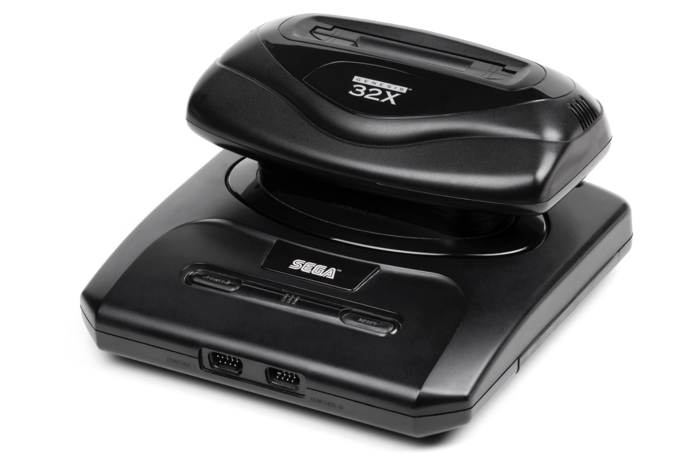

+++
title = "Bouée de sauvetage pour la défunte Neptune de Sega"
date = 2024-06-23T11:00:00+01:00
draft = false
author = "Mickael"
tags = ["Actu"]
image = "https://nostick.fr/articles/vignettes/juin/gf1-neptune.jpg"
+++

La Neptune est une fêlure — une de plus — dans le petit cœur des fans de Sega. Cette console combinant une Mega Drive et l'extension 32X en un seul boîtier a été abandonnée en rase campagne, quelques mois après le lancement de son développement au printemps 1995.

Sega courait à l'époque deux lièvres : en plus de la conception de la Neptune, le constructeur avait lancé la commercialisation de la Saturn (dès la fin 1994 au Japon, au printemps 1955 aux États-Unis). Dès lors, il n'y avait guère de raison d'investir en parallèle dans ces deux gammes : en octobre 1995, Sega prend la décision d'arrêter les frais pour la 32X et donc de la Neptune, pour concentrer ses efforts sur la Saturn.

Il faut dire que le catalogue de jeux compatibles 32X/Neptune n'est guère pléthorique avec 40 titres en tout et pour tout. En revanche, il est de qualité : les capacités des deux processeurs SH-2 d'Hitachi 32 bits (23 MHz) — quarante fois plus puissants que la Mega Drive 16 bits ! — permet des portages de bornes d'arcade très convaincants : *Knuckles' Chaotix*, *After Burner Complete*, *Mortal Kombat II*, *Virtua Fighter*, *Virtua Racing Deluxe*… Certains nécessitent le Mega CD comme *Fahrenheit* ou le poétiquement nommé *Corpse Killer*.

Mais évidemment, la Neptune n'était pas morte dans l'esprit de nombreux joueurs. Les plus bidouilleurs ont réalisé ce que Sega n'était pas parvenu à faire, c'est à dire intégrer l'électronique de l'extension dans une Mega Drive II ! Il existe évidemment des émulateurs pour la 32X, mais les nostalgiques pourront se laisser tenter par la GF1 Neptune, une toute nouvelle console conçue par GamesCare.

L'entreprise brésilienne a [imaginé](https://www-comunidademegadrive-com-br.translate.goog/2024/06/gf1-neptune-um-novo-console-brasileiro-vem-ai/?_x_tr_sl=auto&_x_tr_tl=pt&_x_tr_hl=pt-pt&_x_tr_pto=wapp) un boîtier avec slot SD, une connexion internet, et surtout un circuit intégré FGPA (Field-Programmable Gate Array) qui peut être reconfiguré pour émuler matériellement d'anciennes consoles — ici, la Neptune — pour imiter parfaitement leur comportement. La GF1 aura aussi un port d'extension pour Mega CD, on pourra la brancher en HDMI (1080p), et il y a même une sortie analogique. Une boutique en ligne pour acheter des jeux exclusifs (un SDK est dans les tuyaux) sera aussi disponible.

 

Alors évidemment, tout cela est bien sexy mais on demande à voir. Une présentation plus en détail est programmée lors de la GamesCom LatAm qui se tiendra en fin de semaine. Espérons que GamesCare pensera aux joueurs à petit budget : Analogue, autre spécialiste de la console FGPA, produit certes de très beaux produits mais ça douille.