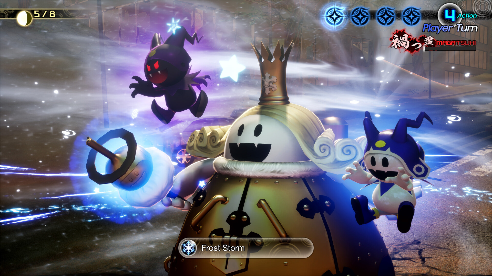
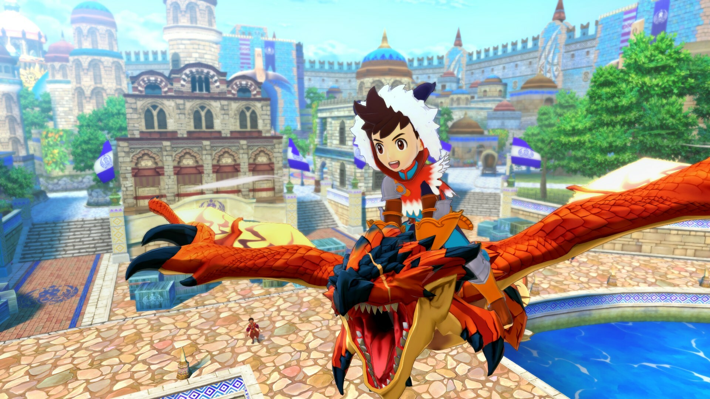

+++
title = "Les sorties de la semaine (16/06)"
date = 2024-06-16T07:30:01+01:00
draft = false
author = "Félix"
tags = ["C’est dispo"]
image = "https://nostick.fr/articles/2024/juin/020624-les-sorties-de-la-semaine/rpop.jpg"
+++

 

Entre le boulot, les courses et le capharnaüm politique ambiant, vous n’avez peut-être pas eu le temps de vous intéresser aux nouveautés du moment. Qu’à cela ne tienne : voici les sorties de ces derniers jours qui ont retenu notre attention.

## Les Démons de minuit

Accrochez-vous parce qu’on va commencer avec un jeu 100 % japonais : ***Shin Megami Tensei V : Vengeance***, qui est sorti sur PC et consoles cette semaine. Pour ceux qui ne connaissent pas (ce qui ne serait pas surprenant étant donné que c’est quand même assez niche), *Shin Megami Tensei* est une série de jeux de rôle japonais plutôt d4rk qui a eu droit à pas mal de spin-offs, notamment les *Personas* qui ont un peu plus percés par chez nous. Ici, le ton est beaucoup plus grave avec un univers de Fantasy post-apo dans lequel on va devoir sauver le monde d'un conflit millénaire entre anges et démons. C’est du J-RPG pur jus avec de l’exploration en monde ouvert et de gros donjons, le tout entremêlé de bonnes séances de bla-bla. Cette édition *Vengeance* est une version améliorée du cinquième opus initialement sorti sur Switch en 2021 : il y a de nouvelles zones, de nouveaux arcs et un paquet de monstres en plus, sans parler des 60 i/s sur PC, Xbox One X et PS5. À tester si l’univers vous intrigue et que vous n’êtes pas allergique aux jeux difficiles, ça a quand même l’air assez spécial. 60 € [sur Steam](https://store.steampowered.com/app/1875830/Shin_Megami_Tensei_V_Vengeance/).

## Monstres et Cie

J-RPG toujours avec ***Monster Hunter Stories*** 1 et 2, un duo de jeux moyens sortis à la base sur 3DS visant les plus jeunes. La formule est assez classique (un héros quitte son village pour partir vaincre une grande menace bla bla bla) avec un gameplay correct d’après les tests de l’époque. Contrairement à ce que le nom laisse à penser, il va ici falloir élever des monstres que l’on pourra chevaucher pour explorer la gigantesque map avant de se tataner au tour par tour. Le portage bénéficie de graphismes revus, d’un doublage anglais/japonais et d’un nouveau mode bonus. Malgré tout, pas de quoi se taper le cul par terre : ça a l’air d’avoir vieilli et on réservera ça aux fans de la licence ou à ceux qui cherchent un RPG pas prise de tête. C’est quand même vendu [30 balles unité](https://store.steampowered.com/app/2356560/Monster_Hunter_Stories/), ce qui fait cher pour du réchauffé à l’heure où l’offre en bon RPG est pléthorique. Dispo sur PS4, Switch et PC. 

 

## La foire à la saucisse de Steam

On notera bien l’arrivée des ***Kingdom Hearts*** [sur Steam](https://store.steampowered.com/app/2552430/KINGDOM_HEARTS_HD_1525_ReMIX/) mais mis à part ça on ne va pas se mentir : on s’est un peu emmerdé cette semaine. Ce qui est une bonne occasion pour vous recommander deux trois démo à tester à l’occasion du Steam Néo Fest qui a lieu jusqu’au 17 juin à 19h. Vous pouvez par exemple essayer ***Metal Slug Tactics***, sur lequel Mickael est déjà revenu dans [un article dédié](https://nostick.fr/articles/2024/juin/0706-metal-slug-tactics/) et qui a franchement l’air [assez sexy](https://store.steampowered.com/app/1590760/Metal_Slug_Tactics). De mon côté j’en ai profité pour faire [la démo](https://store.steampowered.com/app/2337820/The_Crush_House/) de ***The Crush House***, un simulateur de Loft Story assez sympathique (on en parlait [ici](https://nostick.fr/articles/2024/avril/0405-the-crush-house-est-un-simulateur-de-tv-realite-des-annees-2000-parce-que-pourquoi-pas-apres-tout/)) et dont la première heure m’a plutôt convaincu. C’est rigolo, le gameplay est pas mal et le concept original : ça vaut bien une demi-heure de votre temps. Même chose pour ***[Thank Goodness You're Here!](https://store.steampowered.com/app/2366980/Thank_Goodness_Youre_Here/)***, qui devrait vous parler si vous aimez l’humour anglais et *Untitled Goose Game*.



Mis à part ça, la démo qui a attiré le plus de joueurs est celle de ***Once Human***, un jeu de survie multijoueur en monde ouvert dans un univers post-apo qui sortira [le 9 juillet](https://store.steampowered.com/app/2139460/Once_Human/). Ça a pas l’air bien original mais si vous avez quelques amis sous la main c’est sans doute rigolo. Toujours post-apo mais moins déprimant, la [démo](https://store.steampowered.com/app/1582650/Caravan_SandWitch/) de **Caravan Sandwitch** vaut visiblement le coup d’œil si vous cherchez à explorer un monde abandonné mais tout de même rayonnant au volant d’un gros van jaune. Je suis curieux de voir ce que donnera *[**Hollywood Animal**](https://store.steampowered.com/app/2680550/Hollywood_Animal/)*, un tycoon proposant de prendre la tête d'un studio de cinéma qui a l’air assez complet. Ah, et **SCHiM** (dont on discutait [ici](https://nostick.fr/articles/2024/avril/schim-passera-de-lombre-a-la-lumiere-le-18-juillet/)) peut désormais être [essayé](https://store.steampowered.com/app/1519710/SCHiM/) sur Mac et PC.



Difficile de citer tout ce qu’il y a d’intéressant alors terminons sur quelques démos en vrac qui méritent le coup d’œil : celle du jeu de baston-snowboard-dans-les-Alpes *[**Dungeons of Hinterberg**](https://store.steampowered.com/app/1983260/Dungeons_of_Hinterberg/)*, du bizarro jeu d’horreur ***[Sorry We're Closed](https://store.steampowered.com/app/1796580/Sorry_Were_Closed/)***, du *Sekiro* cyberpunk ***[Disco Samurai](https://store.steampowered.com/app/2576410/Disco_Samurai/)*** ou du *Rust* avec des canards ***[Duckside](https://store.steampowered.com/app/2682580/DUCKSIDE/)***.

