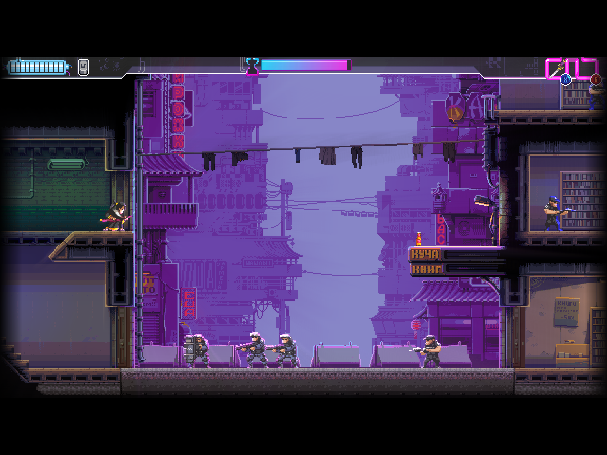
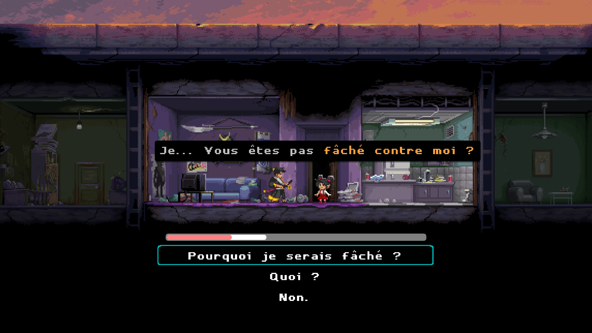
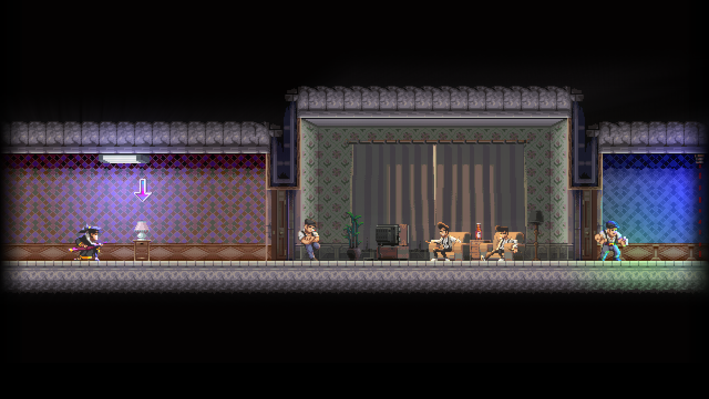

+++
title = "Test de Katana Zero : jeu de massacre sauce samouraï"
date = 2024-06-25T19:00:00+01:00
draft = false
author = "Félix"
tags = ["Test"]
type = "une"
image = "https://nostick.fr/articles/2024/juin/2504-test-de-katana-zero/screen01.PNG"
+++ 

**Toujours premier sur l'actu, *Nostick* vous propose aujourd’hui un petit test de *Katana Zero*, un chouette jeu de plateforme / hack-n-slash sorti en 2019.**

*Hotline Miami* a laissé un grand vide dans mon cœur de joueur. Si le jeu a bien eu une suite (nulle) et quelques copies moyennes (*Hong Kong Massacre*), rien ne m’a jamais fait retrouver l’adrénaline du titre de Dennaton Games. Ça, c’était jusqu’à ce que je tombe sur *Katana Zero*, caché au milieu du catalogue de jeu iOS de Netflix.

Il faut dire que la formule *Hotline Miami* était simple et efficace. Fortement inspiré du film *Drive*, le jeu vous donnait le contrôle d’un tueur silencieux recevant des coups de fil l’invitant à se rendre à un endroit, massacrer une cible (et tous ses gardes) avant de fuir les lieux, le tout sur une bande-son électrique. Au premier coup d’œil, *Katana Zero* semble simplement adapter cette formule en la passant en 2D. Les niveaux ne sont plus vus du dessus, mais défilent de gauche à droite, et l’on continue de zigouiller les différents ennemis qui effectuent naïvement leurs rondes derrière les portes closes. L’intrigue a des bases similaires, notre personnage exécutant des contrats sans se poser de question. 

Fort heureusement, *Katana Zero* se démarque très rapidement de son inspiration : exit la Floride psychédélique, bienvenu dans une très belle dystopie néo-noire qui nous fera explorer pêle-mêle des discothèques, des hôtels ou un studio de cinéma. On aurait parfois aimé un peu plus de diversité afin d’éviter les sempiternels entrepôts et bunkers, mais bon, on va dire que les splendides animations en pixel viennent compenser.

Ces différents lieux sont prétexte à autant de niveaux composés d’une dizaine de tableaux chacun. Contrairement à *Hotline Miami*, aucune arme ici car tout se règle à coup de sabre. L’architecture des niveaux permet de retrouver cette sensation de « danse » dans laquelle il s’agit tout d’abord d’analyser les pièces avant de tomber sur les ennemis dans le bon ordre et au rythme d’une musique effrénée. 

On se fait vite à la maniabilité, et la formule évolue légèrement au fil de l’aventure en faisant apparaître des objets à lancer ou en laissant manipuler des éléments du décor. Le héros a le pouvoir d’activer un mode slow-motion qui sera bien pratique sur les derniers tableaux où les ennemis sont légion. La vue 2D impose des éléments de plateforme, et le titre se permet même quelques petites excentricités avec des niveaux sortant de l’ordinaire que je ne vais pas vous divulgâcher ici.

Le jeu ne laisse pas de côté la partie scénario, avec une intrigue tournant autour d’une mystérieuse drogue et d’un vétéran aux cauchemars récurrents. Notre héros-samurai se retrouvera régulièrement à tailler une bavette avec différents personnages, ayant le choix d’interrompre la conversation brusquement ou d’être beaucoup plus sympathique. Entre deux massacres, des petites scènes de vie viennent permettre au joueur de relâcher la pression. Finissons avec un bon point pour la BO, aux musiques électros *‌synthwave* parfaitement adaptées à l’ambiance néon-noir et que l’on a envie de réécouter une fois le jeu terminé.



## En bref

J’ai lancé *Katana Zero* un peu au hasard, j’ai été happé par son ambiance et sa prise en main nerveuse. Les niveaux s’enchaînent sur ce titre qui dure environ 5 heures et qui pourra facilement vous occuper par petites sessions. L’histoire est intrigante, les animations sont délicieuses et le gameplay maîtrisé : aucune raison de ne pas craquer si vous avez aimé *Hotline Miami* ou que vous êtes client des hack-n-slash 2D. Dispo sur Xbox One, Mac, Switch, Xbox et PC [pour 15 €](https://store.steampowered.com/app/460950/Katana_ZERO/) (sans doute moins en promo). Également dispo « gratuitement » sur iOS et Android pour les abonnés Netflix.

**J’ai aimé**

- Les graphismes splendides
- L’action nerveuse
- L’ambiance globale

**J’ai moins aimé**

- C’est un peu court, jeune homme
- Univers un poil sous-exploité
- Des environnements parfois répétitifs

*Testé sur iPad Pro avec une manette (évidemment). Des contrôles tactiles sont disponibles, mais franchement, vous ne voulez pas vous infliger ça.*