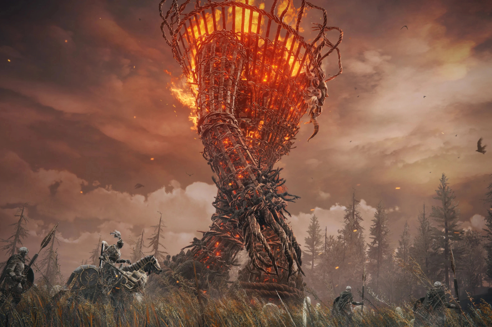

+++
title = "Shadow of the Erdtree est trop difficile, mais c'est pour votre bien"
date = 2024-06-25T06:45:00+01:00
draft = false
author = "Mickael"
tags = ["Actu"]
image = "https://nostick.fr/articles/vignettes/juin/Shadow-of-the-Erdtree2.jpg"
+++

*Elden Ring*, déjà à la base c'est trop dur, alors imaginez un peu le DLC ! *Shadow of the Erdtree* représente un tel challenge que ça râle sur Steam, où les joueurs se plaignent de la trop grande difficulté de l'extension. Ce sont pourtant des aventuriers qui se sont coltinés le jeu d'origine (il faut battre un boss avant de pouvoir y accéder). Résultat : les notes du DLC sont actuellement « moyennes », alors qu'il a été brillamment [accueilli](https://www.metacritic.com/game/elden-ring-shadow-of-the-erdtree/) par la critique.

Les boss en particulier sont pointés du doigt à cause de leur très grande difficulté. Shura [déplore](https://steamcommunity.com/profiles/76561198055488557/recommended/2778580/) « *des fenêtres d'esquives ridicules* » alors qu'« *il n'est pas rare de se faire tuer en 2 ou 3 coups seulement* ». Boubouche [adore](https://steamcommunity.com/profiles/76561198107051335/recommended/2778580/) le jeu, mais « *les boss m'ont arraché la perruque* » ! D'autres [remontent](https://steamcommunity.com/profiles/76561198078020974/recommended/2778580/) des problèmes d'optimisation avec de grosses chutes de framerate, comme Lasilix. 

Évidemment, tout le monde aura une expérience différente en fonction de ses skills et de sa capacité d'endurance ([et de masochisme](https://nostick.fr/articles/2024/avril/0904-nayez-pas-honte-de-jouer-en-mode-facile/)). Bandai Namco, l'éditeur d'Elden Ring, a toutefois [posté](https://x.com/BandaiNamcoUS/status/1804630213562962043) un petit conseil pour aiguiller les joueurs frustrés : favoriser les bénédictions de l'arbre-occulte, qui permettent de mieux encaisser les dégâts et d'en bananer davantage sur les ennemis.

Le DLC a de toute manière été conçu pour être difficile. Pour Hidetaka Miyazaki, le créateur d'*Elden Ring*, *Shadow of the Erdtree* s'adresse d'abord aux joueurs qui ont fini une bonne partie du jeu de base : « *nous pensons que nous avons vraiment repoussé les limites de ce que peut supporter le joueur* », affirme-t-il ~~la bave aux lèvres~~ à *[Cnet](https://www.cnet.com/tech/gaming/elden-ring-creator-hidetaka-miyazaki-talks-shadow-of-the-erdtree-new-weapons-and-more/)*.

Il est même allé plus loin : « *Nous aurions pu réduire la difficulté du jeu* » pour attirer plus de joueurs (même si Elden Ring a dépassé les 25 millions de copies vendues !), a-t-il raconté au *[Guardian](https://www.theguardian.com/games/article/2024/jun/21/hidetaka-miyazaki-fromsoftware-elden-ring-shadow-erdtree)*. « *Mais ce n'était pas la bonne approche* ». Même si FromSoftware le voulait, le studio ne pourrait pas proposer un « niveau facile », car cela « *briserait le jeu en lui-même* ». Le sens d'accomplissement du joueur lorsqu'il parvient finalement à battre un boss fait partie de « *l'expérience fondamentale* » d'Elden Ring. Allez donc mourir encore une fois.