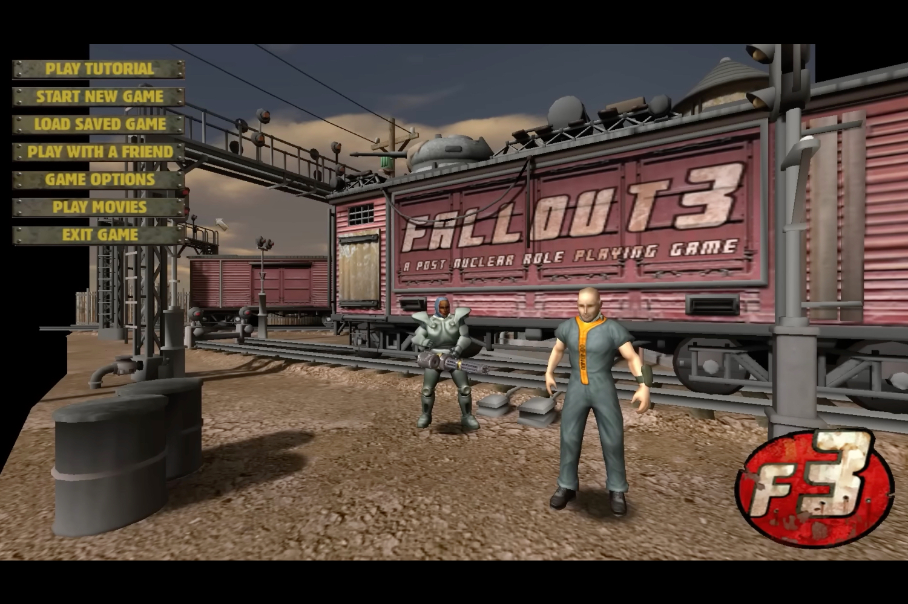
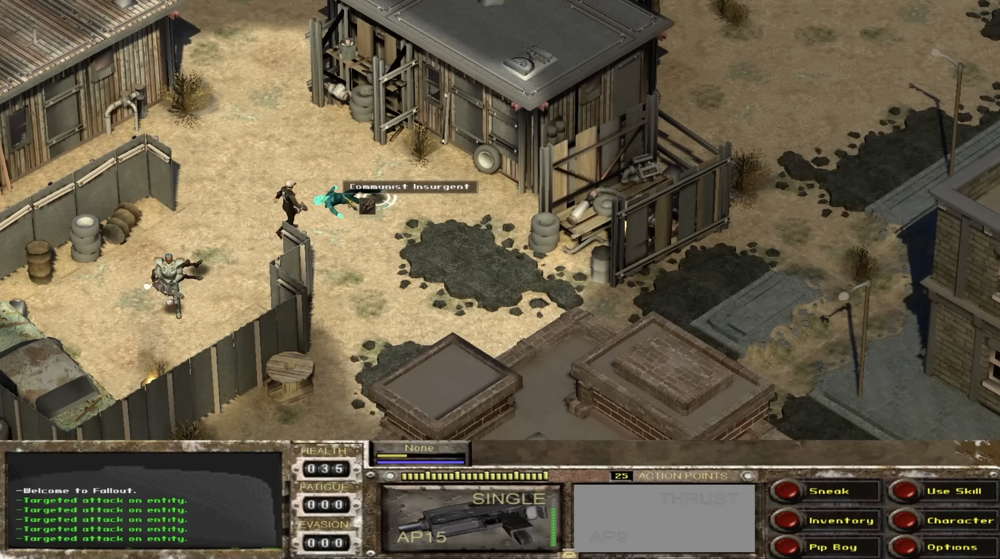
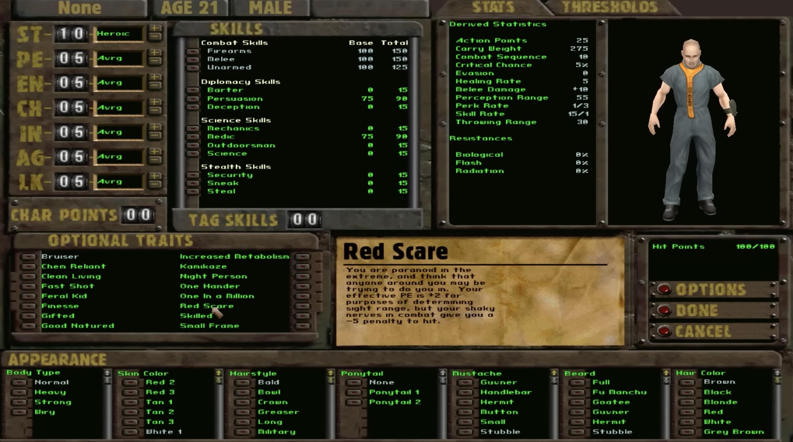

+++
title = "Projet Van Buren : Fallout 3 aurait pu être très différent"
date = 2024-06-25T15:47:32+01:00
draft = false
author = "Mickael"
tags = ["Actu"]
type = "Actu"
image = "https://nostick.fr/articles/vignettes/juin/fallout-3-1.jpg"
+++

En 2008 avec *Fallout 3*, Bethesda transformait ce qui était déjà une saga à succès en véritable phénomène qui s'est encore amplifié avec les suites bien sûr, sans oublier la série télé. Mais *Fallout 3* aurait pu être très différent si l'histoire en avait voulu ainsi. Ce troisième épisode, à l'origine connu sous le nom de projet Van Buren, était en effet développé par Black Isle, un studio édité par Interplay.

Le jeu, se déroulant en 2253, reprenait de ses prédécesseurs — toujours édités par Interplay — les combats au tour par tour et la vue isométrique avec cette fois le Jefferson Engine, un tout nouveau moteur 3D (au lieu du moteur 2D des premiers jeux). Le développement, entamé peu de temps après *Fallout 2* (1998), prenait beaucoup de temps et Interplay n'avait plus un rond dans la caisse pour continuer à financer la conception du jeu.

C'est là qu'intervient Timothy Cain. Le producteur du *Fallout* original a quitté l'éditeur en plein développement de *Fallout 2* pour fonder le studio Troika Games. Mais il était toujours en bon terme avec son ancienne équipe et au mitan de l'année 2003, un vice-président d'Interplay lui demande de venir tester le prototype de *Fallout 3*.

Dans une vidéo postée par ses soins sur YouTube (et [repérée](https://arstechnica.com/gaming/2024/06/why-interplays-original-fallout-3-was-canceled-20-years-ago/) par *ArsTechnica*), Timothy Cain revient sur cette rencontre qui a scellé le sort funeste du jeu. « *Nous sommes en train de créer un jeu Fallout et je vais devoir l'annuler* », lui a expliqué le dirigeant anonyme. « *Je ne pense pas qu'ils puissent le terminer… mais si tu pouvais venir et le regarder pour me donner une estimation, il y a une chance que je ne l'annule pas.* »

 

C'est alors que Cain a pu jouer avec la build la plus récente du projet Van Buren. Deux heures plus tard, il livre son verdict : pour transformer le titre en « *vraiment bon jeu* », il lui faudrait 18 mois de développement supplémentaires. En 12 mois de « crunch time » pour le terminer, le jeu risquait d'être bourré de bugs.

Malheureusement, Interplay n'avait pas les fonds pour plus de 6 mois de développement. « *[Le vice-président] pensait que ça ne pourrait pas être fait en six mois, et je lui ai confirmé* », raconte Cain. Quant à l'idée de réutiliser le même moteur que pour *Fallout 1* et 2, cela lui paraissait inconcevable : « *Est-ce que ce moteur aurait été acceptable cinq ans après Fallout 2 ? Est-ce que quelqu'un l'avait vraiment examiné de près ? J'ai commencé à travailler sur ce moteur en 1994… Il était vraiment vieillissant* ».

En décembre 2003, six mois après le test de Cain, Interplay annulait le projet pour concentrer ses efforts sur *Fallout: Brotherhood of Steel*, un titre sorti en janvier 2004… et très différent des opus originaux par son aspect linéaire et son action plus portée sur le hack'n slash que sur la stratégie.

 

En 2007, Bethesda achète et revitalise la licence en changeant complètement la structure du jeu avec le « vrai » *Fallout 3*. Le projet Van Buren continue de susciter beaucoup d'intérêt, comme ce documentaire sorti début 2023 (voir ci-dessus), ou encore ces projets de fans comme [Fallout Revelation Blue](https://www.reddit.com/r/classicfallout/comments/nd7jsn/fallout_revelation_blue_a_van_buren_remake_in_new/) ou *[Beyond Boulder Dome](https://www.nexusmods.com/newvegas/mods/46907)*.